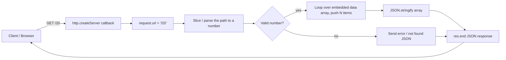

# Day 01 — Node.js Basics: First HTTP Server with the `http` Module

## Overview
Day 01 is the very first exposure to Node.js backend development. It covers:
- Basic JavaScript practice (arrays, loops, pushing objects into arrays).
- Creating a raw HTTP server using Node's built-in `http` module — no Express yet.
- Reading `req.url`, parsing it manually, and returning JSON responses.
- Building an in-memory "currency lookup" API.
- Three frontend HTML demos ("TaskVault") that show why a backend is needed: Step 1 is frontend-only (data lost on refresh), Step 2 adds localStorage, Step 3 adds a shared cloud database — motivating the move to backend servers.

## File-by-file explanation
| File | What it does |
|---|---|
| `first.js` | Pure JS practice: builds an array from a `gitHubProfile` array using a `for` loop with `push()`. |
| `second.js` | First real server: embeds a large array of GitHub user profiles (public GitHub API sample data) and serves `/N` — the first N users as JSON. Demonstrates `http.createServer`, `request.url`, manual URL string slicing, `JSON.stringify`, and `server.listen(3000)`. |
| `server.js` | Currency API: hardcodes a map of currency codes (from the frankfurter.dev currencies API) and serves `/{CODE}` (e.g. `/INR`) returning `{code, name}` as JSON, or `{error: "not found"}` for unknown codes. |
| `Project01/index.html` | "TaskVault — Step 1: frontend-only demo". Self-contained HTML/CSS/JS todo app; teaching banner explains data disappears on refresh. |
| `Project02/index.html` | "TaskVault — Step 2: local permanent storage". Same app but persists tasks with `localStorage`. |
| `Project03/index.html` | "TaskVault — Step 3: shared cloud database". Same app switched to a cloud/shared database mode, motivating why a backend server is required. |
| `reviseNoNet/first.js` | Revision copy of the GitHub-users server pattern (data embedded, no network needed). |
| `reviseNoNet/second.js` | Revision copy of the currency lookup server (listens on port 3000, returns currency name by code). |

## Code flow

## Key concepts learned
- Node.js runs JavaScript outside the browser; `require('http')` gives the HTTP toolbox.
- `http.createServer((req, res) => {...})` — every request hits this callback.
- `req.url` contains only the path (e.g. `/20`), not the full URL.
- `res.end()` sends the response; `JSON.stringify()` converts JS objects to JSON text.
- `server.listen(3000, callback)` starts listening on a port.
- Why backends exist: frontend-only apps lose data (refresh) and can't share data between users — solved next by localStorage, then by a real server/database.

## Notes
No credentials, MongoDB URIs, API keys, emails or passwords appear in this day's code. The GitHub user data and currency-code map are public API sample data, not secrets.
