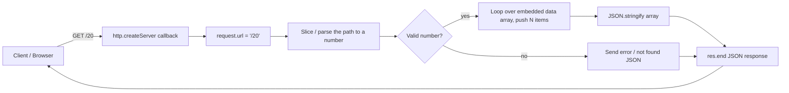

# Day 01 — Node.js Basics: First HTTP Server with the `http` Module

## Overview
Day 01 is the very first exposure to Node.js backend development. It covers:
- Basic JavaScript practice (arrays, loops, pushing objects into arrays).
- Creating a raw HTTP server using Node's built-in `http` module — no Express yet.
- Reading `req.url`, parsing it manually, and returning JSON responses.
- Building an in-memory "currency lookup" API.
- Three frontend HTML demos ("TaskVault") that show why a backend is needed: Step 1 is frontend-only (data lost on refresh), Step 2 adds localStorage, Step 3 adds a shared cloud database (Supabase) — motivating the move to backend servers.

## Files
| File | What it does |
|---|---|
| `first.js` | Pure JS practice: builds an array from a `gitHubProfile` array using a `for` loop with `push()`. |
| `second.js` | First real server (port 3000): embeds a large array of GitHub user profiles (public GitHub API sample data) and serves `/N` — the first N users as JSON. Demonstrates `http.createServer`, `request.url`, manual URL string building character-by-character in a loop (instead of `slice`), `Number()` conversion, `JSON.stringify`, and `server.listen(3000)`. |
| `server.js` | Currency API (port 3000): hardcodes a map of currency codes (from the frankfurter.dev currencies API) and serves `/{CODE}` (e.g. `/INR`) returning `{code, name}` as JSON, or `{error: "not found"}` for unknown codes. |
| `Project01/index.html` | "TaskVault — Step 1: frontend-only demo". Self-contained HTML/CSS/JS todo app; teaching banner explains data disappears on refresh. |
| `Project02/index.html` | "TaskVault — Step 2: local permanent storage". Same app but persists tasks with `localStorage`. |
| `Project03/index.html` | "TaskVault — Step 3: shared cloud database". Same app switched to Supabase (sign-in card, per-user lists, cloud sync). Has a CONFIG block for a Supabase project URL and anon key; if keys are not configured it falls back to local-only mode. |
| `reviseNoNet/first.js` | Revision copy of the GitHub-users server: full embedded profile array plus a `http.createServer` that serves `/N` (port 3000) — works offline, no network needed. |
| `reviseNoNet/second.js` | Revision copy of the currency lookup server (port 3000, returns currency name by code, with a playful error message for unknown codes). |

## How the code flows
Taking `second.js` (the GitHub-users server) as the example:
1. `require('http')` loads Node's built-in HTTP toolbox — no npm install needed.
2. `http.createServer(callback)` creates a server object. The callback runs **for every incoming request**.
3. Inside the callback, `request.url` holds only the path (e.g. `/20`), never the full URL.
4. The code strips the leading `/` by copying characters from index 1 into a new string (`str1`), then converts it with `Number()`.
5. A loop pushes the first N profiles from the embedded `github` array into `arr`.
6. `JSON.stringify(arr)` turns the array into JSON text and `res.end(...)` sends it back, closing the response.
7. `server.listen(3000, ...)` binds the server to port 3000 and prints a confirmation.

`server.js` follows the same shape but instead of a numeric slice it treats the whole path after `/` as a currency code and looks it up in a plain object — an if/else acting as the first "router".

## How it works — first principles
- **What is a server, really?** A program that never exits: it sits in a `listen()` loop, and every time a client sends an HTTP request, the OS hands the request bytes to Node, which calls your callback with two objects — `req` (what the client asked) and `res` (what you'll answer with).
- **Where does the data come from?** Nowhere external yet. The GitHub profiles and currency names are hardcoded in the file — an "in-memory database". Restart the process and nothing changes because nothing was persisted. This limitation is exactly what later days (npm packages, then databases) fix.
- **Why parse the URL by hand?** Before `url.parse` (Day 02) or Express routers (Day 05), the URL is just a string. Day 01 shows the raw truth: routing is string inspection. `second.js` builds the substring with a loop; `server.js` uses `slice(1)` — the shortcut you'll use forever after.
- **Why JSON?** HTTP responses are text. `JSON.stringify` converts JS values into that text so any client (browser, Postman, another server) can read them. This is the universal data format of the web.
- **Why the TaskVault progression?** Step 1 (in-memory JS) loses data on refresh; Step 2 (localStorage) persists but is trapped on one device and one browser; Step 3 (Supabase cloud DB) shares data across devices. A shared database can only live behind a server — which is the whole motivation for backend development.

## Flow

```mermaid
flowchart LR
    A[Client / Browser] -->|GET /20| B[http.createServer callback]
    B --> C["request.url = '/20'"]
    C --> D[Slice / parse the path to a number]
    D --> E{Valid number?}
    E -- no --> F[Send error / not found JSON]
    E -- yes --> G[Loop over embedded data array, push N items]
    G --> H[JSON.stringify array]
    H --> I[res.end JSON response]
    F --> I
    I --> A
```

## Key concepts
- Node.js runs JavaScript outside the browser; `require('http')` gives the HTTP toolbox.
- `http.createServer((req, res) => {...})` — every request hits this callback.
- `req.url` contains only the path (e.g. `/20`), not the full URL.
- `res.end()` sends the response; `JSON.stringify()` converts JS objects to JSON text.
- `server.listen(3000, callback)` starts listening on a port.
- Why backends exist: frontend-only apps lose data (refresh) and can't share data between users — solved next by localStorage, then by a real server/database.

## Notes
`Project03/index.html` contains a hardcoded Supabase project URL and a Supabase anon key in its CONFIG block. Both are expired dummies — treat them as `<SUPABASE_URL>` / `<SUPABASE_ANON_KEY>` placeholders and never copy them anywhere. (An anon key is designed to be browser-public, but this project is defunct, so use your own.) No other credentials, MongoDB URIs, or passwords appear in this day's code. The GitHub user data and currency-code map are public API sample data, not secrets.
