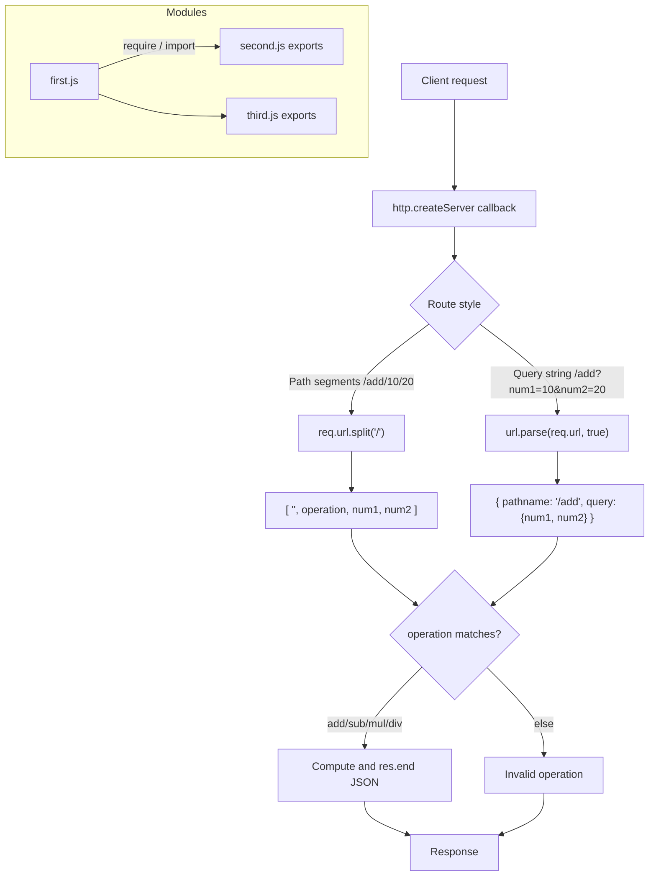

# Day 02 — URL/Query-String Routing and JavaScript Modules (CommonJS & ES Modules)

## Overview
Day 02 builds on the raw `http` server and introduces two big ideas:
1. **Routing with URL parsing** — path-parameter style routes (`/add/10/20`) and query-string style routes (`/add?num1=10&num2=20`) parsed with `url.parse(req.url, true)`, used to build a calculator API. Input validation (NaN checks, division by zero, "rate limiting" the number of users returned) is practiced in the `revise/` folder.
2. **Modules** — why large codebases must be split into files (naming conflicts, readability, accidental overwrites), how to export/import with CommonJS (`module.exports` / `require`) and with ES Modules (`export` / `import` / `export default`, enabled by `"type": "module"` in package.json).

## File-by-file explanation
| File | What it does |
|---|---|
| `first.js` | GitHub-users server on port 9000: serves `/N` returning the first N embedded GitHub profiles; validates input (rejects NaN / <= 0) and caps N at 100 ("just like a rate limiter"). |
| `second.js` | Calculator API (port 3000) using path segments: splits `req.url` on `/` to get `operation/num1/num2`, supports `add`, `sub`, `mul`, `div`. |
| `third.js` | Calculator API using query strings: `url.parse(req.url, true)` gives `{pathname, query}`; reads `num1`/`num2` from `parsed.query`. |
| `LearnModule01/amazon.js` | Comment-only "whiteboard" file: why modules are needed in a huge codebase (1 lakh lines, 100 engineers) — auth, payment, email, OTP as separate modules. |
| `LearnModule01/first.js` | CommonJS consumer: `require()`s functions from `second.js` and `third.js` and calls them. |
| `LearnModule01/second.js` | Exports via `module.exports = {payment, sub}`; comments explore `exports.x`, replacing the whole export object, etc. |
| `LearnModule01/third.js` | Exports `add` and `mul` via `module.exports = {add, mul}`. |
| `LearnModule02/first.js` | ES Module consumer: `import hatim, {add, sub, fibonaci} from "./second.js"` — one default + named imports. |
| `LearnModule02/second.js` | ES Module: `export default function hatim()`, named `export function fibonaci`, and `export {add, sub}`. |
| `LearnModule02/third.js` | ES Module exporting `fib` (unused in first.js — practice in spotting module errors). |
| `LearnModule02/package.json` | `"type": "module"` — this is what switches a folder/package to ESM syntax. |
| `revise/first.js` | Revised GitHub-users server (port 3646) with the three validation cases (invalid number, >100 cap, slice of profiles). |
| `revise/second.js` | Revised path-segment calculator (port 5000) with NaN checks and div guard. |
| `revise/third.js` | Revised query-string calculator (port 5000) with a divide-by-zero guard. |
| `revise/ollamarevi2.js` | Empty placeholder file. |

## Code flow

## Key concepts learned
- `url.parse(req.url, true)` returns `{pathname, query}` — query strings come back as an object of strings (always `Number()`-convert them).
- Path-parameter routing vs query-string routing; `pathname.slice(1)` strips the leading `/`.
- Always validate input: `isNaN()`, negative/zero checks, and limits (a simple rate limiter idea).
- Modules solve name conflicts, readability, and accidental edits in big codebases.
- CommonJS: `module.exports = {...}` / `const {x} = require('./file.js')`.
- ES Modules: `export` / `export default` / `import ... from`; enabled by `"type": "module"` in package.json; only one default export per file.

## Notes
No credentials, MongoDB URIs, API keys, emails or passwords appear in this day's code. The GitHub user data is public API sample data, not secrets.
