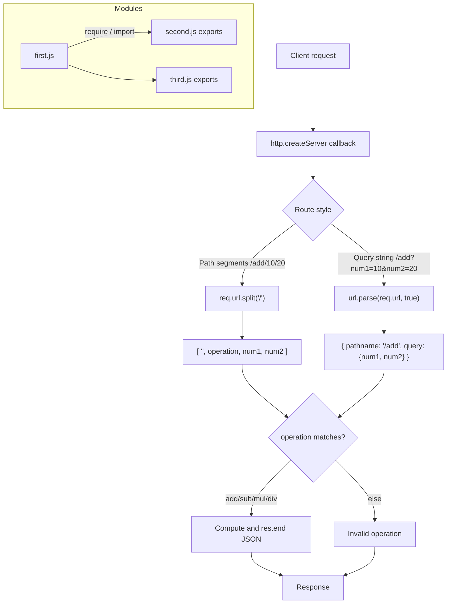

# Day 02 — URL/Query-String Routing and JavaScript Modules (CommonJS & ES Modules)

## Overview
Day 02 builds on the raw `http` server and introduces two big ideas:
1. **Routing with URL parsing** — path-parameter style routes (`/add/10/20`) and query-string style routes (`/add?num1=10&num2=20`) parsed with `url.parse(req.url, true)`, used to build a calculator API. Input validation (NaN checks, division by zero, "rate limiting" the number of users returned) is practiced in the `revise/` folder — including a couple of instructive *bugs* (see Files).
2. **Modules** — why large codebases must be split into files (naming conflicts, readability, accidental overwrites), how to export/import with CommonJS (`module.exports` / `require`) and with ES Modules (`export` / `import` / `export default`, enabled by `"type": "module"` in package.json).

## Files
| File | What it does |
|---|---|
| `first.js` | GitHub-users server on port 9000: serves `/N` returning the first N embedded GitHub profiles; validates input (rejects NaN / <= 0) and caps N at 100 ("just like a rate limiter"). |
| `second.js` | Calculator API (port 3000) using path segments: splits `req.url` on `/` to get `operation/num1/num2`, supports `add`, `sub`, `mul`, `div`, else "Invalid operation". No validation yet. |
| `third.js` | Calculator API using query strings (port 3000): `url.parse(req.url, true)` gives `{pathname, query}`; reads `num1`/`num2` from `parsed.query`, operation from `parsed.pathname.slice(1)`. |
| `LearnModule01/amazon.js` | Comment-only "whiteboard" file: why modules are needed in a huge codebase (1 lakh lines, 100 engineers) — auth, payment, email, OTP as separate modules. |
| `LearnModule01/first.js` | CommonJS consumer: `require()`s functions from `second.js` and `third.js` and calls them. |
| `LearnModule01/second.js` | Exports via `module.exports = {payment, sub}`; comments explore `exports.x`, replacing the whole export object, exporting a single function, etc. |
| `LearnModule01/third.js` | Exports `add` and `mul` via `module.exports = {add, mul}`. |
| `LearnModule02/first.js` | ES Module consumer: `import hatim, {add, sub, fibonaci} from "./second.js"` (one default + named imports) and `import {fib} from "./third.js"` — `fib` is imported but never called. |
| `LearnModule02/second.js` | ES Module: `export default function hatim()`, named `export function fibonaci`, and `export {add, sub}`. |
| `LearnModule02/third.js` | ES Module exporting `fib`. |
| `LearnModule02/package.json` | **Empty placeholder** (`{ }`). Note: ESM `import` syntax only works if the package.json contains `"type": "module"` (or the file is `.mjs`) — as committed, running `LearnModule02/first.js` would throw `SyntaxError: Cannot use import statement outside a module`. Adding `"type": "module"` is the fix and the lesson of the day. |
| `revise/first.js` | Revised GitHub-users server (port 3646) with the three validation cases: invalid number (NaN / <= 0 → "Invalid Url"), >100 cap ("We cant fetch more than 100 users"), and exactly 100 falls through to a joke message. |
| `revise/second.js` | Revised path-segment calculator (port 5000). Intended NaN guard is buggy: `num1 == NaN` is always false (NaN is not equal to anything, including itself — use `isNaN()`), so bad input slips through; the `div` guard rejects when **both numbers are negative**, not divide-by-zero. Good example of why `==` with NaN fails. |
| `revise/third.js` | Revised query-string calculator (port 5000) with a real divide-by-zero guard ("why are you divided by zero are you crazy"). But its NaN guard is also buggy: `isNaN(NaN)` is always true, so **every** request returns the error message before reaching the calculator. Spotting these two bugs is excellent revision practice. |
| `revise/ollamarevi2.js` | Empty placeholder file. |

## How the code flows
Routing (`second.js`, path-segment style):
1. A request like `GET /add/10/20` hits the `createServer` callback.
2. `req.url.split("/")` produces `["", "add", "10", "20"]` — index 0 is empty because the URL starts with `/`.
3. `url[1]` is the operation; `Number(url[2])` and `Number(url[3])` convert the operands from strings to numbers.
4. An if/else chain matches the operation and `res.end(JSON.stringify(result))` answers; anything unmatched gets "Invalid operation".

Query-string style (`third.js`):
1. `url.parse(req.url, true)` returns `{ pathname: "/add", query: { num1: "10", num2: "20" } }`.
2. `parsed.pathname.slice(1)` strips the leading `/`; `parsed.query.num1` etc. are always **strings**, so `Number()` conversion is mandatory.

Modules (`LearnModule01`, CommonJS): `require("./second.js")` runs that file once, reads its `module.exports` object, and destructures the needed functions into the importer. `LearnModule02` mirrors the same idea in ESM syntax (`import`/`export`), which Node only enables when the package is flagged as a module.

## How it works — first principles
- **Why routing is just string parsing:** an HTTP request is `METHOD path HTTP/1.1`. Node hands you `req.url` as the raw path string. Before frameworks, "routing" means deciding what to do based on that string — split it (path params) or parse it (query params). Frameworks like Express (Day 05) only automate this.
- **Path params vs query params:** `/add/10/20` puts data *in the path* (positional, ordered); `/add?num1=10&num2=20` puts it *in the query* (key=value, order-free, optional-friendly). Same server, two conventions — real APIs mix both.
- **Why `Number()` and `isNaN` matter:** everything in a URL is a string. `"10" + "20"` is `"1020"`, not `30`. And NaN is toxic: it is the only value not equal to itself, so `x == NaN` can never be true — you must use `Number.isNaN(x)`. The `revise/` bugs demonstrate both traps concretely.
- **Why modules exist:** one giant file means name collisions, unreadable structure, and teammates overwriting each other's code. A module is a file with an explicit *contract*: what it exports. CommonJS wraps each file in a hidden `module` object; `module.exports` is what `require` hands back, and the file body runs exactly once (results are cached). ESM is the modern standard with static `import`/`export` declarations; Node needs `"type": "module"` in package.json to treat `.js` files as ESM, and each file may have at most one default export plus any number of named exports.
- **Rate limiting intuition:** capping N at 100 in `first.js`/`revise/first.js` is a miniature of a real rate limiter — a server must protect itself from clients asking for too much.

## Flow

```mermaid
flowchart TD
    A[Client request] --> B[http.createServer callback]
    B --> C{Route style}
    C -->|Path segments /add/10/20| D["req.url.split('/')"]
    C -->|Query string /add?num1=10&num2=20| E["url.parse(req.url, true)"]
    D --> F["[ '', operation, num1, num2 ]"]
    E --> G["{ pathname: '/add', query: {num1, num2} }"]
    F --> H{operation matches?}
    G --> H
    H -- add/sub/mul/div --> I[Compute and res.end JSON]
    H -- else --> J[Invalid operation]
    I --> K[Response]
    J --> K

    subgraph Modules
      M1[first.js] -->|require / import| M2[second.js exports]
      M1 --> M3[third.js exports]
    end
```

## Key concepts
- `url.parse(req.url, true)` returns `{pathname, query}` — query strings come back as an object of strings (always `Number()`-convert them).
- Path-parameter routing vs query-string routing; `pathname.slice(1)` strips the leading `/`.
- Always validate input: `isNaN()`, negative/zero checks, and limits (a simple rate limiter idea). Remember: `x == NaN` is always false and `isNaN(NaN)` is always true — the two bugs planted in `revise/second.js` and `revise/third.js`.
- Modules solve name conflicts, readability, and accidental edits in big codebases.
- CommonJS: `module.exports = {...}` / `const {x} = require('./file.js')`.
- ES Modules: `export` / `export default` / `import ... from`; enabled by `"type": "module"` in package.json; only one default export per file.

## Notes
No credentials, MongoDB URIs, API keys, emails or passwords appear in this day's code. The GitHub user data is public API sample data, not secrets.
