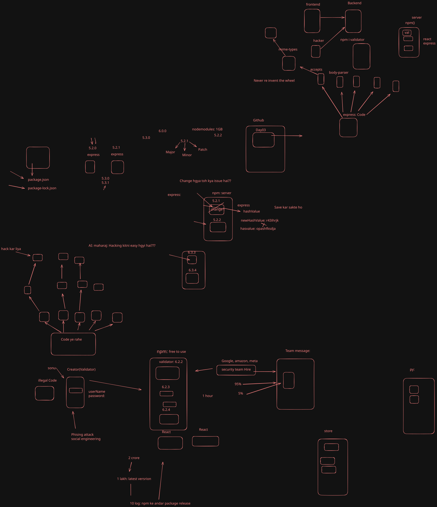
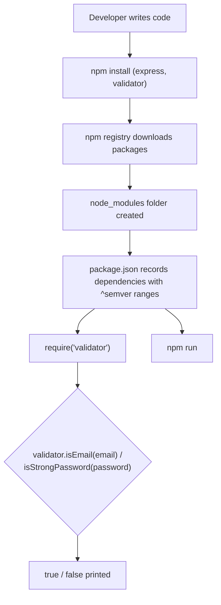

# Day 03 — npm, package.json, Semver, and the `validator` Package

## Overview
Day 03 is about the npm ecosystem — "never reinvent the wheel":
- Why packages exist (npm registry, `npm install`, `node_modules`, dependencies).
- Anatomy of `package.json` (name, version, scripts, dependencies, `"type"`).
- Semantic Versioning (Semver): `major.minor.patch` — patch = bug fixes, minor = new features, major = breaking changes; `^` caret ranges.
- First real third-party package: **validator** (`validator.isEmail`, `validator.isStrongPassword`) to validate form-style input.

## File-by-file explanation
| File | What it does |
|---|---|
| `index.js` | Uses the `validator` npm package: checks a sample email with `validator.isEmail(email)` and a sample password with `validator.isStrongPassword(password)`, printing true/false. Comments show the transition from raw `http.createServer` to npm-powered code. **Note: the email and password strings in this file are dummy test values typed for practicing validation — treat them as expired/irrelevant and ignore them.** |
| `first.js` | A small calculator module (`add`, `sub`, `mul`, `div`, `square`) with type guards, exported via `module.exports` — plus comments explaining Semver `1.0.0` → patch/minor/major bumps. |
| `package.json` | Declares the package: `"type": "commonjs"`, main entry `index.js`, and dependencies `express ^5.2.1` and `validator ^13.15.35`. |
| `lates3.svg` | Excalidraw class notes diagram (see below). |

## About `lates3.svg`
The SVG is an Excalidraw hand-drawn diagram of the day's concepts. Its text labels cover:
- The **frontend / backend / hacker / server** big picture, with **React** on the frontend and **Express** on the backend.
- **npm()**: `npm i validator`, packages "accept" dependencies like **body-parser** and **mime-types**, "express: code — never re-invent the wheel", and `node_modules: 1GB`.
- **Semantic versioning** walk-through for express: `5.2.0 → 5.2.1` (patch), `5.3.0` (minor), `6.0.0` (major), etc., labelled Major / Minor / Patch, ending at express `5.2.1` as pinned in package.json.

## Code flow

## Key concepts learned
- npm installs third-party code; `node_modules` is generated (never committed) and can be huge.
- `package.json` is the project's manifest: entry point, scripts, and dependency list.
- Semver `major.minor.patch`: patch = bug fix, minor = backward-compatible feature, major = breaking change; `^` allows minor/patch updates within the same major.
- The `validator` package gives battle-tested `isEmail` / `isStrongPassword` checks instead of hand-rolled regexes.
- Reusable modules (like `first.js`'s calculator) are the building blocks that npm packages scale up.

## Notes
`index.js` contains an email and a password string used only as sample input for the `validator` calls. They are dummy test values — treat them as expired/irrelevant and do not reuse them anywhere.
