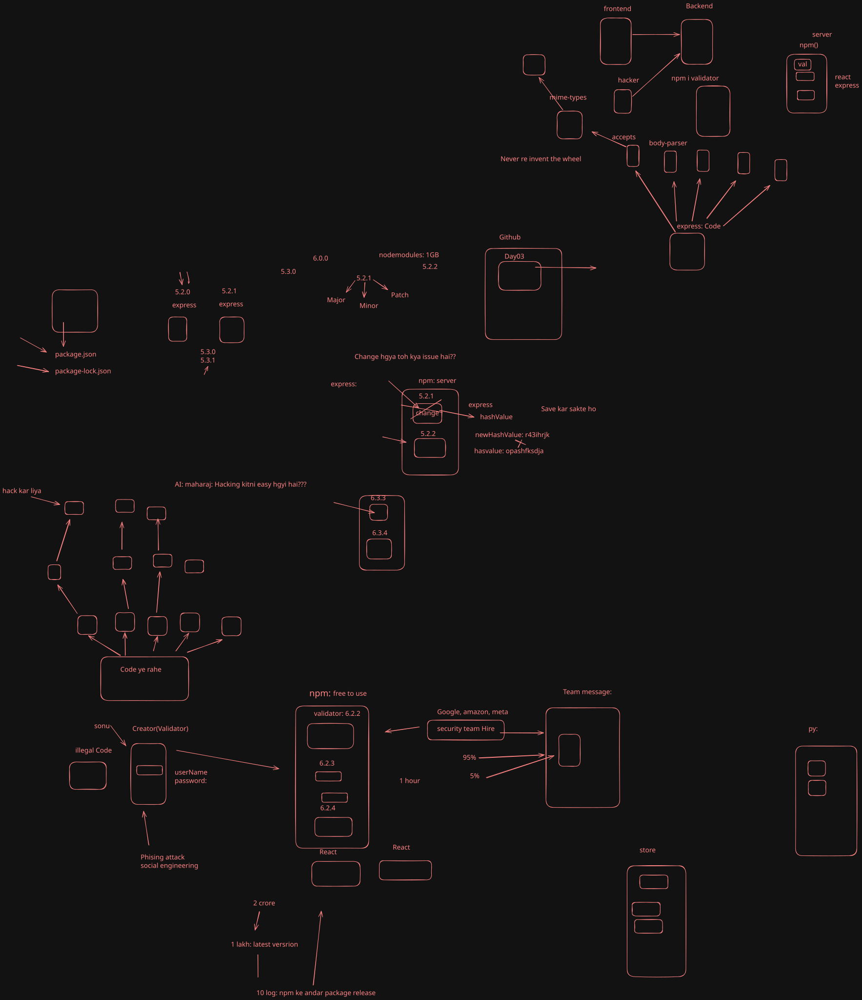
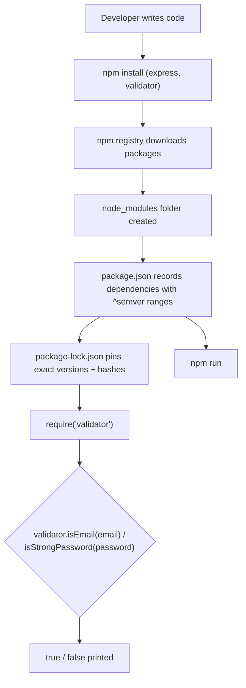

# Day 03 — npm, package.json, Semver, and the `validator` Package

## Overview
Day 03 is about the npm ecosystem — "never reinvent the wheel":
- Why packages exist (npm registry, `npm install`, `node_modules`, dependencies).
- Anatomy of `package.json` (name, version, scripts, dependencies, `"type"`).
- Semantic Versioning (Semver): `major.minor.patch` — patch = bug fixes, minor = new features, major = breaking changes; `^` caret ranges; why `package-lock.json` pins exact versions (and hash values) so everyone gets identical installs.
- First real third-party package: **validator** (`validator.isEmail`, `validator.isStrongPassword`) to validate form-style input.
- Security angle from the notes diagram: malicious or phished package versions can ship illegal code — another reason version pinning and trusted sources matter.

## Files
| File | What it does |
|---|---|
| `index.js` | Uses the `validator` npm package: checks a sample email with `validator.isEmail(email)` and a sample password with `validator.isStrongPassword(password)`, printing true/false. Comments show the transition from raw `http.createServer` (commented out) to npm-powered code. **The email and password strings in this file are dummy test values typed for practicing validation — treat them as expired/irrelevant; use placeholders like `<SAMPLE_EMAIL>` and never reuse them.** Note: only `validator` is actually used here — `express` is installed but not required until Day 05. |
| `first.js` | A small calculator module (`add`, `sub`, `mul`, `div`, `square`) with type guards, exported via `module.exports` — plus comments explaining Semver `1.0.0` → patch/minor/major bumps. |
| `package.json` | Declares the package: name `day03`, version `1.0.0`, `"type": "commonjs"`, main entry `index.js`, scripts, and dependencies `express ^5.2.1` and `validator ^13.15.35`. |
| `lates3.svg` | Excalidraw class notes diagram (see below). |

## The diagram
The SVG is an Excalidraw hand-drawn diagram of the day's concepts. Its text labels cover:
- The **frontend / backend / hacker / server** big picture, with **React** on the frontend and **Express** on the backend.
- **npm()**: `npm i validator`, packages "accept" dependencies like **body-parser** and **mime-types**, "express: code — never re-invent the wheel", and `node_modules: 1GB`.
- **Semantic versioning** walk-through for express: `5.2.0 → 5.2.1` (patch), `5.3.0` (minor), `6.0.0` (major), labelled Major / Minor / Patch, ending at express `5.2.1` as pinned in package.json.
- **package-lock.json**: once a version is installed, its hash value is recorded ("change hua toh kya issue hai?" — the lock file saves the exact verified version so re-installs are identical).
- **Security/phishing note**: a fake "validator" version shipped by an attacker (phishing / social engineering) with illegal code — why you should trust the official creator's versions.

## How the code flows
1. You write `package.json` (or run `npm init`) declaring what the project needs.
2. `npm install` reads it, downloads each dependency (and *its* dependencies) from the npm registry into `node_modules`, and writes exact resolved versions + integrity hashes to `package-lock.json`.
3. `index.js` runs: the commented-out raw `http` server shows what Day 01–02 looked like; the active code just does `require('validator')` — Node resolves that name from `node_modules`.
4. Two sample strings are passed to `validator.isEmail()` and `validator.isStrongPassword()`, and the boolean results are printed.

`first.js` is the "do it yourself" counterpart: the same idea of reusable validated functions, but hand-rolled and exported with `module.exports` — the pattern npm packages scale up.

## How it works — first principles
- **Why packages?** Any non-trivial program needs code other people already wrote (parsing, validation, HTTP frameworks). npm is a giant public library: `npm install <name>` copies a versioned snapshot into your project.
- **Why `node_modules` is disposable:** it is just downloaded code — you can delete and regenerate it from `package.json` + lock file at any time. That's why it's gitignored and why it can grow to 1GB.
- **Why Semver?** Version numbers are a communication contract: `major.minor.patch`. Patch bumps fix bugs without changing behavior; minor bumps add features without breaking you; major bumps *may break you*. The `^` in `"express": "^5.2.1"` means "any 5.x.y ≥ 5.2.1 is acceptable" — you get fixes/features automatically, but never a breaking 6.0.0 until you choose it.
- **Why package-lock.json?** `^` ranges are fuzzy; two installs on different days could resolve different versions. The lock file freezes the exact version and its integrity hash, so every machine and CI run installs byte-identical dependencies.
- **Why validation libraries?** Hand-rolled regexes for email/password strength are notoriously wrong. `validator` encodes thousands of edge cases tested by the community — import expertise instead of guessing.
- **Security intuition:** anything you `npm install` runs with your program's full power. A phished/malicious package version can exfiltrate data, which is why pinning, lock files, and official sources matter (see the diagram's "hacker" panel).

## Flow

```mermaid
flowchart TD
    A[Developer writes code] --> B["npm install (express, validator)"]
    B --> C[npm registry downloads packages]
    C --> D[node_modules folder created]
    D --> E["package.json records dependencies with ^semver ranges"]
    E --> F["package-lock.json pins exact versions + hashes"]
    F --> G["require('validator')"]
    G --> H{"validator.isEmail(email) /\nisStrongPassword(password)"}
    H --> I[true / false printed]
    E --> J["npm run <script> from package.json scripts"]
```

## Key concepts
- npm installs third-party code; `node_modules` is generated (never committed) and can be huge.
- `package.json` is the project's manifest: entry point, scripts, and dependency list; `package-lock.json` pins exact versions and integrity hashes.
- Semver `major.minor.patch`: patch = bug fix, minor = backward-compatible feature, major = breaking change; `^` allows minor/patch updates within the same major.
- The `validator` package gives battle-tested `isEmail` / `isStrongPassword` checks instead of hand-rolled regexes.
- Malicious/phished package versions are a real threat — pin versions and install only from trusted, official sources.
- Reusable modules (like `first.js`'s calculator) are the building blocks that npm packages scale up.

## Notes
`index.js` contains an email and a password string used only as sample input for the `validator` calls. They are dummy test values — treat them as expired/irrelevant, refer to them only as `<SAMPLE_EMAIL>` / `<SAMPLE_PASSWORD>`, and do not reuse them anywhere. No real credentials, MongoDB URIs, or API keys appear in this day's code.
