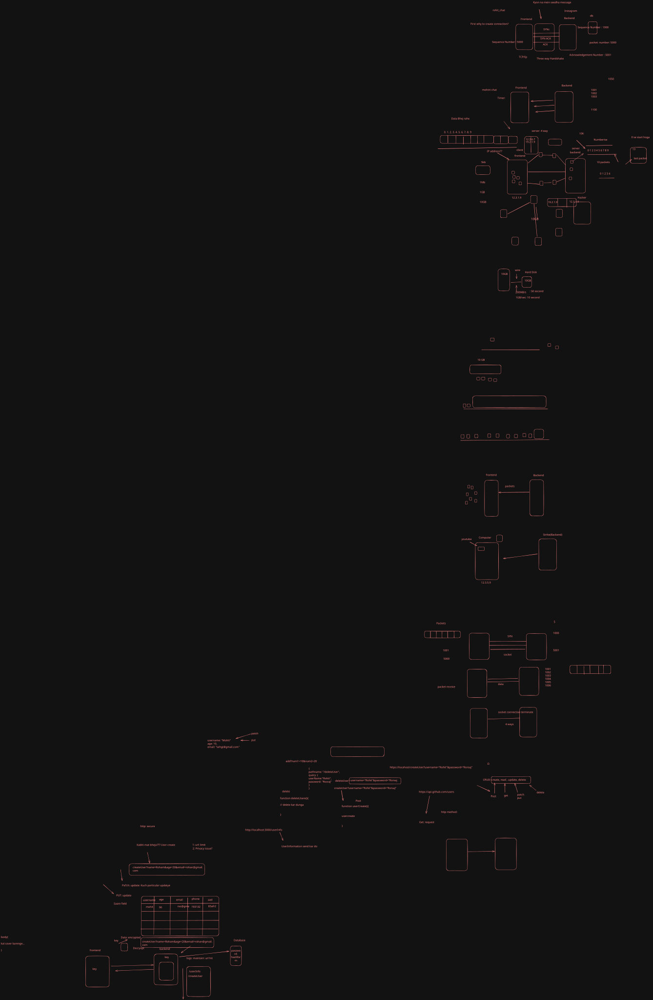
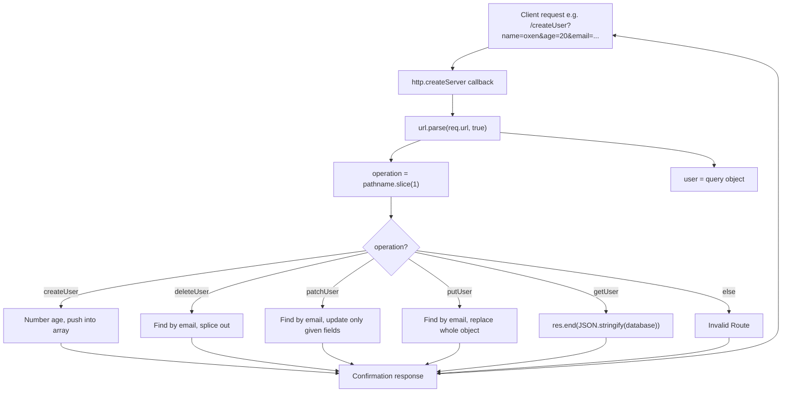

# Day 04 — Building a CRUD "Database" API with Raw Node (In-Memory Users)

## Overview
Day 04 builds a full CRUD-style API with only the built-in `http` and `url` modules — no Express yet. An in-memory array acts as the database, and query strings drive the operations:
- `getUser` — read all users
- `createUser?name=&age=&email=` — create
- `deleteUser?email=` — delete (matched by email as the unique key)
- `patchUser?email=&name=/age=` — partial update (only provided fields)
- `putUser?name=&age=&email=` — full replacement of the matched user

This teaches the semantics behind GET/POST/PATCH/PUT/DELETE before HTTP methods are introduced formally on Day 05.

## File-by-file explanation
| File | What it does |
|---|---|
| `index.js` | Complete user-CRUD server (port 3000). `database` array of user objects; `url.parse(req.url, true)` extracts `operation` (pathname) and `user` (query). Helper functions `createUser`, `deleteUser`, `patchUpdate`, `putUpdate`, and a `getUser` branch that returns the whole DB as JSON. Ends with commented example URLs for every operation. |
| `index2.js` | Heavily commented re-implementation of the same CRUD server — explains that the browser sends strings (`age: "20"`), so `createUser` converts age with `Number()`, and walks through how `url.parse` splits path vs query. |
| `second.js` | Small aside: printing messages at code "checkpoints" (line 100/200/300/400) — an intro to thinking about execution order in a long file. |
| `package.json` | Project manifest, `"type": "commonjs"`, main `index.js`. |
| `l4.svg` | Excalidraw class notes diagram (see below). |

## About `l4.svg`
An Excalidraw hand-drawn diagram of networking/storage concepts behind client-server apps:
- **Frontend ↔ Backend ↔ db** architecture, with an Instagram-like chat example (`rohit_chat`, `mohini chat`).
- **TCP/IP three-way handshake**: SYN → SYN-ACK → ACK ("First, why create a connection?") and the server-side **4-way** termination.
- Message/data size comparisons (5kb vs 1Mb vs 1GB vs 10GB) and data moving over a **wire** to **Hard Disk** — illustrating why data is chunked/transferred and stored.

## Code flow

## Key concepts learned
- CRUD semantics (Create / Read / Update / Delete) can be modeled with just URLs + query strings before using real HTTP methods.
- PATCH vs PUT: patch updates only supplied fields; put replaces the entire record.
- Email used as the unique identifier (primary key) to find users in the array.
- Query-string values are always strings — convert numbers explicitly (`Number(user.age)`).
- The "database" is just an in-memory array, so all data is lost when the server restarts — motivating real databases later.
- Networking backdrop (from `l4.svg`): TCP three-way handshake and chunked transfer underlie every HTTP request.

## Notes
No credentials, MongoDB URIs, API keys or passwords appear in this day's code. The email addresses in the seed users (`adf@gmail.com`, etc.) are obviously fake dummy data.
