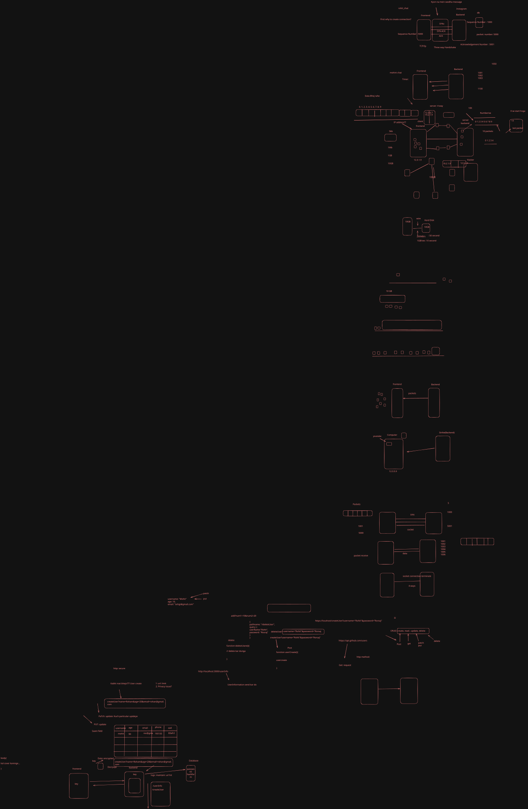
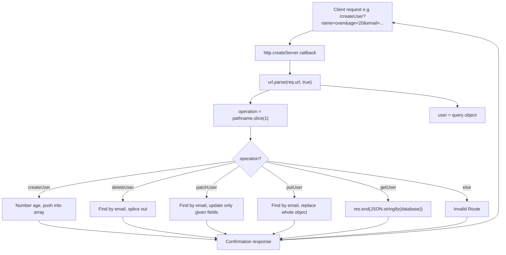

# Day 04 — Building a CRUD "Database" API with Raw Node (In-Memory Users)

## Overview
Day 04 builds a full CRUD-style API with only the built-in `http` and `url` modules — no Express yet. An in-memory array acts as the database, and query strings drive the operations:
- `getUser` — read all users
- `createUser?name=&age=&email=` — create
- `deleteUser?email=` — delete (matched by email as the unique key)
- `patchUser?email=&name=/age=` — partial update (only provided fields)
- `putUser?name=&age=&email=` — full replacement of the matched user

This teaches the semantics behind GET/POST/PATCH/PUT/DELETE before HTTP methods are introduced formally on Day 05.

## Files
| File | What it does |
|---|---|
| `index.js` | Complete user-CRUD server (port 3000). `database` array of 3 seeded user objects; `url.parse(req.url, true)` extracts `operation` (pathname) and `user` (query). Helper functions `createUser`, `deleteUser`, `patchUpdate`, `putUpdate`, and a `getUser` branch that returns the whole DB as JSON. Ends with commented example URLs for every operation. |
| `index2.js` | Heavily commented re-implementation of the same CRUD server with 5 seeded users — explains that the browser sends strings (`age: "20"`), so `createUser` converts age with `Number()`, and walks through how `url.parse` splits path vs query. |
| `second.js` | Small aside: printing messages at code "checkpoints" (line 100/200/300/400) — an intro to thinking about execution order in a long file. |
| `package.json` | Project manifest, `"type": "commonjs"`, main `index.js` (no dependencies — built-ins only). |
| `l4.svg` | Excalidraw class notes diagram (see below). |

## The diagram
An Excalidraw hand-drawn diagram of networking/storage concepts behind client-server apps:
- **Frontend ↔ Backend ↔ db** architecture, with an Instagram-like chat example (`rohit_chat`, `mohini chat`).
- **TCP/IP three-way handshake**: SYN → SYN-ACK → ACK ("First, why create a connection?") and the server-side **4-way** termination.
- Message/data size comparisons (5kb vs 1Mb vs 1GB vs 10GB) and data moving over a **wire** to **Hard Disk** at rated speeds (200MB/s ≈ 50s for 10GB).
- **Chunking**: 10GB is split into numbered packets (0,1,2,…9) — "numberise" them so the receiver knows the order and can detect the last packet. This is the principle behind streaming request bodies on Day 05.

## How the code flows
1. A request arrives; `url.parse(req.url, true)` splits it into `pathname` (e.g. `/createUser`) and a `query` object of strings.
2. `parsed.pathname.slice(1)` strips the leading `/` to get the operation name.
3. The if/else chain dispatches:
   - **getUser** — `res.end(JSON.stringify(database))` returns every record.
   - **createUser** — converts `user.age` with `Number()` (query values are always strings), pushes the object into the array.
   - **deleteUser** — loops the array, matches on `email`, `splice(i, 1)` removes it, `break` stops the scan.
   - **patchUser** — matches on `email`, then updates `name`/`age` **only if those fields were provided** in the query (`if (user.name)` etc.) — the essence of PATCH.
   - **putUser** — matches on `email`, then replaces the whole record with a new object built from the query — the essence of PUT.
4. Each branch `res.end(...)`s a plain-text confirmation and `return`s so the fallback "Invalid Route" never runs.
5. The server keeps running with the mutated array — but only in memory.

## How it works — first principles
- **What is a database, minimally?** An array of objects plus operations on it. CRUD (Create, Read, Update, Delete) is the complete vocabulary of persistence: every real database (MongoDB, Postgres) exposes these four verbs. Day 04 implements them against `Array.push`, `JSON.stringify`, `splice`, and index assignment — so you learn the semantics before the tooling.
- **Why email as the key?** Update/delete need to find *which* record. A primary key must be unique and stable — email plays that role. Indexing by a key is exactly what real databases optimize.
- **PATCH vs PUT, from scratch:** PATCH means "change these fields, keep the rest" (check each field, assign only what's present); PUT means "this is the new record, replace it wholesale" (build a fresh object). Both find the record by key first — the difference is only how much they overwrite.
- **Query values are always strings:** the URL has no types. `age=20` arrives as `"20"`. Forgetting `Number()` is the classic bug (`"20" + 1 = "201"`), which is why `createUser` converts immediately.
- **Why this is not a real database yet:** the array lives in process memory. Restart the server and every create/update/delete vanishes; two users hitting two processes see different data. Persistence (files, then MongoDB) and shared state are the problems later days solve.
- **Networking backdrop (from `l4.svg`):** every one of these requests rides a TCP connection (three-way handshake) and data crosses the wire in numbered chunks — the foundation for reading streamed request bodies in Day 05.

## Flow

```mermaid
flowchart TD
    A[Client request e.g. /createUser?name=oxen&age=20&email=...] --> B[http.createServer callback]
    B --> C["url.parse(req.url, true)"]
    C --> D["operation = pathname.slice(1)"]
    C --> E["user = query object"]
    D --> F{operation?}
    F -- getUser --> G["res.end(JSON.stringify(database))"]
    F -- createUser --> H[Number age, push into array]
    F -- deleteUser --> I[Find by email, splice out]
    F -- patchUser --> J[Find by email, update only given fields]
    F -- putUser --> K[Find by email, replace whole object]
    F -- else --> L["Invalid Route"]
    H --> M[Confirmation response]
    I --> M
    J --> M
    K --> M
    G --> M
    L --> M
    M --> A
```

## Key concepts
- CRUD semantics (Create / Read / Update / Delete) can be modeled with just URLs + query strings before using real HTTP methods.
- PATCH vs PUT: patch updates only supplied fields; put replaces the entire record.
- Email used as the unique identifier (primary key) to find users in the array.
- Query-string values are always strings — convert numbers explicitly (`Number(user.age)`).
- The "database" is just an in-memory array, so all data is lost when the server restarts — motivating real databases later.
- Networking backdrop (from `l4.svg`): TCP three-way handshake, packet numbering, and chunked transfer underlie every HTTP request.

## Notes
No credentials, MongoDB URIs, API keys or passwords appear in this day's code. The email addresses in the seed users (`adf@gmail.com`, etc.) are obviously fake dummy data.
