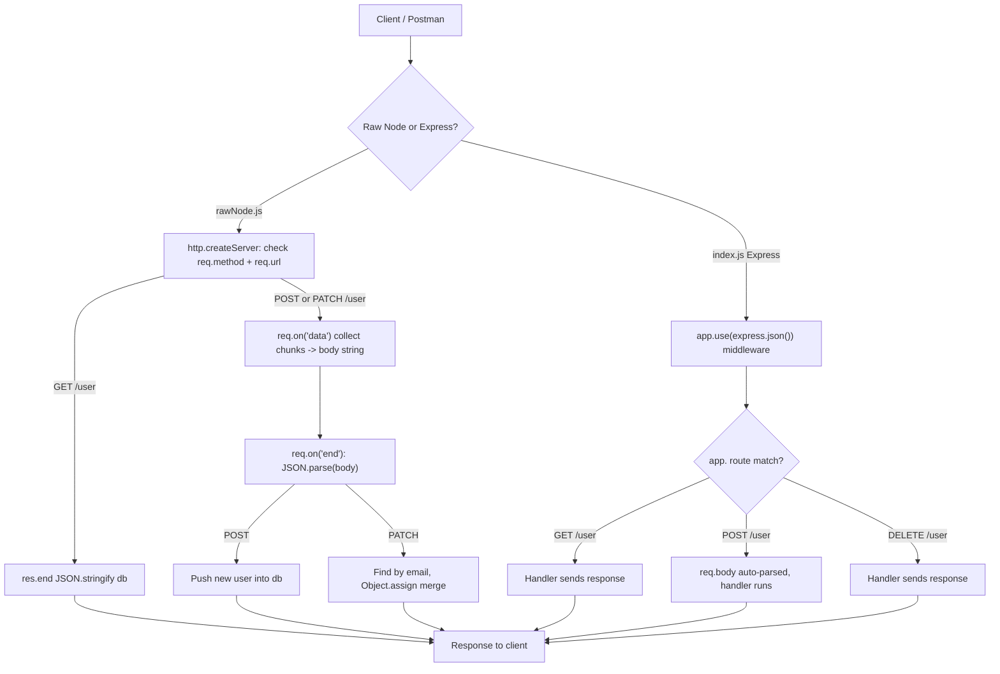

# Day 05 — HTTP Methods (GET/POST/PATCH/PUT/DELETE) with Raw Node, and First Express Server

## Overview
Day 05 upgrades Day 04's URL-based CRUD to **real HTTP methods** and then introduces **Express**:
- `rawNode.js`: a raw `http` server routing on `req.method` + `req.url` — GET returns the user list as JSON, POST/PATCH read the request **body** chunk-by-chunk via `req.on("data")` / `req.on("end")` and `JSON.parse` it (why `req.body` is undefined in raw Node: data arrives in packets asynchronously). PATCH merges fields with `Object.assign`; PUT/DELETE are stubbed; unknown routes return "Invalid Route".
- `index.js`: first **Express** app — `express.json()` middleware to parse bodies, and clean routes `app.get`, `app.post`, `app.delete`, `app.listen(3000)`. Compares with the commented-out raw version above it.
- `reviseRawNode.js`: revision file with the seed `db` array (same users as `rawNode.js`).

## File-by-file explanation
| File | What it does |
|---|---|
| `rawNode.js` | Raw Node CRUD API on `/user` (port 3000): GET returns the in-memory `db` (pretty-printed JSON); POST collects body chunks, parses JSON, pushes a new user; PATCH finds the user by email and merges with `Object.assign`; PUT/DELETE return stub responses; fallback "Invalid Route". Ends with a summary table of method/URL/what-happens. |
| `index.js` | First Express server: `const app = express()`, `app.use(express.json())` middleware, routes for `GET /`, `GET /user`, `POST /user` (logs `req.body`), `DELETE /user`, and `app.listen(3000)`. Top half is the commented raw-Node equivalent for comparison. |
| `reviseRawNode.js` | Revision copy containing the same seed `db` array of five users (name/age/email/amount). |
| `package.json` | Manifest with `"type": "module"` (ESM imports) and dependency `express ^5.2.1`. |

## Code flow

## Key concepts learned
- HTTP methods encode intent: GET = read, POST = create, PATCH = partial update, PUT = full update, DELETE = remove.
- In raw Node the request body arrives as asynchronous data chunks — you must buffer them (`req.on("data")` / `req.on("end")`) before `JSON.parse`; that's why `req.body` doesn't exist without help.
- Express solves this with middleware: `app.use(express.json())` parses the body into `req.body` automatically.
- Express routing (`app.get/post/...`) replaces the long if/else chains of raw Node — path + method matching built in.
- Middleware is the pipeline concept (authentication, rate limiting, body parsing will all be middleware).
- `"type": "module"` lets the code use `import`/`export` instead of `require`.

## Notes
No credentials, MongoDB URIs, API keys, emails or passwords appear in this day's code. The user records in the seed `db` (e.g. `roh@gamil.com`, `chandan32@gmail.com`) are clearly fake dummy data.
