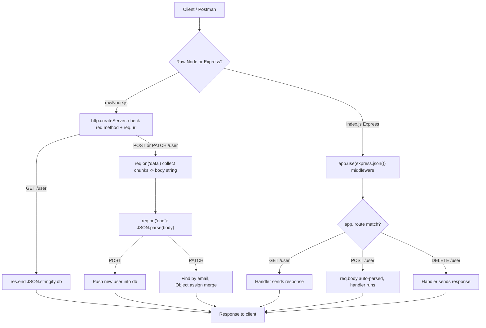

# Day 05 — HTTP Methods (GET/POST/PATCH/PUT/DELETE) with Raw Node, and First Express Server

## Overview
Day 05 upgrades Day 04's URL-based CRUD to **real HTTP methods** and then introduces **Express**:
- `rawNode.js`: a raw `http` server (ESM imports) routing on `req.method` + `req.url` — GET returns the user list as pretty-printed JSON, POST/PATCH read the request **body** chunk-by-chunk via `req.on("data")` / `req.on("end")` and `JSON.parse` it (why `req.body` is undefined in raw Node: data arrives in packets asynchronously). PATCH merges fields with `Object.assign`; PUT/DELETE return stub responses; unknown routes return "Invalid Route". Ends with a method/URL summary table. (Caveats worth noticing: `res.end` fires before the `end` event handles the body, and `Object.assign(findUser, ...)` would crash if no user matched — both are teaching moments, fixed properly by frameworks and better code.)
- `index.js`: first **Express** app — `express.json()` middleware to parse bodies, and clean routes `app.get`, `app.post`, `app.delete`, `app.listen(3000)`. Compares with the commented-out raw version above it (which also sketches the middleware idea: authentication, rate limiting).
- `reviseRawNode.js`: revision file with the seed `db` array (same five users as `rawNode.js`).

## Files
| File | What it does |
|---|---|
| `rawNode.js` | Raw Node CRUD API on `/user` (port 3000): GET returns the in-memory `db` (pretty-printed with `JSON.stringify(db, null, 2)`); POST collects body chunks, parses JSON, pushes a new user; PATCH finds the user by email and merges with `Object.assign`; PUT/DELETE return stub responses; fallback "Invalid Route". Ends with a summary table of method/URL/what-happens. |
| `index.js` | First Express server: `const app = express()`, `app.use(express.json())` middleware, routes for `GET /`, `GET /user`, `POST /user` (logs `req.body`), `DELETE /user`, and `app.listen(3000)`. Top half is the commented raw-Node equivalent for comparison. |
| `reviseRawNode.js` | Revision copy containing the same seed `db` array of five users (name/age/email/amount). |
| `package.json` | Manifest with `"type": "module"` (ESM imports) and dependency `express ^5.2.1`. |

## How the code flows
**Raw Node (`rawNode.js`):**
1. `http.createServer` callback inspects **both** `req.method` and `req.url` — e.g. `POST /user` vs `GET /user` now hit different branches of the same route path.
2. GET just stringifies the seed `db` and ends the response.
3. POST/PATCH must wait for the body: `req.on("data", chunk => body += chunk)` accumulates the arriving packet chunks into one string; `req.on("end", ...)` fires when all chunks arrived, then `JSON.parse(body)` produces the user object.
4. POST pushes the parsed user into `db`; PATCH finds the record by `email` (`db.find(u => u.email == user.email)`) and merges supplied fields with `Object.assign`.
5. PUT and DELETE currently just reply with confirmation stubs; anything unmatched gets "Invalid Route".

**Express (`index.js`):**
1. `express()` creates the app; `app.use(express.json())` registers a middleware that reads the body stream and sets `req.body` before any handler runs.
2. `app.get("/user")`, `app.post("/user")`, `app.delete("/user")`, `app.get("/")` each register a handler for one method+path pair — replacing the if/else chains of raw Node.
3. `app.listen(3000)` starts the server; handlers respond with `res.send(...)`.

## How it works — first principles
- **Why HTTP methods?** Day 04 stuffed the verb into the URL (`/createUser?...`). But HTTP already has verbs: GET, POST, PATCH, PUT, DELETE. Method + URL together identify *what to do on what resource* — this is the core of REST. Read-only GETs can be cached; writes get their own semantics.
- **Where is the body in raw Node?** A request body is not a field — it's a **stream**. The network delivers it as chunks (the packet numbering from Day 04's diagram), and Node emits them as `data` events at unpredictable times. Until the `end` event, you cannot know you have the whole payload. That's why `req.body` is `undefined` in raw Node and why you buffer chunks manually. Notice the teaching bug: `res.end("created")` runs immediately, while `req.on("end")` completes later — in real code you send the response *inside* `end`.
- **Why middleware?** Body parsing is identical plumbing for every route. Express extracts it into `app.use(express.json())`: a function that runs first on every request, buffers the stream, parses JSON, and attaches `req.body`. One line replaces the `on("data")/on("end")` dance — and the same slot will later hold authentication, rate limiting, logging, etc. (sketched in the comments).
- **Why Express routing wins:** raw Node matches `req.method == "POST" && req.url == "/user"` by hand. `app.post("/user", handler)` declares the same thing declaratively, adds 404 handling and pattern matching for free, and scales to hundreds of routes.
- **PATCH via `Object.assign`:** merging the parsed body over the found record copies only the fields present — the runtime version of Day 04's per-field `if (user.name)` checks. (Guard the `find` result in real code: assigning over `undefined` throws.)

## Flow

```mermaid
flowchart TD
    A[Client / Postman] --> B{Raw Node or Express?}
    B -->|rawNode.js| C["http.createServer: check req.method + req.url"]
    C -->|GET /user| D[res.end JSON.stringify db]
    C -->|POST or PATCH /user| E["req.on('data') collect chunks -> body string"]
    E --> F["req.on('end'): JSON.parse(body)"]
    F -->|POST| G[Push new user into db]
    F -->|PATCH| H[Find by email, Object.assign merge]
    B -->|index.js Express| I["app.use(express.json()) middleware"]
    I --> J{app.<method> route match?}
    J -->|GET /user| K[Handler sends response]
    J -->|POST /user| L["req.body auto-parsed, handler runs"]
    J -->|DELETE /user| M[Handler sends response]
    D --> N[Response to client]
    G --> N
    H --> N
    K --> N
    L --> N
    M --> N
```

## Key concepts
- HTTP methods encode intent: GET = read, POST = create, PATCH = partial update, PUT = full update, DELETE = remove.
- In raw Node the request body arrives as asynchronous data chunks — you must buffer them (`req.on("data")` / `req.on("end")`) before `JSON.parse`; that's why `req.body` doesn't exist without help (and why the response should be sent inside `end`, not before it).
- Express solves this with middleware: `app.use(express.json())` parses the body into `req.body` automatically.
- Express routing (`app.get/post/...`) replaces the long if/else chains of raw Node — path + method matching built in.
- Middleware is the pipeline concept (authentication, rate limiting, body parsing will all be middleware).
- `"type": "module"` lets the code use `import`/`export` instead of `require`.

## Notes
No credentials, MongoDB URIs, API keys, emails or passwords appear in this day's code. The user records in the seed `db` are clearly fake dummy data (placeholder-style emails like `<USER>@gamil.com`).
