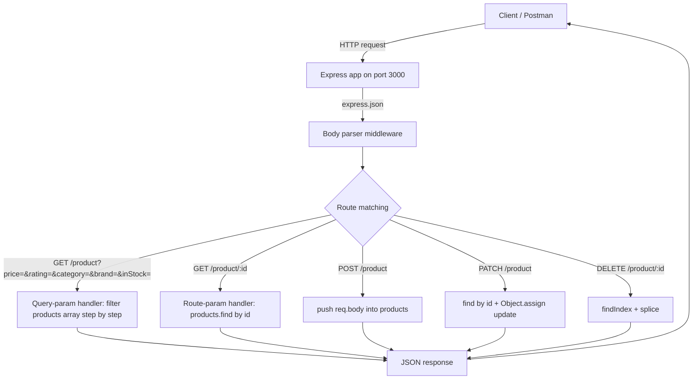
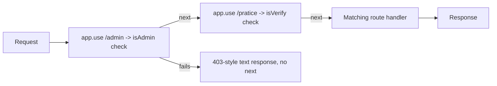

# Day 06 — Express Routing Deep Dive: Query Params, Route Params & Full CRUD

## Overview

Day 06 practices Express routing on an in-memory product catalog (50 items in `data.js`). The main lesson (`index.js`) builds a complete CRUD API for products and demonstrates the difference between **query parameters** (`?price=5000&brand=Apple`) for filtering and **route parameters** (`/product/:id`) for identifying a single resource. `midLearning.js` is a playground for **middleware** (`app.use`) with simple `isAdmin` / `isVerified` guard checks. Everything runs on port 3000 with Express 5, using a JSON body parser (`express.json()`).

## File-by-file explanation

| File | Purpose |
|---|---|
| `index.js` | Main lesson: an Express server with a full product CRUD API. Shows query-param filtering (`price`, `rating`, `category`, `brand`, `inStock` combined), route-param lookup (`/product/:id`), and `PATCH`/`POST`/`DELETE` handlers that mutate the in-memory array. Also contains a commented-out first attempt showing how the filter endpoint evolved from a single `price` filter into a multi-filter version (note: the older duplicate `app.get("/product")` appears later in the file and is shadowed by the multi-filter version registered first). |
| `data.js` | Exports a `products` array of 50 dummy products (mobiles, laptops, TVs, earbuds, watches, cameras, headphones, accessories, speakers, tablets) with `id`, `name`, `price`, `rating`, `category`, `brand`, `inStock` fields. Acts as a fake database. |
| `midLearning.js` | Middleware practice file (two versions: commented-out first pass and a live second pass). Demonstrates `app.use("/admin", ...)` and `app.use("/pratice", ...)` as gatekeeper middleware using `next()`, prefix matching of `app.use`, and route-parameter routes (`/pratice/:id`). Contains small bugs worth learning from: `app.get("/pratice:id", ...)` is missing the `/` before `:id`, and the admin middleware calls `next()` even when access is denied (in the commented version). |
| `reviseIndex.js` | Empty (placeholder file — nothing implemented yet). |
| `package.json` | ES-module Node project (`"type": "module"`) depending on `express ^5.2.1`. Entry point `index.js`. |

## Code flow

Middleware flow in `midLearning.js`:

## Key concepts learned

- **Query parameters** (`req.query`) — used for *filtering* a collection; several filters are chained (`price`, `rating`, `category`, `brand`, `inStock`) by successively calling `.filter()`.
- **Route parameters** (`req.params`) — used to *identify* one resource (`:id`); the `:` prefix makes a segment accept anything.
- **Full CRUD verbs**: `GET` (read), `POST` (create via `req.body`), `PATCH` (partial update via `Object.assign`), `DELETE` (remove via `findIndex` + `splice`).
- **`express.json()`** middleware is required so `req.body` is parsed from JSON.
- **Middleware with `app.use`**: runs on path prefixes, uses `next()` to pass control; forgetting `return` after sending a response (or calling `next()` after responding) causes headers-already-sent style bugs.
- Route registration order matters: two `app.get("/product", ...)` handlers exist and only the first one runs.
- Small correctness notes found in the code: the `DELETE` handler uses `index > 0`, so deleting the first product (index 0) fails; comparisons use `==` (loose equality) so string params match number ids.

## Notes

- No credentials or external services are used in Day 06 — everything is in-memory.
- Run with `node index.js` (or `node midLearning.js` for the middleware lesson); server listens on port 3000.
