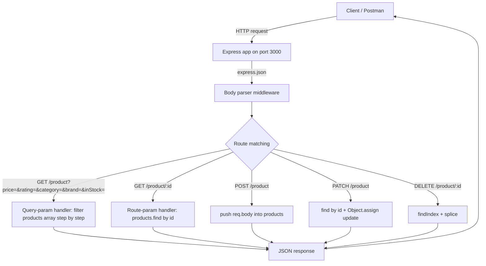
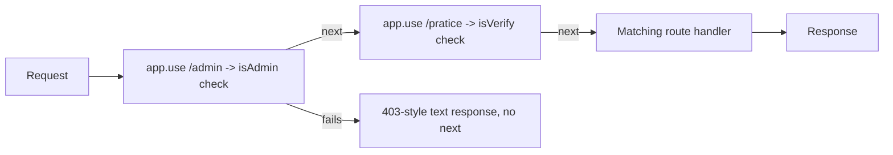

# Day 06 — Express Routing Deep Dive: Query Params, Route Params & Full CRUD

## Overview

Day 06 practices Express routing on an in-memory product catalog (50 items in `data.js`). The main lesson (`index.js`) builds a complete CRUD API for products and demonstrates the difference between **query parameters** (`?price=5000&brand=Apple`) for filtering and **route parameters** (`/product/:id`) for identifying a single resource. `midLearning.js` is a playground for **middleware** (`app.use`) with simple `isAdmin` / `isVerified` guard checks. Everything runs on port 3000 with Express 5, using a JSON body parser (`express.json()`).

## Files

| File | Purpose |
|---|---|
| `index.js` | Main lesson: an Express server with a full product CRUD API. Shows query-param filtering (`price`, `rating`, `category`, `brand`, `inStock` combined), route-param lookup (`/product/:id`), and `PATCH`/`POST`/`DELETE` handlers that mutate the in-memory array. Also contains a commented-out first attempt showing how the filter endpoint evolved from a single `price` filter into a multi-filter version (note: the older duplicate `app.get("/product")` appears later in the file and is shadowed by the multi-filter version registered first). |
| `data.js` | Exports a `products` array of 50 dummy products (mobiles, laptops, TVs, earbuds, watches, cameras, headphones, accessories, speakers, tablets) with `id`, `name`, `price`, `rating`, `category`, `brand`, `inStock` fields. Acts as a fake database. |
| `midLearning.js` | Middleware practice file (two versions: commented-out first pass and a live second pass). Demonstrates `app.use("/admin", ...)` and `app.use("/pratice", ...)` as gatekeeper middleware using `next()`, prefix matching of `app.use`, and route-parameter routes (`/pratice/:id`). Contains small bugs worth learning from: `app.get("/pratice:id", ...)` is missing the `/` before `:id`, and the admin middleware calls `next()` even when access is denied (in the commented version). |
| `reviseIndex.js` | Empty (placeholder file — nothing implemented yet). |
| `package.json` | ES-module Node project (`"type": "module"`) depending on `express ^5.2.1`. Entry point `index.js`. |

## How the code flows

A request enters Express, passes through the body-parser middleware, and Express walks its registered routes **top to bottom** until one matches. This is why the duplicate `app.get("/product")` matters: only the first registration ever runs. Handlers either respond with `res.json(...)` (data) or `res.send(...)` (text) and never call `next()`, so the response goes straight back to the client. In `midLearning.js`, `app.use("/prefix", ...)` middleware runs first for any path starting with that prefix and only reaches the route handler if it calls `next()`.

## How it works — first principles

- **An HTTP request is just text**: `METHOD /path?query body`. Express's job is to parse that text and hand you friendly objects: `req.params`, `req.query`, `req.body`. Nothing magical — without `express.json()` the body stays an unread stream, which is why the parser is registered first.
- **Routing = ordered matching.** `app.get("/product/:id", ...)` compiles the `:id` segment into a pattern that matches anything, and stores `id` in `req.params`. `req.query` is parsed from whatever follows `?` in the URL. A request matches the *first* route whose pattern fits — which is exactly why the second (single-filter) `app.get("/product")` in `index.js` is dead code.
- **Query params vs route params** answer two different questions: query params say "which subset?" (filter a collection, `GET /product?brand=Apple`), route params say "which one?" (identify a resource, `GET /product/3`). REST APIs lean on this split.
- **CRUD maps to HTTP verbs**: POST creates (`products.push(req.body)`), GET reads (`filter`/`find`), PATCH partially updates (`Object.assign` copies body fields onto the found object), DELETE removes (`findIndex` + `splice`). Because `data.js` is just an in-memory array, all four verbs mutate the same live array — restart the server and every change is gone, which is the first hint that you need persistence (Day 08).
- **Middleware = functions in the request pipeline.** `app.use("/admin", guard)` runs for every request whose path starts with `/admin`; calling `next()` hands control to whatever matches next, responding instead short-circuits the pipeline. Forgetting to `return` after responding (or calling `next()` after responding) tries to send two responses to one request — the classic "headers already sent" error.
- **Loose equality quirks**: `p.id == req.params.id` works because `==` coerces `"3"` to `3`, but it also hides bugs; and `if (index > 0)` in the DELETE handler means index 0 (the first product) can never be deleted.

## Flow

```mermaid
flowchart TD
    C[Client / Postman] -->|HTTP request| E[Express app on port 3000]
    E -->|express.json| P[Body parser middleware]
    P --> R{Route matching}
    R -->|GET /product?price=&rating=&category=&brand=&inStock=| Q[Query-param handler: filter products array step by step] --> J[JSON response]
    R -->|GET /product/:id| RP[Route-param handler: products.find by id] --> J
    R -->|POST /product| PO[push req.body into products] --> J
    R -->|PATCH /product| PA[find by id + Object.assign update] --> J
    R -->|DELETE /product/:id| D[findIndex + splice] --> J
    J --> C
```

Middleware flow in `midLearning.js`:

```mermaid
flowchart LR
    Req[Request] --> Use1[app.use /admin -> isAdmin check] -->|next| Use2[app.use /pratice -> isVerify check] -->|next| H[Matching route handler] --> Res[Response]
    Use1 -->|fails| Deny[403-style text response, no next]
```

## Key concepts learned

- **Query parameters** (`req.query`) — used for *filtering* a collection; several filters are chained (`price`, `rating`, `category`, `brand`, `inStock`) by successively calling `.filter()`.
- **Route parameters** (`req.params`) — used to *identify* one resource (`:id`); the `:` prefix makes a segment accept anything.
- **Full CRUD verbs**: `GET` (read), `POST` (create via `req.body`), `PATCH` (partial update via `Object.assign`), `DELETE` (remove via `findIndex` + `splice`).
- **`express.json()`** middleware is required so `req.body` is parsed from JSON.
- **Middleware with `app.use`**: runs on path prefixes, uses `next()` to pass control; forgetting `return` after sending a response (or calling `next()` after responding) causes headers-already-sent style bugs.
- Route registration order matters: two `app.get("/product", ...)` handlers exist and only the first one runs.
- Small correctness notes found in the code: the `DELETE` handler uses `index > 0`, so deleting the first product (index 0) fails; comparisons use `==` (loose equality) so string params match number ids.

## Notes

- No credentials or external services are used in Day 06 — everything is in-memory.
- Run with `node index.js` (or `node midLearning.js` for the middleware lesson); server listens on port 3000.
