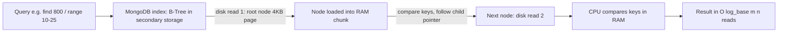

# Day 07 — MongoDB Architecture: Why B-Trees? (From Excel Sheets to B-Trees)

## Overview

Day 07 contains no code — it is a hand-drawn **Excalidraw whiteboard** (`MongoDB Architecture.excalidraw.svg` / `.png`, plus a copy `l7.svg`) that works out *how MongoDB stores and searches data efficiently*. It starts with the naive idea of storing data in an Excel sheet, walks through sorted arrays → Binary Search Trees → AVL trees, and arrives at the **B-Tree/B+ tree** that MongoDB (via WiredTiger-style indexes) actually uses, explaining disk reads (4 KB pages), RAM buffering, and Big-O complexity of every data structure along the way.

The same drawing in SVG form (identical content, vector format):

## What the diagram explains, section by section

1. **Why not an Excel sheet?**
   - Data coming from the frontend (e.g. users with `email`, `age`, `name`, `amount`: rows like `dep@gmail.com 20 Deepa 15478`, `hca@gmail.com 41 Chandan 352226`, `ro@gmail.com 21 Rohit 3426356`) could be dumped into an Excel-like table in the backend.
   - But Excel is only for small data ("1000 or 500 rows only bcz excelsheet is not ready for large database") — a real app needs to handle 1 lakh+ rows and search by email, delete, find, etc. Unsorted storage means searching is **O(n)** — not optimized.

2. **Sorted array** — search improves with **binary search: O(log n)**, but insert/delete are **O(n)** (find position, then shift elements; delete traverses the whole array until the target block then shifts).

3. **BST → AVL tree** — the "wasted power of the disk" is solved by tree structures. Worst case of an unbalanced binary tree is a long chain (`2, 3, 83, 103, 525, 4456`), so the diagram shows balancing into an AVL tree where search/insert/update/delete are all **O(log n)**.

4. **Hashing data structure** — great for *exact match* lookups (**O(1)** create/insert/update/delete/search: "SO HASH IS USED FOR EXACT DATA"), but useless for **range queries** ("user wants names of people whose age is between 10–20" → need sorted order). Range query cost on a tree is **O(log n + k)** where k is the number of keys returned (find the starting node, then in-order traversal of the relevant leaves).

5. **B-Tree (the winner)** — the big blue box shows a 3-level B-tree of sorted keys (`500,1000,200 | 600,800,900,1000,1200,1400 | 1300,1350,1400 | 2000,3000,2000,1400...`), with:
   - `key : m`, `children : m + 1` (each node holds up to m keys and m+1 children; the example uses m = 3, i.e. order-4).
   - Complexities: `search / insert / update / delete: log_base(m) n` — a high branching factor keeps the tree shallow.
   - **Disk-read math**: each node is sized to **1 KB** while a disk reads **4 KB** per read; packing a whole node (many keys) into one disk block uses the full 4 KB page instead of wasting it. Example: "task is find 800" → "we can got the value of 800 in the 2 disk reads" (root → leaf).
   - "The complete B-TREE is present in the secondary storage to use this"; flow is always **root to children**; "For range query → 10–25" works by finding the start leaf then traversing leaves in order.

6. **"LET'S DISCUSS AMAZING THINGS"** — two CPU/RAM/Secondary-storage panels tie it together: the CPU processes instructions, needed pages are pulled from **secondary storage** into **RAM** in 4 KB chunks ("data can't go to the RAM here the 'chunk'"), the requested node is searched in RAM, and MongoDB persists everything to secondary storage ("MongoDB → database → permanently storage device (secondary storage)"). This is the internal architecture that makes MongoDB's indexed reads fast.

7. **Why MongoDB at all** — conclusion: "So we need MongoDB for efficient data handle" — optimized storage + B-tree indexes for search, exact-match (hash) and range queries alike.

## Code flow

There is no code this day, so the "flow" is the conceptual read path the diagram teaches:

## Key concepts learned

- Why plain storage (Excel/array) doesn't scale: O(n) search, O(n) insert/delete.
- Sorted array + binary search: search O(log n) but writes stay O(n).
- BST/AVL fix write complexity to O(log n) but are pointer-heavy and not disk-friendly.
- Hashing gives O(1) exact-match but cannot do range queries.
- **B-Tree properties**: up to m keys per node, m+1 children, height log_base(m) n — shallow trees mean few disk reads.
- **Disk page economy**: nodes sized ~1 KB inside 4 KB disk pages; each level of the tree = one disk read; range queries are O(log n + k).
- RAM acts as a buffer for disk pages; MongoDB persists data on secondary storage (durable) while hot pages live in RAM.

## Notes

- No code, no server, no credentials in Day 07.
- `l7.svg` is a duplicate copy of the Excalidraw export (same XML content, different filename).
- The .png can be opened directly in this repo to view the full whiteboard; the SVG contains ~180 text labels of the same notes.
