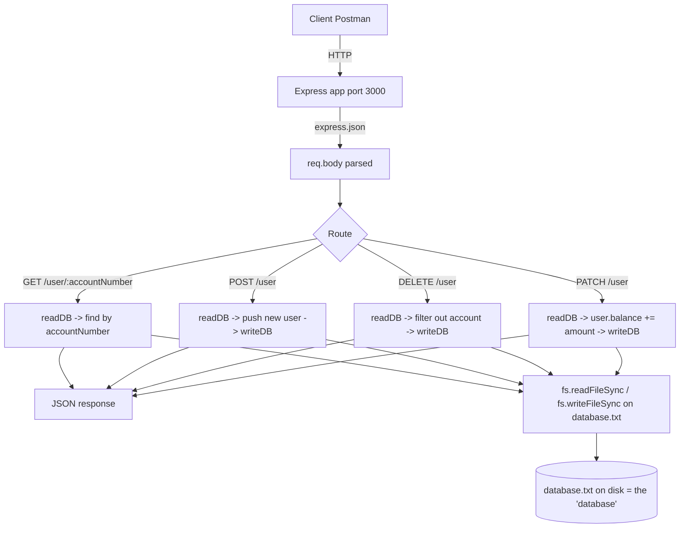

# Day 08 — Building a "Database" from a Text File (fs-based CRUD API)

## Overview

Day 08 answers the question "what does a database actually do for us?" by building a bank-account API where the "database" is a plain **`database.txt` file** read/written with Node's `fs` module. The Express server (`index.js`) implements full CRUD (get by account number, create, delete, update balance) over a JSON array persisted to disk — showing why manual file reads/writes on every request are clunky and setting up the motivation for MongoDB in Day 09+.

## File-by-file explanation

| File | Purpose |
|---|---|
| `index.js` | Express server on port 3000. Defines two helper functions: `readDB()` (reads `./database.txt` as UTF-8 and `JSON.parse`s it into an array) and `writeDB(data)` (`JSON.stringify(data, null, 2)` back to the file). Routes: `GET /` welcome, `GET /user/:accountNumber` (find one account), `POST /user` (push and persist a new account), `DELETE /user` (filter out the matching account by `req.body.accountNumber`), `PATCH /user` (add `req.body.balance` to the found account's balance and persist). The bottom of the file contains commented Postman test payloads (create/update/delete bodies). |
| `database.txt` | The fake database: a JSON array of 4 bank accounts (`name`, `accountNumber`, `city`, `age`, `balance`) — e.g. Chandan Kumar Dalai (Bhubaneswar), Danda Panigrahi (Delhi), Ankita Biswal (Puri), Dipsa Biswal (Cuttack). Mutated by the API on every POST/PATCH/DELETE. |
| `package.json` | ES-module project (`"type": "module"`) with `express ^5.2.1`. No DB driver yet. |

## Code flow

## Key concepts learned

- A database is fundamentally **persistent storage + read/write operations** — here simulated with `fs.readFileSync` / `fs.writeFileSync` on every request.
- **Encoding matters**: `fs.readFileSync(path, "utf-8")` returns a string; `JSON.parse` turns it into data; `JSON.stringify(data, null, 2)` pretty-prints it back.
- **Full CRUD over HTTP**: GET (read), POST (create), PATCH (partial update — here a balance deposit), DELETE.
- `express.json()` middleware is required to read `req.body`.
- Route param (`:accountNumber`) for one-resource reads vs body payload for update/delete in this design (the delete/update take the account number in the body, unlike Day 06's param style — both patterns are valid).
- Pain points that motivate real databases: the whole file is rewritten for every change, no indexing/validators/atomicity, and no concurrent-write safety — hence MongoDB/Mongoose next.

## Notes

- No credentials used; the only "connection string" is the local file path `./database.txt`.
- Postman examples in code: POST body `{ "name": "Ankita Biswal", "accountNumber": "39852", "city": "Puri", "age": 20, "balance": 20000 }`; PATCH body `{ "accountNumber": "3445", "balance": 10000 }` (this *adds* to balance, it does not replace it); DELETE body `{ "accountNumber": "3445" }`.
- Minor bug to notice: `DELETE /user/` has a trailing slash and takes the id from the body, and `PATCH /user` crashes if the account doesn't exist (`user.balance` of undefined).
