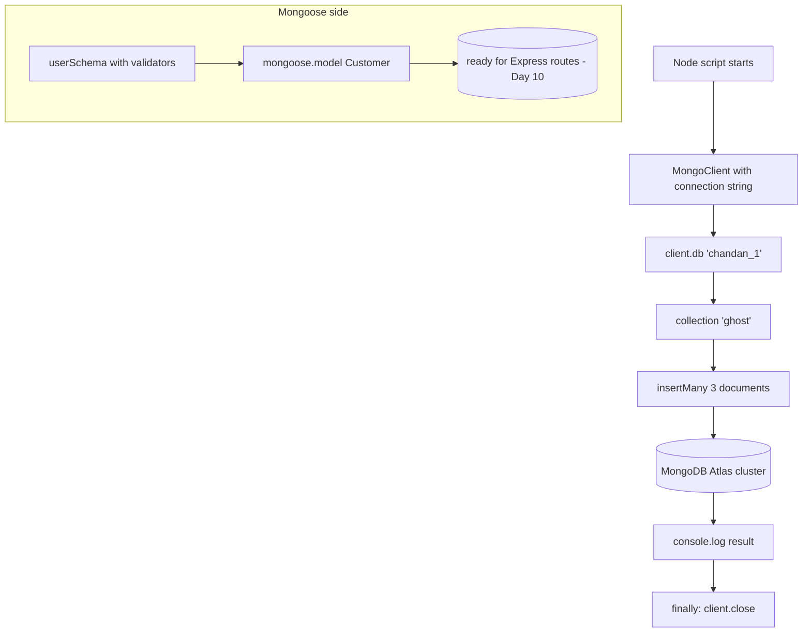

# Day 09 — First Steps with MongoDB & Mongoose (Connection, insertMany, Schema Basics)

## Overview

Day 09 is the jump from the fake file-database to a real **MongoDB Atlas** cluster. The root project uses the official **`mongodb` driver** to run `insertMany` into a collection. The `MongooseLearning/` subproject introduces **Mongoose**: defining a `userSchema` with validators (required, minLength/maxLength, trim, min/max) and compiling it into a `Customer` model. This is the "hello world" of schema-based MongoDB access in Node.

## Files

| File | Purpose |
|---|---|
| `index.js` (root) | Pure **mongodb driver** example (`runGetStarted`): creates a `MongoClient` from a connection string (credentials redacted), gets database `chandan_1`, collection `ghost`, and inserts three inventory documents (`journal`, `mat`, `mousepad` — each with `qty`, `tags` array and a nested `size` object) via `insertMany`. Closes the client in a `finally` block. Demonstrates: connection string, `client.db()`, `collection()`, async/await, and graceful close. |
| `MongooseLearning/index.js` | Empty placeholder (schema file is the lesson; routes come in Day 10). |
| `MongooseLearning/buildSchema.js` | Defines `userSchema = new mongoose.Schema({...})` for a bank customer: `name` (String, required, minLength 3, maxLength 20, `trim: true`), `accountNumber` (Number, required), `city` (String, trimmed, length limits), `age` (Number, min 18, max 100), `balance` (Number, min 0, required), `accountType` (String, required). Schema option `{ timestamps: true }` adds `createdAt`/`updatedAt`. Compiles it with `mongoose.model("Customer", userSchema)` and exports the model. |
| `MongooseLearning/package.json` | Depends on `express ^5.2.1` and `mongoose ^9.9.2`, ES modules. |
| `package.json` (root) | Depends on `mongodb ^7.5.0` — the raw driver, no Mongoose. |

## How the code flows

The root script is a one-shot program, not a server: build a client, run one `insertMany`, close the client in `finally` (so the connection is released even if the insert throws), and the process exits. The Mongoose side runs the opposite order — define the schema, compile the model — and stops there; the model is exported but nothing connects or listens yet (that wiring arrives in Day 10).

## How it works — first principles

- **Connecting to a database is opening a socket.** The URI `mongodb+srv://<username>:<password>@<cluster>.mongodb.net/` (in the code the real credentials are dummy/expired — never reproduce or commit a live one) says *where* the cluster is and *who you are*. `new MongoClient(uri)` doesn't connect yet; the driver connects lazily on the first operation, and `client.close()` in `finally` guarantees the socket is released whatever happens.
- **The hierarchy is namespaces all the way down**: deployment (cluster) → database (`client.db('chandan_1')`) → collection (`database.collection('ghost')`) → document (BSON). A database and collection need not be created in advance — the first insert materializes them.
- **Documents beat rows for real-world data.** Each inserted document carries its own `tags` array and a nested `size` object — no join tables, no fixed columns. Two documents in the same collection can have different shapes; this flexibility is the defining feature of a document database.
- **Why schemas at all, then?** Flexibility cuts both ways: nothing stops `balance: "abc"` from being saved. Mongoose's answer is to put a validation gate *in front of* MongoDB in your code: a Schema declares each field's type and rules (`required`, `minLength`/`maxLength`, `trim`, `min`/`max`), and `{ timestamps: true }` auto-maintains `createdAt`/`updatedAt`.
- **A model is a compiled schema.** `mongoose.model("Customer", userSchema)` produces a constructor-like object wired to a `customers` collection (Mongoose lowercases and pluralizes the name). From Day 10 onward, every query goes through this model, so validation applies to every write.
- **Raw driver vs Mongoose**: the `mongodb` driver speaks raw documents (no validation, total freedom); Mongoose is a thin ODM layer on top adding schema, validation, casts and a model API. Day 09 shows both side by side before committing to Mongoose.

## Flow

```mermaid
flowchart TD
    A[Node script starts] --> B[MongoClient with connection string]
    B --> C[client.db 'chandan_1']
    C --> D[collection 'ghost']
    D --> E[insertMany 3 documents]
    E --> F[(MongoDB Atlas cluster)]
    F --> G[console.log result]
    G --> H[finally: client.close]

    subgraph Mongoose side
        S[userSchema with validators] --> M[mongoose.model Customer]
        M --> App[(ready for Express routes - Day 10)]
    end
```

## Key concepts learned

- **MongoDB hierarchy**: deployment/cluster → database → collection → document (BSON), and how that maps to `client.db('db').collection('coll')`.
- **Connection string / MongoClient** lifecycle: create client → operate → `await client.close()` in `finally`.
- **Documents are JSON-like**: supports nested objects (`size: {h, w, uom}`) and arrays (`tags`), unlike a flat SQL row.
- **Mongoose Schema**: field types plus declarative validators — `required`, `minLength`/`maxLength`, `min`/`max`, `trim`.
- **`{ timestamps: true }`** auto-manages `createdAt` and `updatedAt` on every document.
- **Model = compiled schema**: `mongoose.model("Customer", userSchema)` gives a class-like object (conventionally capitalized, singular) that maps to a `customers` collection in MongoDB and exposes CRUD methods (`create`, `find`, `findOne`, … used in Day 10).
- Difference between the raw `mongodb` driver (schema-less, direct queries) and **Mongoose** (schemas, validation, model API).

## Notes

- The MongoDB Atlas connection string in `index.js` contains a username/password pair (user `chandanzx1`, cluster `cluster0.bpfqkoy.mongodb.net`). **These are dummy/expired credentials and have been redacted here — treat any committed URI as leaked and rotate it.** Safe form: `mongodb+srv://<username>:<password>@<cluster>.mongodb.net/`.
- Run with `node index.js` (root) after `npm install`; MongooseLearning is a separate npm project with its own install.
