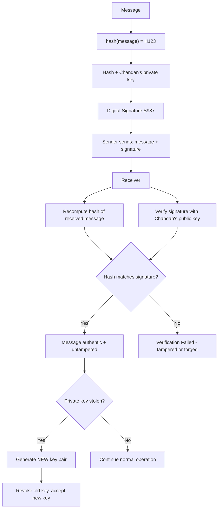

# Day 11 — Digital Signatures (Node.js Process Notes)

## Overview
Day 11 is a single diagram: `Process.svg`. Despite the filename suggesting the Node.js *Process* object, the diagram actually walks through **digital signatures** — how a message is hashed, signed with the sender's private key, verified with the sender's public key, and why each step protects against tampering and forgery. It then covers key compromise and key rotation.

## File-by-file explanation
- **Process.svg** — A hand-drawn (Excalidraw-style) diagram with the following narrative:
  1. `message → Hash`, then `Hash + Sender's private key → Digital Signature`.
  2. Sender sends **message + signature** together.
  3. Receiver hashes the received message and verifies the signature using the **sender's public key**.
  4. Worked example: message `Pay ₹1000 to user 25`, `hash(message) = H123`, `H123 signed with Chandan's private key → S987`. Receiver recomputes the hash (still `H123`) and verifies `S987` with Chandan's public key → proves the message came from Chandan and was not changed.
  5. Attack analysis:
     - **Attacker edits the message** (`₹1000 → ₹7000`): the recomputed hash no longer matches the signature → *"Verification Failed"*.
     - **Attacker fakes a signature**: impossible without Chandan's private key.
     - **Private key stolen**: the system cannot distinguish Chandan from the attacker — the fundamental problem. Recovery = generate a **NEW key pair**, **revoke** the old key, and accept the new one.

## Code flow

## Key concepts
- **Digital signature** = hash of the message encrypted (signed) with the sender's **private key**; verified by anyone with the sender's **public key**.
- Provides **authenticity** (sender identity), **integrity** (no tampering), and **non-repudiation**.
- A plain hash detects accidental corruption; a signature detects **malicious** modification.
- Key compromise is unrecoverable cryptographically — mitigation is key **revocation + rotation**.
- This is exactly how TLS certificates, JWT signatures (asymmetric variants), and code signing work.

## Notes
- The diagram's example keys, hashes (`H123`, `S987`) and payment amounts are purely illustrative placeholders, not real credentials.
