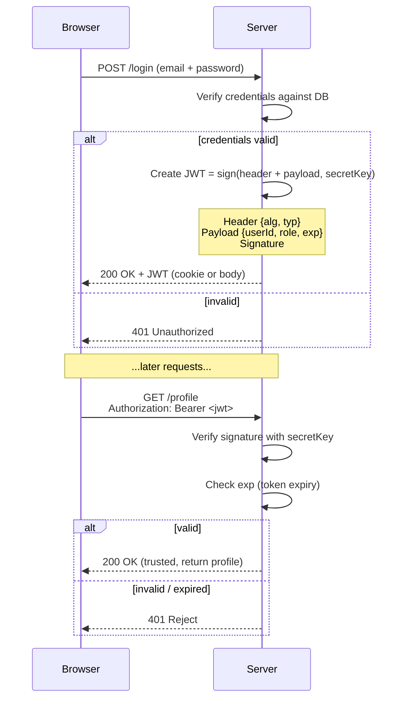
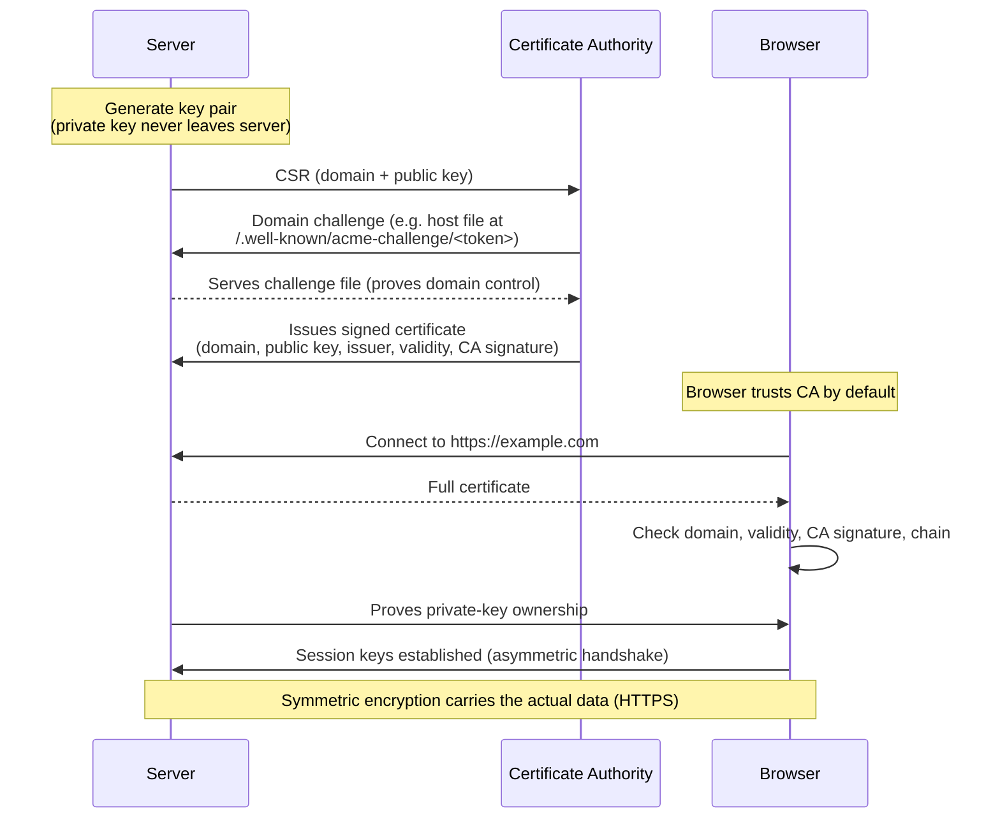

# Day 12 — Authentication: Encoding/Encryption/Hashing, TLS/HTTPS and JWT

## Overview
Day 12 contains two large hand-drawn diagrams:

- **Uthentication.svg** — the cryptography foundations behind authentication: encoding vs encryption vs hashing, symmetric vs asymmetric encryption, password hashing with **salt & pepper**, data integrity with **hash vs HMAC**.
- **JWT.svg** — how HTTPS/TLS works (including how certificates are issued by a CA) and the **JWT (JSON Web Token)** authentication flow.

## File-by-file explanation

### Uthentication.svg
1. **Encoding vs Encryption vs Hashing**
   - *Encoding* (`Hello → SGVsbG8=`): changes format for storage/transfer/display; **not secret**, trivially decodable.
   - *Encryption* (`Plain text + Key → Cipher text`): keeps data **secret**; reversible only with the key.
   - *Hashing* (`SHA-256` etc.): one-way **fingerprint** for checking data; cannot be reversed.
2. **Symmetric encryption** — one shared secret key does both encryption and decryption. Very fast, used for bulk data (files, video, DB records, disk encryption, HTTPS data transfer). Common algorithm: **AES**. Problem: *how do two parties share the key over a network without an attacker seeing it?*
3. **Asymmetric encryption** — a key pair: **public key** (share with everyone) + **private key** (keep secret). To send a secret to Rohit, Chandan encrypts with *Rohit's public key*; only Rohit's *private key* decrypts. Slower, so in practice both are combined: **asymmetric to establish trust/exchange keys, symmetric to move the actual data** — exactly what HTTPS does. Algorithms: RSA, ECC, Diffie–Hellman, ECDH.
4. **Password hashing, salt, pepper**
   - Never store plaintext passwords — a DB leak is "game over". Store `hash(password)`.
   - Login: hash the entered password and compare with the stored hash.
   - Problem: identical passwords produce identical hashes → **rainbow table** attacks. Fix: **salt** — a random value mixed into the password before hashing, so `password123 + saltA/B/C → three different hashes`.
   - **Pepper** — an additional server-side secret stored in a *separate file/location* from the DB, so a stolen database alone still cannot be cracked.
   - Algorithm status table: MD5 broken, SHA-1 weak, SHA-256/512 general-purpose, **bcrypt** and **Argon2** for passwords.
5. **Data integrity: hash vs HMAC**
   - Plain hash detects accidental changes, but an attacker can tamper with the data *and recompute/replace the hash*.
   - **HMAC** = `HMAC(data, secretKey)` — the attacker cannot forge the tag without the secret, so tampering is detected.

### JWT.svg
1. **HTTPS/TLS**
   - SSL is old/deprecated; **TLS** is the modern protocol; **HTTPS = HTTP + TLS**.
   - TLS gives: **confidentiality** (encryption), **integrity** (tamper-free transfer), **server authentication** (browser verifies the real domain). HTTP on port 80, HTTPS on 443.
   - Caveat: a scam site can still have valid HTTPS — HTTPS proves a secure connection to a domain, **not** the honesty of the site.
   - TLS setup uses **asymmetric** crypto (trust/certificate/key exchange), then **symmetric** crypto for actual data transfer.
2. **How a TLS certificate is issued** (e.g. for `coderarmy.in`):
   - Server generates a public/private key pair; the private key **never** leaves the server.
   - Server sends a **CSR** (Certificate Signing Request) — public key + domain — to a **CA** (Let's Encrypt, DigiCert, GlobalSign).
   - CA verifies domain ownership, e.g. an HTTP challenge: host a file at `http://coderarmy.in/.well-known/acme-challenge/<random-token>`.
   - CA signs and issues the certificate containing: domain name, server public key, issuer, validity dates, signature algorithm, CA digital signature, chain info.
   - Server installs `certificate.crt` + `private_key.pem` + intermediate chain. Browser trusts the certificate because it trusts the CA. Then: certificate check → chain → server proves private-key ownership → session keys → HTTPS starts.
3. **JWT flow**
   - JWT = JSON Web Token: carries user **claims** protected by a **signature** (not encrypted!).
   - Three parts: **Header** (`{"alg":"HS256","typ":"JWT"}`), **Payload** (claims like `userId`, `role`, `exp` — put no passwords/credit cards here), **Signature** = `sign(header + payload, secretKey)`.
   - Login flow: browser sends email+password → server verifies → server creates JWT → future requests carry `Authorization: Bearer <jwt>` → server verifies **signature** and **expiry** → trust or reject.
   - If a JWT is stolen, the attacker can use it until it **expires**. JWT ≠ encryption — anyone can Base64-decode the payload, but cannot modify it without a valid signing key.

## Code flow (reproduced as sequence diagrams)

### JWT login / verification flow

### TLS certificate issuance & HTTPS handshake

## Key concepts
- Encoding is not security; encryption is reversible secrecy; hashing is one-way fingerprinting.
- Real-world crypto is hybrid: asymmetric for trust/key exchange, symmetric for speed.
- Store passwords as **salted, slow hashes** (bcrypt/Argon2), optionally with a server-side pepper.
- HMAC beats a plain hash for integrity because the attacker cannot recompute the tag.
- HTTPS validates the *connection*, not the *intent*, of a website.
- JWT payload is readable by anyone; only the signature is protection.

## Notes
- All emails, passwords, secrets, domains and tokens in the diagrams (`chandan@gmail.com`, `mySecret123`, `SECRET_SERVER_VALUE`, etc.) are illustrative examples — treat them as placeholders, not real credentials.
