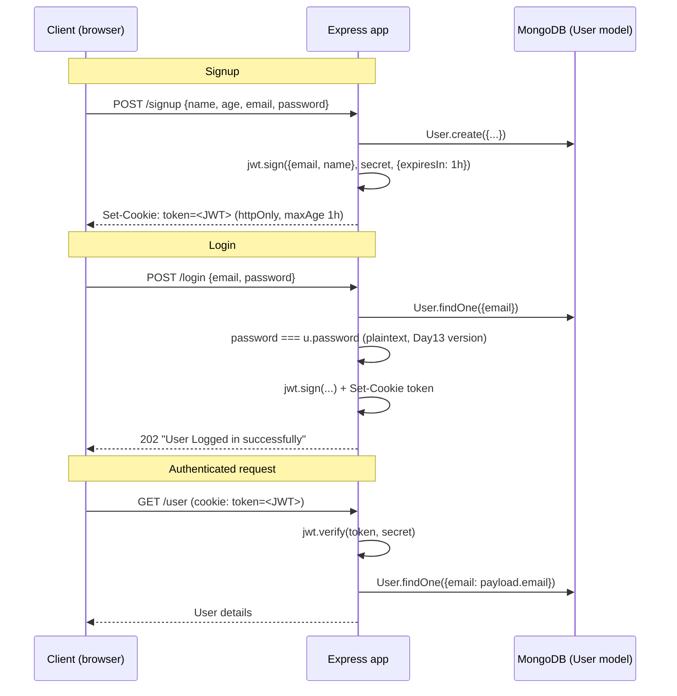

# Day 13 — Express + Mongoose User Authentication with JWT Cookies

## Overview
Day 13 has two small Express apps — `classs/` (in-class version) and `Pratice/` (self-practice version) — that implement the same **signup / login / get-user** authentication flow: Mongoose for persistence, **JWT** for stateless sessions, and **httpOnly cookies** for token transport. Passwords are still compared in plaintext here (bcrypt arrives on Day 14).

## File-by-file explanation

### `classs/` (in-class app)
- **userSchema.js** — Mongoose schema for the `User` model:
  - `name`: String, `minLength:3`, `maxLength:20`, `trim:true`, required.
  - `age`: Number, `min:18`, `max:100`.
  - `email`: String, `unique:true` (unique creates an index too).
  - `password`: String.
  - `{timestamps:true}` adds `createdAt`/`updatedAt`.
  - Comments explain index options: `index` (plain index, duplicates allowed), `unique` (enforces uniqueness + builds an index), `sparse` (only indexes documents where the field exists — e.g. optional phone number).
  - `mongoose.model("User", userSchema)` compiles the schema into the `User` model (collection `users` in MongoDB).
- **index.js** — Express server:
  - Connects to MongoDB Atlas (`mongoose.connect`), mounts `cookieParser` and `express.json`.
  - `POST /signup` — creates the user, then signs a JWT: `jwt.sign({email, name}, <secret>, {expiresIn:"1h"})` and sets it as an httpOnly cookie (`token`, `maxAge` 1 hour, `secure:false` so it also works over plain HTTP).
  - `GET /user` — reads `req.cookies.token`, `jwt.verify(token, <secret>)`, then looks up the user by the verified payload's email.
  - `POST /login` — finds the user by email, compares `password == u.password` (**plaintext comparison** — insecure, replaced by bcrypt on Day 14), then issues the same JWT cookie.
  - Listens on port 3000.
- **package.json** — deps: `express@5`, `mongoose`, `jsonwebtoken`, `cookie-parser`; ESM (`"type":"module"`).

### `Pratice/` (self-practice app)
- Same three routes and identical flow, with learning comments (e.g. `secure:false` means the cookie is also sent over HTTP; `maxAge` is the browser-side cookie expiry; JWT `iat`/`exp` timestamps). Differences are cosmetic: slightly different secret constant, `res.status(202)` responses, and `name` is also marked `unique` in the schema.

## Code flow

## Key concepts
- **JWT anatomy in practice**: payload (claims) + secret + options (`expiresIn`) → signed token; `jwt.verify` fails on tampering or expiry.
- **httpOnly cookie**: JavaScript cannot read the cookie, mitigating XSS token theft; `secure:false` here because dev runs on HTTP (should be `true` on HTTPS).
- **Stateless auth**: the server stores no session — identity lives inside the signed token.
- **Schema validators** (`minLength`, `trim`, `min/max`) run on save; `unique` is enforced by a MongoDB index.
- **What's missing (fixed on Day 14)**: passwords are stored and compared in plaintext, and there is no try/catch or auth middleware.

## Notes
- The MongoDB Atlas connection strings (usernames, passwords, cluster hosts) in `index.js`, and the JWT secrets (`"Rohit@456"`, `"chandan@1010"`), are **dummy/expired test credentials from the learning exercises** — do not copy them into any real project, and always keep such values in environment variables.
