# Day 14 — bcrypt Password Hashing + Hardened Auth App (validator, .env)

## Overview
Day 14 upgrades Day 13's auth app by replacing plaintext password storage with **bcrypt hashing**. It contains a standalone bcrypt playground (`class/`), the class app (`Day13UpdatePratice/class/`) which also moves the DB URI into a `.env`, and a fuller practice app (`Day13UpdatePratice/praticeClass/`) adding a `phoneNumber` field, the `validator` package, and stronger schema validation.

## File-by-file explanation

### `class/` — bcrypt playground
- **index.js** — first shows a commented one-liner: `bcrypt.hash(password, 10)` where the cost factor (rounds) implicitly generates a salt, plus `bcrypt.compare(plain, hash)` returning a boolean. The active "old method" code does it explicitly:
  - `bcrypt.genSalt(10)` → generates a random salt with 2^10 rounds.
  - `bcrypt.hash(plainPassword, salt)` → produces a hash of the form `$2b$10$<salt+hash>` (algorithm, cost, salt embedded in the output string).
  - `bcrypt.compare()` verifies by hashing the input with the same embedded salt — the original password is never stored anywhere.
- **package.json** — only dependency: `bcrypt`.

### `Day13UpdatePratice/class/` — Day 13 app updated with bcrypt + .env
- **index.js** — same signup/login/get-user routes, but:
  - `POST /signup` hashes the password before creating the user: `await bcrypt.hash(password, 10)`.
  - `POST /login` verifies with `bcrypt.compare(password, u.password)` instead of `==`.
  - JWT signing/verification and httpOnly cookie logic unchanged (comments explain `httpOnly` — browser-only, JS can't touch it; `maxAge` arithmetic 60×60×1000 ms = 1 h).
  - Connects via `process.env.MONGODB_URI` instead of a hardcoded URI.
- **.env** — holds `MONGODB_URI` for the connection (values redacted; see Notes).
- **userSchema.js** — same schema as Day 13 (name unique + trimmed, age 18–100, unique email, password, timestamps), with Hinglish comments explaining model creation.
- **package.json** — adds `bcrypt` to the Day 13 dependency set.

### `Day13UpdatePratice/praticeClass/` — practice app with `validator`
- **userSchema.js** — the interesting file:
  - A commented-out earlier version with a `phoneNumber` field using `minLength/maxLength` (note: `minLength` is invalid on a Number type — replaced in the live version).
  - Live schema uses the **`validator`** package with custom validators:
    - `phoneNumber`: `validator.isMobilePhone(value, "en-IN")`.
    - `email`: `validator.isEmail(value)`.
    - `password`: `validator.isStrongPassword(value, {minLength:8, minLowercase:1, minUppercase:1, minNumbers:1, minSymbols:1})` — "Password must be strong".
  - All fields required + `timestamps:true`.
- **index.js** — full auth cycle with bcrypt at **cost 11** on signup, `bcrypt.compare` on login, JWT with `name`, `email`, `age` claims signed with a secret, cookie named `tok`, and proper 404 responses for unknown users / wrong credentials.
- **package.json** — Day 13 deps + `bcrypt` + `validator`.

## Code flow

```mermaid
flowchart TD
    subgraph Signup
        A[POST /signup<br/>name, phoneNumber, age, email, password] --> B{Schema validators:<br/>isEmail, isMobilePhone, isStrongPassword}
        B -- invalid --> B1[422 / validation error]
        B -- valid --> C["bcrypt.hash(password, 10 or 11)<br/>salt generated + embedded in hash"]
        C --> D[User.create with password = hash]
        D --> E[jwt.sign claims + secret, expiresIn 1h]
        E --> F[Set-Cookie httpOnly]
    end
    subgraph Login
        G[POST /login email + password] --> H[User.findOne by email]
        H -- not found --> H1[404]
        H --> I["bcrypt.compare(entered password, stored hash)"]
        I -- match --> J[jwt.sign + Set-Cookie]
        I -- no match --> K[404 wrong credentials]
    end
    subgraph Authenticated request
        L[GET /user with cookie] --> M[jwt.verify token with secret]
        M --> N[User.findOne by payload.email]
        N --> O[Return name, email, age, phone]
    end
```

## Key concepts
- **bcrypt = hash + salt in one step**; the salt is stored *inside* the hash string, so identical passwords still hash differently and rainbow tables are useless.
- **Cost factor** (10, 11) = 2^N internal rounds — deliberately slow to brute-force; higher cost = slower hashing for both you and the attacker.
- **Never compare hashes manually** — always use `bcrypt.compare`, which extracts the salt from the stored hash.
- **Config in .env**: credentials leave the source code; read via `process.env` (note: this app reads `process.env` without loading `dotenv` — worth adding `import "dotenv/config"`).
- **`validator` package** gives declarative format checks (email, mobile, password strength) directly inside the Mongoose schema.
- Minor gotcha shown by the commented code: `minLength/maxLength` don't apply to `Number` fields — use `min/max`.

## Notes
- The `.env` in this folder and the Atlas URIs/secrets embedded in the class code (`MONGODB_URI`, JWT secrets like `"chandan@1010"`, `"chandan@1020"`) are **dummy, expired learning credentials** — redacted here on purpose. Do not reuse them; generate fresh secrets and keep them out of version control.
- The bcrypt hash strings printed/logged in `class/index.js` are also throwaway test values.
