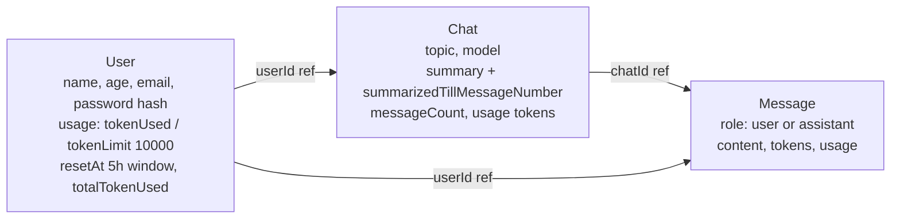

# Day 15 — GPT Chat Backend: Mongoose Schemas for Users, Chats and Messages

## Overview
Day 15 designs the data layer for a **ChatGPT-style backend** (LLM access via OpenRouter). Three Mongoose schemas — `User`, `Chat`, `Message` — split chat history across collections so no document ever hits MongoDB's 16 MB (diagram says ~2 MiB working size) limit, plus per-user **token usage/quota tracking**. A hand-drawn diagram, `gptBackendAnalysis.svg` (with a PNG copy), captures the design thinking.

## File-by-file explanation

### `mongooseschema.js` — User model
- `name` (String, required), `age` (Number), `email` (String, required, **unique**), `password` (String, required — stored hashed in the real backend).
- `usage` sub-document — the quota system:
  - `tokenUsed` (default 0): tokens spent in the **current window**.
  - `tokenLimit` (default 10000): per-window cap.
  - `resetAt`: defaults to `Date.now() + 5*60*60*1000` — a **5-hour rolling window** after which usage resets (diagram mentions a 1-lakh total token limit too).
  - `totalTokenUsed` (default 0): lifetime usage, never reset.
- `{timestamps:true}`.

### `chatSchema.js` — Chat model (one conversation)
- `userId`: ObjectId **ref "User"**, required — links the chat to its owner.
- `topic` (default "New Chat"), `model` (required — e.g. `"openai/gpt-4o-mini"` or a Qwen model via OpenRouter).
- **Summarisation fields** (to keep prompts small):
  - `summary` (default "") — running summary of older messages.
  - `summaryUpdatedAt`, `summarizedTillMessageNumber` (default 0) — how far the summary covers.
  - `lastMessage` (in diagram), `messageCount` (default 0).
- `usage`: `promptTokens`, `completionTokens`, `totalTokens` per chat.
- **Compound index** `{userId: 1, updatedAt: -1}` — fast "list my chats, newest first".
- `{timestamps:true}`.

### `msgSchema.js` — Message model (one turn)
- `userId` (ref User) **and** `chatId` (ref Chat), both required — messages are doubly linked so they can be queried per chat *or* per user.
- `role`: enum `["user", "assistant"]` — the LLM conversation format.
- `content` (required), `tokens` (per message cost).
- `usage`: prompt/completion/total tokens for assistant turns.
- Indexes: `{chatId: 1, createdAt: 1}` (replay a chat in order) and `{userId: 1, createdAt: -1}` (recent activity across chats).
- `{timestamps:true}`.

### `gptBackendAnalysis.svg` (and `gptBackendAnalysis.png`) — the design diagram
A whiteboard-style diagram titled "Project → Backend → ChatGPT". It lays out:
1. **Actors**: Frontend ↔ Backend ↔ Database and LLM (via **OpenRouter**), with authentication as step 1.
2. **Why not one giant user document**: an early idea — store chat history as an array of objects (`{topic, model, realChat:[...messages...], maximumToken: 50k, spend: 8000}`) inside the user. Problem: document size explodes (16 MiB limit / ~2 MiB practical), so **each chat becomes its own document** referenced by `chatId` from the user.
3. **Final design shown with realistic documents**:
   - User: `{_id:"user_123", name:"Aman", age:22, email, hashed password, usage:{tokenUsed:2500, tokenLimit:10000, resetAt, totalTokenUsed:52000}}`.
   - Chat: `{_id:"chat_456", userId, topic:"Recursion Doubt", model, summary, summaryUpdatedAt, summarizedTillMessageNumber:20, lastMessage, messageCount:28, usage:{...}}`.
   - Message: `{_id:"msg_1", userId, chatId, role:"user", content:"Explain recursion", tokens:20}`.

## Code flow


And the request lifecycle this schema supports:

```mermaid
sequenceDiagram
    participant FE as Frontend
    participant BE as Backend
    participant DB as MongoDB
    participant LLM as LLM (OpenRouter)

    FE->>BE: Send message (chatId, content)
    BE->>DB: Load User -> check usage.tokenUsed < tokenLimit
    alt quota exhausted / resetAt passed
        BE->>DB: Reset tokenUsed, set new resetAt (+5h)
    end
    BE->>DB: Load Chat (summary, summarizedTillMessageNumber)
    BE->>DB: Load recent Messages after summarizedTillMessageNumber
    BE->>LLM: Prompt = summary + recent messages + new content
    LLM-->>BE: Assistant reply + token counts
    BE->>DB: Insert Message(role=user) + Message(role=assistant, tokens)
    BE->>DB: Update Chat.messageCount/usage; User.usage.tokenUsed/totalTokenUsed
    BE-->>FE: Assistant reply
    Note over DB: Periodic job: summarise old messages,<br/>store in Chat.summary, advance summarizedTillMessageNumber
```

## Key concepts
- **Referenced (normalized) design** over embedding: users → chats → messages as separate collections with ObjectId refs, avoiding document size limits.
- **Quota management**: per-user token limit with a time-window reset (`resetAt`) plus a lifetime counter.
- **Prompt-context control**: a rolling chat `summary` + `summarizedTillMessageNumber` means the LLM prompt is `summary + only recent messages`, keeping costs down.
- **Compound indexes** match access patterns: chats per user by recency, messages per chat in chronological order.
- **Role enum** (`user`/`assistant`) mirrors the chat-completions message format the LLM expects.

## Notes
- The email/password fields in the sample documents and the `.env`-style values anywhere in this folder are **illustrative dummy data** — no live credentials; hash passwords with bcrypt (Day 14) before storing.
- `gptBackendAnalysis.png` (~5 MB) is just a raster render of the same `gptBackendAnalysis.svg` diagram.
