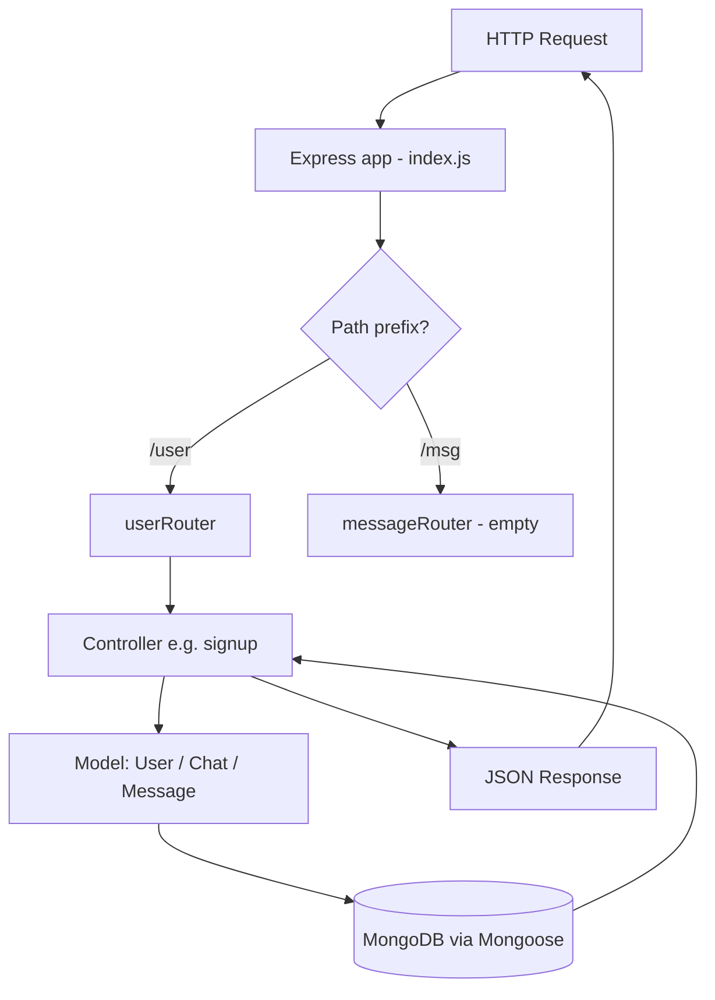

# Day 16 — Chat App Backend: MVC / Layered Structure (Express + Mongoose)

## Overview
Day 16 is the foundation of a ChatGPT-clone backend. Nothing is implemented yet — the day is about **project structure**: splitting a single-file Express server into a layered architecture (config / model / controllers / routes), designing the three Mongoose schemas (User, Chat, Message) with usage/token tracking, and mounting routers in `index.js`. No auth, no validators, no real logic — controllers are empty stubs.

Two variants exist: `classOnline` (instructor's clean version) and `calssPl` (student's in-class practice, same design with typos like `app.listten` and a quoted `"process.env.MONGO_URL"`).

## Folder Structure
```
Day16/
├── classOnline/                # instructor version
│   ├── index.js                # entry point: express app + router mounting + start
│   ├── config/
│   │   └── database.js         # mongoose.connect wrapper
│   ├── model/
│   │   ├── userSchema.js       # User model (name, age, email, password, usage)
│   │   ├── chatSchema.js       # Chat model (userId, topic, model, summary, usage)
│   │   └── messageSchema.js    # Message model (userId, chatId, role, content, tokens)
│   ├── controllers/
│   │   └── userController.js   # empty login/logout/signup/profile stubs
│   ├── routes/
│   │   ├── userRouter.js       # /user routes wired to controller stubs
│   │   ├── chatRouter.js       # empty (placeholder)
│   │   └── messageRouter.js    # empty (placeholder)
│   └── package.json            # express, mongoose, dotenv (ESM)
└── calssPl/                    # student practice version (same layout, minor typos)
```

## File-by-File Explanation

### classOnline/index.js
Entry point. Loads `dotenv.config()`, creates the Express app, applies `express.json()`, mounts `userRouter` at `/user` and `messageRouter` at `/msg`, then an async `startServer()` that first `await connectDB()` and only then `app.listen(process.env.PORT)`. Key idea: **connect to DB before listening** so the server never serves requests without a database. Comments sketch the planned API surface (`/user/login`, `/user/signup`, `/msg/read`, ...).

### config/database.js
```js
const connectDB = async () => {
  await mongoose.connect(process.env.MONGO_URL);
  console.log("Connected to Database Successfully");
};
```
One exported async function wrapping `mongoose.connect`. Reads the connection string from `.env` (never hardcoded).

### model/userSchema.js
`User` model with `name`, `age`, `email` (required + `unique`), `password` (required), plus a `usage` sub-document — a token-quota system for the AI app: `tokenUsed` (default 0), `tokenLimit` (default 10000), `resetAt` (defaults to now + 5 hours via `default: () => new Date(...)`), `totalTokenUsed`. `{ timestamps: true }` adds `createdAt`/`updatedAt`.

### model/chatSchema.js
`Chat` model = one conversation. Fields: `userId` (ObjectId ref `"User"`, required), `topic` (default `"New Chat"`), `model` (which AI model, required), `summary` + `summaryUpdatedAt` + `summarizedTillMessageNumber` (for later context-summarization of long chats), `messageCount`, and a `usage` block (`promptTokens`, `completionTokens`, `totalTokens`). Adds a **compound index** `{ userId: 1, updatedAt: -1 }` to make "recent chats of this user, newest first" queries fast.

### model/messageSchema.js
`Message` model = one turn in a chat. Fields: `userId` (ref User), `chatId` (ref Chat), `role` (enum `["user","assistant"]`), `content`, `tokens`, and the same `usage` token block. Two indexes: `{ chatId: 1, createdAt: 1 }` (fetch a chat's messages in order) and `{ userId: 1, createdAt: -1 }`.

### controllers/userController.js
Four exported empty async handlers — `login`, `logout`, `signup`, `profile` — each taking `(req, res)`. Establishes the convention: controllers contain request/response logic, routers stay thin.

### routes/userRouter.js
`express.Router()` with `POST /login`, `POST /logout`, `POST /signup`, `GET /profile`, each pointing at the controller exports.

### routes/chatRouter.js / routes/messageRouter.js
Empty router shells (messageRouter exports an empty `express.Router()`; chatRouter is a blank file) — placeholders for later days.

### package.json
`"type": "module"` (ESM imports). Dependencies: `express@^5`, `mongoose@^9`, `dotenv`. calssPl is the same; classOnline also has a lockfile.

## Class vs After-Class (`classOnline` vs `calssPl`)
Same design; `calssPl` is the live practice attempt: function named `connectionDB`, imports with `.js` extensions, but contains typos (`app.listten` instead of `app.listen`, `mongoose.connect("process.env.MONGO_URL")` — the env var accidentally quoted, so it would connect to a literal string), controller handlers not exported, and stray comments. `classOnline` is the corrected reference. The schemas are essentially identical.

## Code Flow

Note: in Day 16 the DB round-trip is theoretical — controllers are stubs. The schemas and connection are real.

## API Endpoints (planned / stubbed)
| Method | Path | Controller | Auth | Status |
|---|---|---|---|---|
| POST | /user/signup | signup | No | Stub (empty) |
| POST | /user/login | login | No | Stub (empty) |
| POST | /user/logout | logout | No | Stub (empty) |
| GET  | /user/profile | profile | No | Stub (empty) |
| *    | /msg/... | — | No | Router exists, no routes |
| *    | /chat/... | — | No | No router mounted yet |

## Key Concepts
- **MVC / layered architecture**: routes → controllers → models, with config isolated in its own folder.
- **Mongoose schema design**: refs between models (`User` ← `Chat` ← `Message`), enums, sub-documents (`usage`), default functions (`resetAt`).
- **Indexes** for real query patterns: recent chats per user, ordered messages per chat.
- **DB-before-listen startup order** in an async `startServer()`.
- **Env-based configuration** via dotenv (`MONGO_URL`, `PORT`), `.gitignore`d in calssPl.
- Token-quota design (`usage.tokenUsed` vs `tokenLimit`) anticipating per-user AI usage limits.

## Notes
- `.env` values (MONGO_URL, JWT_SECRET, PORT) are **dummy/expired placeholders from the class — do NOT copy them**; use your own local MongoDB URI and keep `.env` out of git.
- `calssPl` contains intentional student typos (`app.listten`, quoted `MONGO_URL`) — do not copy code verbatim; refer to `classOnline`.
