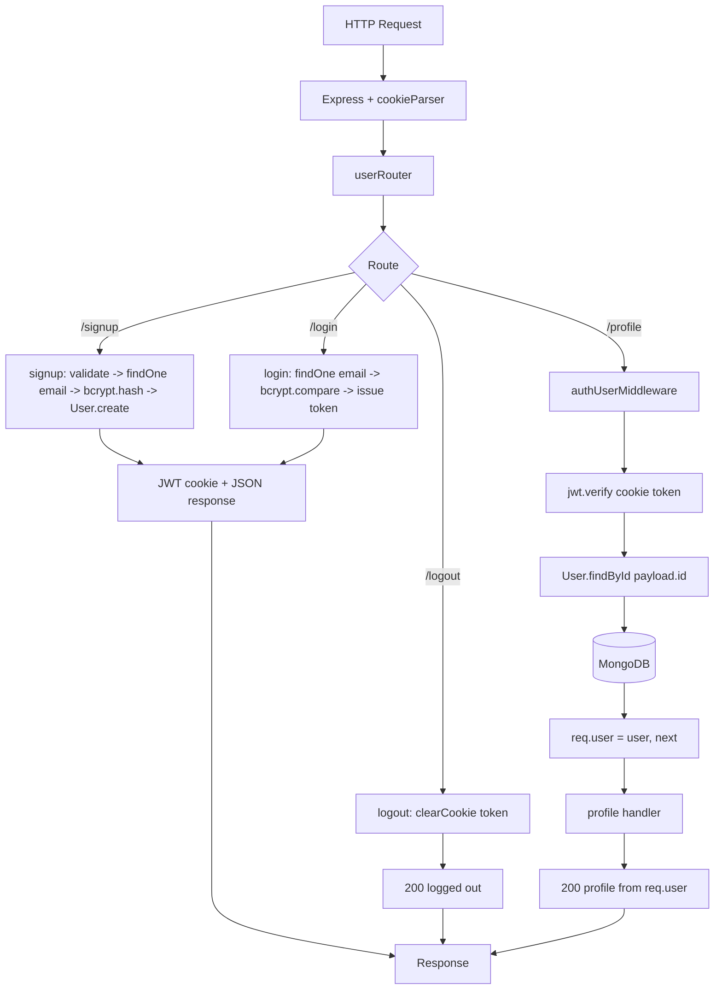

# Day 17 — JWT Authentication: Signup / Login / Logout / Profile with Cookie-based Tokens

## Overview
Building on Day 16's skeleton, Day 17 makes the user APIs real:
- `signup` — validate input, check duplicate email, hash password with **bcrypt**, create user, issue a **JWT** in an httpOnly cookie.
- `login` — find user, `bcrypt.compare` password, issue JWT cookie.
- `logout` — clear the cookie.
- `profile` — now protected by a new **`authUserMiddleware`** that verifies the JWT from the cookie, loads the user from MongoDB, and attaches it to `req.user`.

Two variants: `clss` (instructor version, folder `middlewares/`) and `afterclassx` (student practice, folder `middleware/`).

## Folder Structure
```
Day17/
├── clss/                            # instructor version
│   ├── index.js                     # + cookieParser()
│   ├── config/database.js           # unchanged from Day16
│   ├── middlewares/
│   │   └── authUserMiddleware.js    # NEW: JWT verify middleware
│   ├── model/                       # userSchema / chatSchema / messageSchema (unchanged)
│   ├── controllers/
│   │   └── userController.js        # NEW: real signup/login/logout/profile
│   ├── routes/
│   │   ├── userRouter.js            # profile now guarded by authUserMiddleware
│   │   ├── chatRouter.js            # still empty
│   │   └── messageRouter.js         # still empty
│   └── package.json                 # + bcrypt, jsonwebtoken, cookie-parser
└── afterclassx/                     # student practice (same layout, `middleware/` folder)
```

## File-by-File Explanation

### index.js
Same as Day 16 plus `app.use(cookieParser())` — required so `req.cookies.token` is available to the auth middleware and controllers. Mounts `/user` → userRouter, `/msg` → messageRouter; connects to DB before listening.

### middlewares/authUserMiddleware.js
```js
const {token} = req.cookies;
const payload = jwt.verify(token, process.env.JWT_SECRET);
const existingUser = await User.findById(payload.id);
if (!existingUser) return res.status(404).json({message: "User Doesnt Exist"});
req.user = existingUser;
next();
```
Reads the JWT cookie, verifies signature/expiry against `JWT_SECRET`, looks the user up (so deleted users are rejected even with a valid token), attaches the doc to `req.user`, calls `next()`. Any failure (missing/invalid token, DB error) falls into the catch → 500. This is **authentication + minimal state**: the token proves identity; the DB lookup gives fresh data.

### controllers/userController.js
- `createToken(id, email)` — helper that throws if `JWT_SECRET` is missing and signs `{id, email}` with `expiresIn: "1h"`.
- `cookiesOption` — `{ httpOnly: true, secure: false, maxAge: 60*60*1000 }` (httpOnly so client-side JS can't read the token; secure:false because the class runs on plain http).
- `signup` — destructures body, manual presence check (400), `User.findOne({email})` duplicate check (409), `bcrypt.hash(password, 12)`, `User.create`, issues token cookie, responds 201 without the password hash.
- `login` — presence check (400), `findOne` + `bcrypt.compare` (401 "Invalide Credentials" on either miss), issues token cookie, returns profile + usage (200).
- `logout` — `res.clearCookie("token", ...)` (200).
- `profie` — protected handler; simply returns `req.user` fields (name, age, usage, email). The old email-based (insecure) version is left as a comment — the point being: identity now comes from the verified token, **not** from the request body.

### routes/userRouter.js
Same four routes; the only change is `userRouter.get("/profile", authUserMiddleware, profile)` — route-level middleware so only profile is protected.

### model/ (unchanged)
userSchema / chatSchema / messageSchema same as Day 16.

### package.json
Adds `bcrypt@^6`, `jsonwebtoken@^9`, `cookie-parser@^1.4` (afterclassx also lists `validator`, unused yet).

## Class vs After-Class (`clss` vs `afterclassx`)
Same architecture and flow. Practice-version differences (good bug-finding exercises):
- `afterclassx` folder named `middleware/` (singular) vs `middlewares/`.
- `createToken`: inverted check `if (process.env.JWT_SECRET) throw` — throws when the secret **exists**, a real logic bug.
- `logout` clears a cookie named `"tok"` instead of `"token"`.
- Middleware's catch block uses `response.status(...)` (the express import) instead of `res`, so errors never respond.
- `bcrypt` imported as `bycrpt`; minor naming (`signUpSchema` naming appears in Day 18). `clss` is the corrected reference.

## Code Flow


## API Endpoints
| Method | Path | Controller | Auth | Status |
|---|---|---|---|---|
| POST | /user/signup | signup | No | 201 / 400 / 409 |
| POST | /user/login | login | No | 200 / 400 / 401 |
| POST | /user/logout | logout | No | 200 (clears cookie) |
| GET  | /user/profile | profile | **authUserMiddleware** | 200 / 404 / 500 |

## Key Concepts
- **JWT in httpOnly cookies** vs localStorage — XSS-safer, automatically sent by the browser.
- **Password hashing** with bcrypt (cost 12) and constant-time `bcrypt.compare`; never store or return plaintext.
- **Auth middleware pattern**: verify token → load fresh user → `req.user` → `next()`. Reused across future routers.
- **Route-level middleware** (`router.get(path, middleware, handler)`) to protect only some routes.
- **Status-code semantics**: 400 missing fields, 401 bad credentials, 404 user gone, 409 duplicate email, 201 created.
- Token payload = `{id, email}`, 1h expiry, signed with `process.env.JWT_SECRET`.

## Notes
- `JWT_SECRET`, `MONGO_URL`, `PORT` in any `.env`/code here are **dummy class values, likely expired — do NOT copy them**; generate your own secret and DB URI.
- Known typos in the code (`res.staus`, `paasowrd` in signup's hash line, "Invalide") are as-written in the repo — worth fixing as an exercise; don't treat them as correct patterns.
