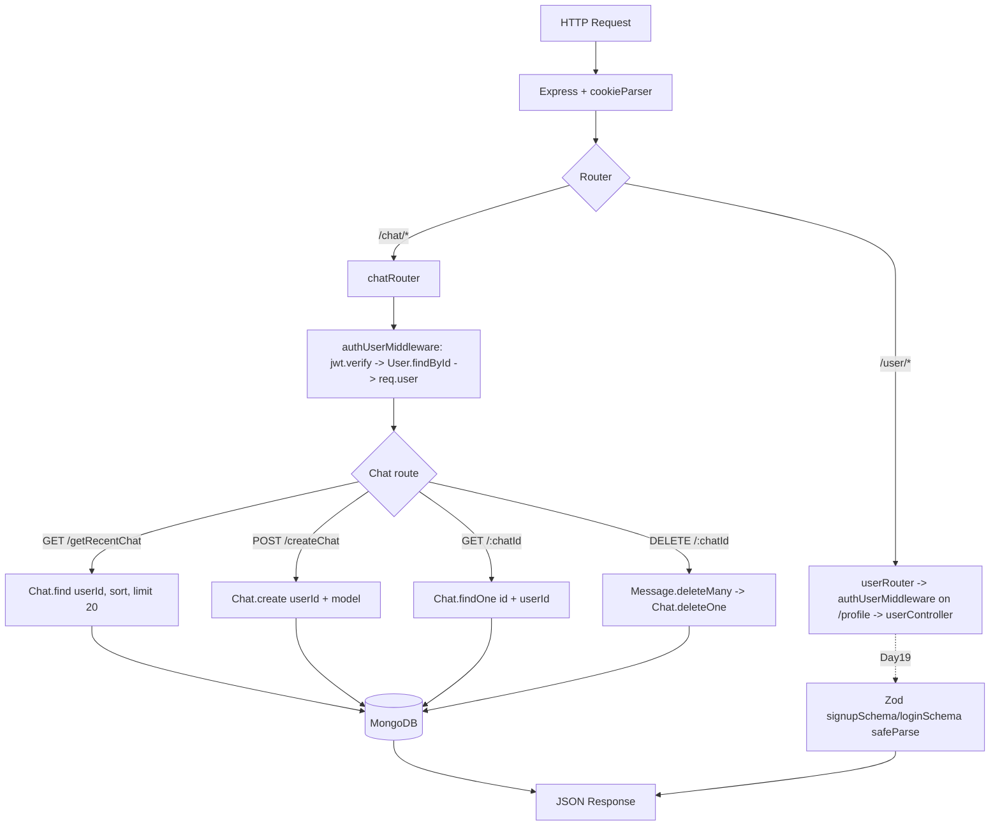

# Day 18 — Zod Validation + Chat CRUD Controllers (getRecentChat / getSingleChat / createChat / deleteChat)

## Overview
Two additions over Day 17:
1. **Validators (`validators/userValidators.js`)** — Zod schemas (`signupSchema`, `loginSchema`) replacing the manual presence checks inside the user controller (schemas are defined here; wiring them into the controller completes in Day 19).
2. **Chat controllers (`controllers/chatController.js`)** — the Chat feature goes live: recent chats, single chat, create chat, delete chat (with cascade delete of messages), all behind `chatRouter.use(authUserMiddleware)`.

Two variants: `class/` (instructor: `middlewares/`, `chatController.js`, `userValidators.js`) and `afterClass/` (student: `middleware/`, `chatcontroller.js`, `userValidator.js`).

## Folder Structure
```
Day18/
├── class/
│   ├── index.js                     # + app.use("/chat", chatRouter)
│   ├── config/database.js
│   ├── middlewares/authUserMiddleware.js   # unchanged (JWT cookie verify)
│   ├── model/                       # unchanged schemas
│   ├── controllers/
│   │   ├── userController.js        # unchanged from Day17
│   │   └── chatController.js        # NEW: getRecentChat / getSingleChat / createChat / deleteChat
│   ├── validators/
│   │   └── userValidators.js        # NEW: Zod signupSchema + loginSchema
│   ├── routes/
│   │   ├── userRouter.js            # unchanged (profile guarded)
│   │   ├── chatRouter.js            # NEW: 4 routes, router-level auth
│   │   └── messageRouter.js         # still empty
│   └── package.json                 # + zod
└── afterClass/                      # student practice (same layout)
```

## File-by-File Explanation

### index.js
Day 17 app plus `chatRouter` import and `app.use("/chat", chatRouter)`.

### validators/userValidators.js
Zod schemas:
- `signupSchema`: `name` — string, trim, 3–30 chars; `age` — number 10–100, optional; `email` — `z.preprocess` that trims/lowercases strings then `z.email()`; `password` — 8–30 chars with regexes requiring one uppercase, one lowercase, one digit, one special character (each with a friendly message).
- `loginSchema`: the same email + password rules.
Idea: **validation lives in its own layer**, separate from controllers; `z.preprocess` normalizes input before validation.

### controllers/chatController.js
All handlers are user-scoped via `req.user._id` (set by the auth middleware), so a user can only touch their own chats:
- `getRecentChat` — `Chat.find({userId: req.user._id}).select("topic updatedAt").sort({updatedAt:-1}).limit(20)` → 200 with `chats`. Select only the fields the sidebar needs.
- `getSingleChat` — `Chat.findOne({_id: chatId, userId: req.user._id})` (404 if none) → returns chatId, userId, topic, usage. Ownership enforced by including `userId` in the filter.
- `createChat` — reads `model` from body (400 if missing), `Chat.create({userId, model})` → 201 with the new chat's id/topic/timestamp.
- `deleteChat` — findOne with ownership filter (403 "not allowed" if none), then **cascade delete**: `Message.deleteMany({chatId})` followed by `Chat.deleteOne`, → 200.

### routes/chatRouter.js
`chatRouter.use(authUserMiddleware)` — protects **every** chat route at once (contrast with Day 17's per-route guard). Then `POST /createChat`, `GET /getRecentChat`, `GET /:chatId`, `DELETE /:chatId`. (Bugs present: `getSingleChat` imported twice and `getRecentChat` not imported; `:chatId` missing the leading slash.)

### middlewares/authUserMiddleware.js, model/, config/, userController.js, userRouter.js
Unchanged from Day 17 (JWT cookie verify → `req.user`; schemas; DB connect).

### package.json
Adds `zod@^4` (afterClass also keeps `validator` from Day 17).

## Class vs After-Class (`class` vs `afterClass`)
Same design. `afterClass` practice issues: `z.number.min(...)` / `z.string.min(...)` missing call parentheses, so validation would break; `chatcontroller.js` filename; singular `middleware/` folder; `z     .email` odd formatting; slightly different password regex and age limits (18–99). `class/` is the reference.

## Code Flow

```mermaid
flowchart TD
    A[HTTP Request] --> B[Express + cookieParser]
    B --> C{Router}
    C -->|/user/*| D[userRouter -> authUserMiddleware on /profile -> userController]
    C -->|/chat/*| E[chatRouter]
    E --> F[authUserMiddleware: jwt.verify -> User.findById -> req.user]
    F --> G{Chat route}
    G -->|GET /getRecentChat| H[Chat.find userId, sort, limit 20]
    G -->|POST /createChat| I[Chat.create userId + model]
    G -->|GET /:chatId| J[Chat.findOne id + userId]
    G -->|DELETE /:chatId| K[Message.deleteMany -> Chat.deleteOne]
    H --> L[(MongoDB)]
    I --> L
    J --> L
    K --> L
    D -. Day19 .-> M[Zod signupSchema/loginSchema safeParse]
    L --> N[JSON Response]
    M --> N
```

## API Endpoints
| Method | Path | Controller | Auth | Status |
|---|---|---|---|---|
| POST | /user/signup | signup | No | 201 (Zod wiring comes Day 19) |
| POST | /user/login | login | No | 200 |
| POST | /user/logout | logout | No | 200 |
| GET  | /user/profile | profile | Yes | 200 |
| POST | /chat/createChat | createChat | Yes (router-level) | 201 / 400 |
| GET  | /chat/getRecentChat | getRecentChat | Yes | 200 (top 20 by updatedAt) |
| GET  | /chat/:chatId | getSingleChat | Yes | 200 / 404 |
| DELETE | /chat/:chatId | deleteChat | Yes | 200 / 403 (cascades messages) |

## How it works — first principles
- **Why validate input at all — and why in a separate layer?** The DB is the last line of defense, not the first: garbage in becomes garbage documents that every later feature must handle. Controllers that hand-roll `if (!email) ...` checks mix "is the input shaped right" with "does the business logic work", and the checks drift apart between signup and login. A Zod schema is a single declarative spec of what valid input is (`signupSchema`, `loginSchema`) that can be reused, tested, and even derive TypeScript types. Basic→advanced: ad-hoc `if` checks in handlers → shared schema objects (Day 18) → schema-driven `safeParse` wired into controllers (Day 19). `z.preprocess` matters because normalization (trim, lowercase email) is not validation — it's cleaning before validating.
- **Why `chatRouter.use(authUserMiddleware)` instead of per-route guards?** Every chat route is private without exception, so protecting at the router level removes the "did I forget the guard on this one?" failure mode. Trade-off learned by contrast: Day 17's per-route guard on `/profile` is the right tool when only *some* routes in a router are protected.
- **Why is ownership enforced in the query filter itself?** `Chat.findOne({_id: chatId, userId: req.user._id})` makes "someone else's chat" indistinguishable from "no such chat" — the DB never even returns it. This kills IDOR (insecure direct object reference) bugs structurally; checking `if (chat.userId !== req.user._id)` *after* fetching works but invites forgetting it on the next endpoint.
- **Why cascade delete?** Messages reference their Chat by `chatId`; deleting the Chat alone leaves orphaned messages forever (wasted storage, wrong query results, no owner). `Message.deleteMany({chatId})` before `Chat.deleteOne` keeps the invariant "every message has a living chat" — in production you'd wrap both in a transaction so a crash between them can't orphan data.
- **Why `.select("topic updatedAt")` and `limit(20)` for the sidebar?** The list view only renders topic + time; fetching full documents (or all chats) wastes bandwidth and memory. This is why the `{userId: 1, updatedAt: -1}` index from Day 16 exists — sort + limit become an index scan instead of collecting and sorting every chat in memory.
- **Zod schema validation**: object schemas, `.trim().min().max()`, regex chains for password policy, `z.preprocess` for input normalization, custom error messages.
- **Validator layer** as its own directory — separation of concerns between "is the input shaped right" and "does the business logic work".
- **Router-level middleware** (`router.use(auth)`) vs per-route guarding.
- **Ownership scoping**: every query includes `userId: req.user._id` — IDOR protection by filter, not by after-the-fact checks.
- **Cascade delete**: removing a Chat also removes its Messages to avoid orphans.
- **Projections + compound index** (`userId, updatedAt`) serving the "recent chats" query efficiently.

## Notes
- Any `.env`/hardcoded credentials are dummy class values — do NOT copy them.
- Known code bugs to fix as practice: chatRouter imports `getSingleChat` twice (so `getRecentChat` is undefined at runtime), `:chatId` should be `/:chatId`, `messages:` typo used as a JSON key in some responses, `z.number.min` missing parentheses in the afterClass validator. Also note `class/validators/userValidators.js` line 1 is `import {z} from zod;` — the `"zod"` module name is missing its quotes, a syntax error; the afterClass copy (`userValidator.js`) has it right.
