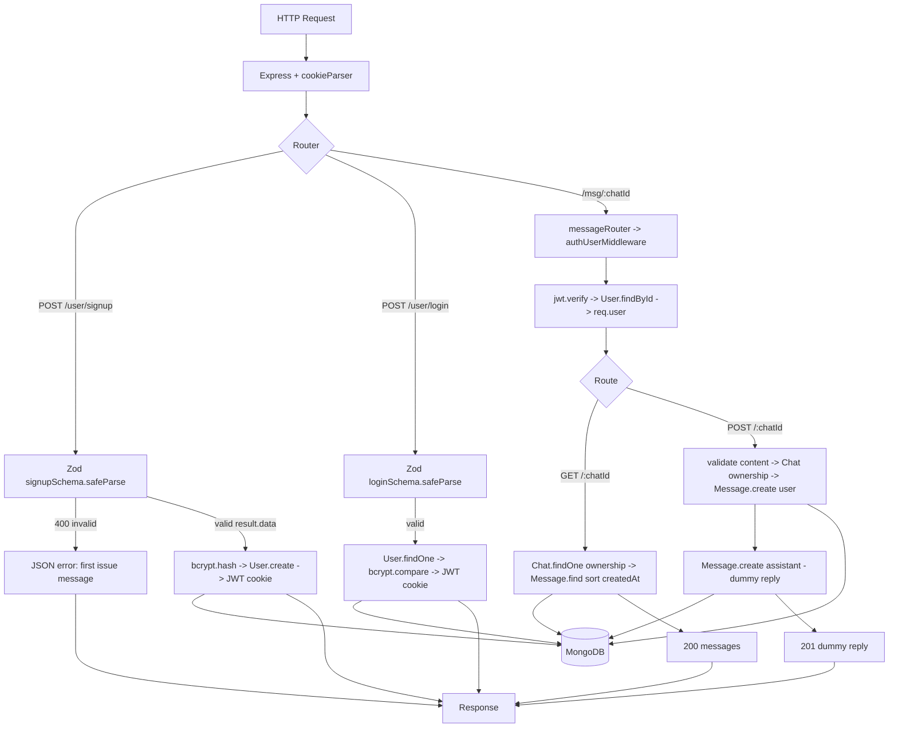

# Day 19 — Zod Validation Wired into User Controller + Message Controller (getMessage / sendMessage)

## Overview
Two completions over Day 18:
1. **Validators go live in `userController`** — `signup` and `login` now call `signupSchema.safeParse(req.body)` / `loginSchema.safeParse(req.body)` and return 400 with the first Zod issue message before touching the database. This also fixes Day 17's typo bugs (`bcrypt.hash(password, 12)` is now correct).
2. **Message feature (`controllers/messageController.js` + real `messageRouter`)** — `getMessage` (list a chat's messages in order, ownership-checked) and `sendMessage` (save the user's message, then a **dummy assistant reply** — real AI integration comes later).

Two variants: `Class/` (instructor) and `afterClass/` (student practice).

## Folder Structure
```
Day19/
├── Class/
│   ├── index.js                     # unchanged (user/chat/msg routers mounted)
│   ├── config/database.js
│   ├── middlewares/authUserMiddleware.js
│   ├── model/                       # unchanged schemas
│   ├── controllers/
│   │   ├── userController.js        # UPDATED: safeParse with Zod schemas
│   │   ├── chatController.js        # unchanged from Day18
│   │   └── messageController.js     # NEW: getMessage / sendMessage
│   ├── validators/userValidators.js # unchanged Zod schemas
│   ├── routes/
│   │   ├── userRouter.js            # unchanged
│   │   ├── chatRouter.js            # unchanged
│   │   └── messageRouter.js         # NEW: GET /:chatId, POST /:chatId (auth)
│   └── package.json                 # express, mongoose, bcrypt, jsonwebtoken, cookie-parser, dotenv, zod
└── afterClass/                      # student practice (middleware/, chatcontroller.js, userValidator.js)
```

## File-by-File Explanation

### controllers/userController.js (updated)
- `signup`: `const result = signupSchema.safeParse(req.body);` — on failure, `res.status(400).json({message: result.error.issues[0].message})` (returns the first validation error). On success, destructures **`result.data`** — Zod's parsed/normalized copy (trimmed/lowercased email), not the raw body. Then the Day 17 flow: duplicate-email check (409), `bcrypt.hash(password, 12)`, `User.create`, JWT cookie, 201.
- `login`: same pattern with `loginSchema.safeParse`, then findOne + bcrypt.compare (401), token cookie, 200.
- `createToken`, `cookiesOption`, `logout`, `profile` unchanged from Day 17.

### controllers/messageController.js (new)
- `getMessage` — reads `chatId` from params, first verifies ownership: `Chat.findOne({_id: chatId, userId: req.user._id})` (404 if not found/not yours), then `Message.find({chatId}).sort({createdAt: 1})` → 200 with the messages in chronological order.
- `sendMessage` — reads `chatId` (params) and `content` (body); 400 if content empty; ownership check via Chat.findOne; `Message.create({userId, chatId, role:"user", content})`; then a placeholder reply — `const dummyReply = "..."` — saved as a second message with `role:"assistant"` (comment: "content: AI ko bhejna hai: Logic" — the real AI call replaces this). Responds 201 with the dummy reply. Note: no `tokens`/usage accounting yet.

### routes/messageRouter.js (new)
`messageRouter.use(authUserMiddleware)` then `GET /:chatId` → getMessage, `POST /:chatId` → sendMessage. (Day 19 version lacks the leading slash pattern correctness of Day 20 — see below.)

### routes/userRouter.js, chatRouter.js
Unchanged from Day 18 (profile guarded per-route; chat routes guarded by `router.use`).

### index.js, config/, model/, middlewares/, validators/
Unchanged from Day 18.

## Class vs After-Class (`Class` vs `afterClass`)
Same endpoints and logic; `afterClass` mirrors it with the usual practice-variance: `middleware/` folder, `chatcontroller.js` filename, `userValidator.js`, minor formatting/typo differences in messageController and userController. Functionally equivalent — use `Class/` as the reference.

## Code Flow


## API Endpoints
| Method | Path | Controller | Auth | Status |
|---|---|---|---|---|
| POST | /user/signup | signup (+Zod) | No | 201 / 400 (validation) / 409 |
| POST | /user/login | login (+Zod) | No | 200 / 400 / 401 |
| POST | /user/logout | logout | No | 200 |
| GET  | /user/profile | profile | Yes | 200 |
| POST | /chat/createChat, GET /chat/getRecentChat, GET/DELETE /chat/:chatId | chatController | Yes | as Day 18 |
| GET  | /msg/:chatId | getMessage | Yes | 200 / 404 |
| POST | /msg/:chatId | sendMessage | Yes | 201 / 400 / 404 |

## Key Concepts
- **`safeParse` + `result.data`**: never trust `req.body` — validate, then use the parsed, normalized output (trim/lowercase via `z.preprocess`).
- **Fail-fast validation**: 400 with the first Zod issue before any DB work.
- **Message persistence model**: each turn = two documents (`role:"user"` and `role:"assistant"`), enabling chat history replay.
- **Ownership check before every read/write**: Chat.findOne({_id, userId}) gates message access.
- **Sorting with the compound index** `{chatId, createdAt}` for ordered history.
- **Placeholder AI reply**: controller structured so the dummy string is a single swap-point for a real LLM API.

## Notes
- `.env` values are dummy/expired class credentials — do NOT copy them.
- Residual typos to fix as practice: `res.staus` in a signup 409 branch, JSON keys spelled `messages:` where `message:` was intended, Day-19 messageRouter's `"/:chatId"` paths (Day 20 normalizes them). All `JWT_SECRET`/`MONGO_URL` strings are placeholders.
