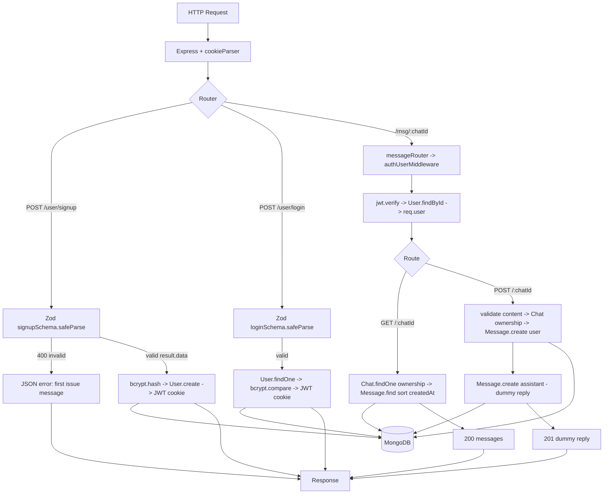

# Day 19 — Zod Validation Wired into User Controller + Message Controller (getMessage / sendMessage)

## Overview
Two completions over Day 18:
1. **Validators go live in `userController`** — `signup` and `login` now call `signupSchema.safeParse(req.body)` / `loginSchema.safeParse(req.body)` and return 400 with the first Zod issue message before touching the database. This also fixes Day 17's typo bugs (`bcrypt.hash(password, 12)` is now correct).
2. **Message feature (`controllers/messageController.js` + real `messageRouter`)** — `getMessage` (list a chat's messages in order, ownership-checked) and `sendMessage` (save the user's message, then a **dummy assistant reply** — real AI integration comes later).

Two variants: `Class/` (instructor) and `afterClass/` (student practice).

## Folder Structure
```
Day19/
├── Class/
│   ├── index.js                     # unchanged (user/chat/msg routers mounted)
│   ├── config/database.js
│   ├── middlewares/authUserMiddleware.js
│   ├── model/                       # unchanged schemas
│   ├── controllers/
│   │   ├── userController.js        # UPDATED: safeParse with Zod schemas
│   │   ├── chatController.js        # unchanged from Day18
│   │   └── messageController.js     # NEW: getMessage / sendMessage
│   ├── validators/userValidators.js # unchanged Zod schemas
│   ├── routes/
│   │   ├── userRouter.js            # unchanged
│   │   ├── chatRouter.js            # unchanged
│   │   └── messageRouter.js         # NEW: GET /:chatId, POST /:chatId (auth)
│   └── package.json                 # express, mongoose, bcrypt, jsonwebtoken, cookie-parser, dotenv, zod
└── afterClass/                      # student practice (middleware/, chatcontroller.js, userValidator.js)
```

## File-by-File Explanation

### controllers/userController.js (updated)
- `signup`: `const result = signupSchema.safeParse(req.body);` — on failure, `res.status(400).json({message: result.error.issues[0].message})` (returns the first validation error). On success, destructures **`result.data`** — Zod's parsed/normalized copy (trimmed/lowercased email), not the raw body. Then the Day 17 flow: duplicate-email check (409), `bcrypt.hash(password, 12)`, `User.create`, JWT cookie, 201.
- `login`: same pattern with `loginSchema.safeParse`, then findOne + bcrypt.compare (401), token cookie, 200.
- `createToken`, `cookiesOption`, `logout`, `profile` unchanged from Day 17.

### controllers/messageController.js (new)
- `getMessage` — reads `chatId` from params, first verifies ownership: `Chat.findOne({_id: chatId, userId: req.user._id})` (404 if not found/not yours), then `Message.find({chatId}).sort({createdAt: 1})` → 200 with the messages in chronological order.
- `sendMessage` — reads `chatId` (params) and `content` (body); 400 if content empty; ownership check via Chat.findOne; `Message.create({userId, chatId, role:"user", content})`; then a placeholder reply — `const dummyReply = "..."` — saved as a second message with `role:"assistant"` (comment: "content: AI ko bhejna hai: Logic" — the real AI call replaces this). Responds 201 with the dummy reply. Note: no `tokens`/usage accounting yet.

### routes/messageRouter.js (new)
`messageRouter.use(authUserMiddleware)` then `GET /:chatId` → getMessage, `POST /:chatId` → sendMessage. (These paths are correctly slash-prefixed here; the missing-slash bug lives in `chatRouter`'s `":chatId"` routes, unchanged from Day 18.)

### routes/userRouter.js, chatRouter.js
Unchanged from Day 18 (profile guarded per-route; chat routes guarded by `router.use`).

### index.js, config/, model/, middlewares/, validators/
Unchanged from Day 18.

## Class vs After-Class (`Class` vs `afterClass`)
Same endpoints and logic; `afterClass` mirrors it with the usual practice-variance: `middleware/` folder, `chatcontroller.js` filename, `userValidator.js`. `afterClass`'s userController is functionally identical to `Class/` (same Zod safeParse flow), but its message layer carries several real bugs worth spotting:
- `messageRouter.get` is written as `messageRouter,get(...)` — a comma, not a dot — so the GET route is never registered and the call silently evaluates two expressions.
- `sendMessage` returns **404** (not 400) for empty content, reads `req.user._Id` (capital I — undefined userId gets saved), and uses `role: "Assistant"` (capital A) which fails the schema `enum: ["user", "assistant"]` validation.
- `getMessage` sorts by `{createAt: 1}` (typo — no such field, so results come back unsorted) and its catch uses `console.lod` / `response.status(...)` (the express import) so errors never respond.
Use `Class/` as the reference.

## Code Flow

```mermaid
flowchart TD
    A[HTTP Request] --> B[Express + cookieParser]
    B --> C{Router}
    C -->|POST /user/signup| D[Zod signupSchema.safeParse]
    C -->|POST /user/login| E[Zod loginSchema.safeParse]
    D -->|400 invalid| R[JSON error: first issue message]
    D -->|valid result.data| F[bcrypt.hash -> User.create -> JWT cookie]
    E -->|valid| G[User.findOne -> bcrypt.compare -> JWT cookie]
    F --> H[(MongoDB)]
    G --> H
    C -->|/msg/:chatId| I[messageRouter -> authUserMiddleware]
    I --> J[jwt.verify -> User.findById -> req.user]
    J --> K{Route}
    K -->|GET /:chatId| L[Chat.findOne ownership -> Message.find sort createdAt]
    K -->|POST /:chatId| M[validate content -> Chat ownership -> Message.create user]
    M --> N[Message.create assistant - dummy reply]
    L --> H
    M --> H
    N --> H
    L --> R2[200 messages]
    N --> O[201 dummy reply]
    R2 --> Q[Response]
    O --> Q
    F --> Q
    G --> Q
    R --> Q
```

## API Endpoints
| Method | Path | Controller | Auth | Status |
|---|---|---|---|---|
| POST | /user/signup | signup (+Zod) | No | 201 / 400 (validation) / 409 |
| POST | /user/login | login (+Zod) | No | 200 / 400 / 401 |
| POST | /user/logout | logout | No | 200 |
| GET  | /user/profile | profile | Yes | 200 |
| POST | /chat/createChat, GET /chat/getRecentChat, GET/DELETE /chat/:chatId | chatController | Yes | as Day 18 |
| GET  | /msg/:chatId | getMessage | Yes | 200 / 404 |
| POST | /msg/:chatId | sendMessage | Yes | 201 / 400 / 404 |

## Key Concepts
- **`safeParse` + `result.data`**: never trust `req.body` — validate, then use the parsed, normalized output (trim/lowercase via `z.preprocess`).
- **Fail-fast validation**: 400 with the first Zod issue before any DB work.
- **Message persistence model**: each turn = two documents (`role:"user"` and `role:"assistant"`), enabling chat history replay.
- **Ownership check before every read/write**: Chat.findOne({_id, userId}) gates message access.
- **Sorting with the compound index** `{chatId, createdAt}` for ordered history.
- **Placeholder AI reply**: controller structured so the dummy string is a single swap-point for a real LLM API.

## Notes
- `.env` values are dummy/expired class credentials — do NOT copy them.
- Residual typos to fix as practice: `res.staus` in a signup 409/201/500 branch (so those responses never send), JSON keys spelled `messages:` where `message:` was intended, and chatRouter's inherited `":chatId"`-without-slash + duplicate `getSingleChat` import (Day 18). All `JWT_SECRET`/`MONGO_URL` strings are placeholders.

## How it works — first principles
- **Why wire the schemas into the controller only now?** Day 18 defined *what valid input is*; Day 19 makes it load-bearing. `safeParse` (rather than `parse`) returns a result object instead of throwing, so the controller can turn validation failure into a clean `400` with `result.error.issues[0].message` — the first rule the input broke, in the author's own words. Destructuring `result.data` (not `req.body`) afterwards is the deeper point: after a `z.preprocess`, the validated copy *is* the normalized truth (trimmed, lowercased email), and everything downstream hashes/queries that. Basic→advanced: trust `req.body` → check fields manually → validate and use the parsed output.
- **Why does each message get stored as two documents (`role: "user"`, `role: "assistant"`)?** A chat transcript is append-only; modeling each turn as its own document with a `role` field means the frontend renders history by simply replaying `Message.find({chatId}).sort({createdAt: 1})` — the same shape the AI APIs expect. Storing the assistant's answer (even a dummy one now) keeps the data model identical once a real LLM replaces the placeholder string; the swap-point is one line.
- **Why check chat ownership before reading/writing messages?** `Message` documents are keyed by `chatId` only — anyone with the id could read them. Verifying `Chat.findOne({_id: chatId, userId: req.user._id})` first makes the *chat* the ownership boundary, and every message access flows through it. It also gives you the chat doc itself for later use (topic, metadata).
- **Why sort `createdAt: 1`?** Chat is a temporal conversation; the `{chatId: 1, createdAt: 1}` index from Day 16 serves "in order, oldest first" as a single index walk. This is also why a missing/typo'd sort field (as in the afterClass copy) is a real bug — the data comes back in insertion-order-by-accident.
