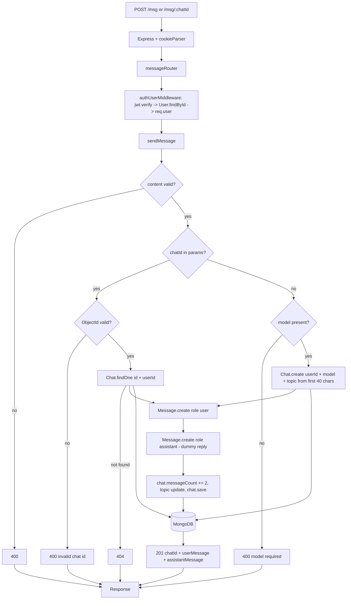

# Day 20 — sendMessage Upgrade: New-Chat-on-the-fly, Chat Metadata Updates & Cleaner Message Routing

## Overview
Day 20 refactors the message flow (no new layers added):
- **`sendMessage` upgraded**: now accepts requests **without a `chatId`** — if `chatId` is present it validates it as a MongoDB ObjectId and loads the existing chat (ownership-checked); if absent it **creates a new chat on the fly** from the `model` in the body and seeds `topic` from the first message's first 40 characters. This merges the old `createChat` + `sendMessage` into one entry point, matching how ChatGPT starts a conversation.
- **Chat metadata maintained**: `chat.messageCount += 2`, topic auto-set from the first message if still `"New Chat"`, then `chat.save()`.
- **messageRouter cleaned**: `POST /` (new chat) + `GET /:chatId` + `POST /:chatId` (existing chat).
- **ObjectId validation** added (`mongoose.Types.ObjectId.isValid(chatId)`) before querying.
- Response now returns both saved messages (`userMessage`, `assistantMessage`) — the dummy AI reply is still a placeholder ("Later we will replace this with OpenRouter response").

Two variants: `class/` and `afterClass/` — same features, practice copy with minor naming differences (`middleware/`, `chatcontroller.js`, `userValidator.js`).

## Folder Structure
```
Day20/
├── class/
│   ├── index.js                     # unchanged: /user, /chat, /msg routers
│   ├── config/database.js
│   ├── middlewares/authUserMiddleware.js
│   ├── model/                       # userSchema / chatSchema / messageSchema
│   ├── controllers/
│   │   ├── userController.js        # Zod-validated (Day 19 behavior)
│   │   ├── chatController.js        # Day 18 chat CRUD
│   │   └── messageController.js     # UPDATED: two-case sendMessage, metadata updates
│   ├── validators/userValidators.js # Zod signup/login schemas
│   ├── routes/
│   │   ├── userRouter.js
│   │   ├── chatRouter.js
│   │   └── messageRouter.js         # POST / , GET /:chatId , POST /:chatId
│   └── package.json                 # express, mongoose, bcrypt, jsonwebtoken, cookie-parser, dotenv, zod
└── afterClass/                      # student practice copy (same layout)
```

## File-by-File Explanation

### controllers/messageController.js (updated)
`sendMessage` is now a numbered 8-step flow:
1. Validate `content` (400 if empty).
2. **Existing-chat case** (`chatId` present): `mongoose.Types.ObjectId.isValid(chatId)` guard (400 "Invalid chat id"), then `Chat.findOne({_id, userId: req.user._id})` (404).
3. **New-chat case** (`chatId` absent): requires `model` in body (400), `Chat.create({userId, model, topic: content.trim().slice(0, 40)})`.
4. `Message.create({chatId: chat._id, role:"user", content: trimmed})` (note: `userId` is now covered by chat ownership).
5. Dummy AI reply string (`"AI reply will come here later."` — OpenRouter integration is next).
6. `Message.create({chatId, role:"assistant", content: aiReply})`.
7. Metadata: `chat.messageCount += 2`; if `chat.topic === "New Chat"` set topic from first message; `await chat.save()`.
8. Respond 201 with `{message, chatId, userMessage, assistantMessage}`.

`getMessage` unchanged from Day 19 (ownership check → messages sorted `createdAt: 1`).

### routes/messageRouter.js (updated)
```
messageRouter.post("/", sendMessage);        // new chat (no chatId)
messageRouter.get("/:chatId", getMessage);
messageRouter.post("/:chatId", sendMessage); // existing chat
```
All behind `messageRouter.use(authUserMiddleware)`.

### Everything else
`userController` (Zod safeParse flow), `chatController`, validators, middleware, models, `index.js`, `config/` — unchanged from Day 19/18; chatRouter still carries the Day 18 duplicate-import typo.

## Class vs After-Class (`class` vs `afterClass`)
Feature-identical. `afterClass` is the student's retype: `middleware/` (singular), `controllers/chatcontroller.js`, `validators/userValidator.js`, minor comment/format differences. Same bugs inherited (chatRouter double import of `getSingleChat`).

## Code Flow


## API Endpoints
| Method | Path | Controller | Auth | Status |
|---|---|---|---|---|
| POST | /msg | sendMessage (creates new chat; needs `model` in body) | Yes | 201 / 400 |
| POST | /msg/:chatId | sendMessage (existing chat) | Yes | 201 / 400 / 404 |
| GET  | /msg/:chatId | getMessage | Yes | 200 / 404 |
| *    | /user/*, /chat/* | as Day 18/19 | — | unchanged |

## Key Concepts
- **One endpoint, two modes**: same handler creates or extends a conversation based on whether `chatId` is supplied — the UX pattern of chat apps where the first message spins up the chat.
- **Input validation of identifiers**: `ObjectId.isValid` before querying prevents CastErrors from malformed ids.
- **Denormalized metadata**: `messageCount` and `topic` maintained on the Chat doc (avoids counting messages on every sidebar render).
- **Default-then-update topic**: seeded from the first 40 chars of the first message.
- **Swap-point for the LLM**: the assistant `Message.create` wraps a placeholder string, ready to be replaced by an OpenRouter/AI call and token usage tracking.

## Notes
- All credentials (`MONGO_URL`, `JWT_SECRET`, `PORT`) anywhere in these folders are dummy/expired class values — do NOT copy them into a real project.
- Inherited bugs to fix: chatRouter imports `getSingleChat` twice (`getRecentChat` undefined at runtime); `:chatId` missing slash in chatRouter; `messages:` JSON-key typos; no usage/token accounting yet despite schema support.
