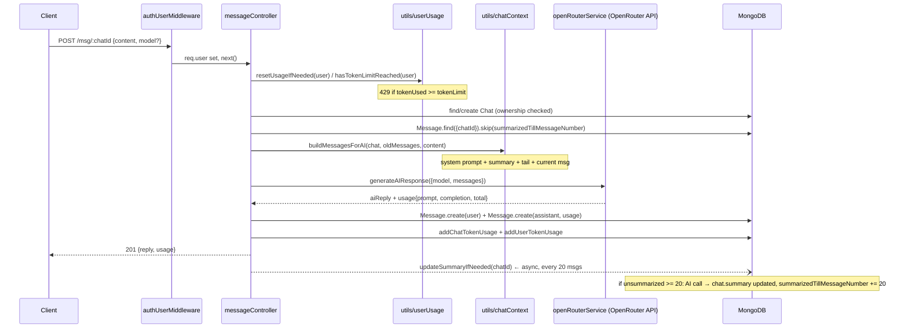

# Day 22 — AI Chat Backend with OpenRouter Integration

## Overview

Day 22 plugs a **real LLM** into the Day 21 chat backend via **OpenRouter**. What's new on top of Day 21:

- `config/openRouter.js` — OpenRouter SDK client configured from an env API key
- `services/openRouterService.js` (or `service/` in the class variant) — one function, `generateAIResponse`, that calls the model and normalizes token usage
- `utils/chatContext.js` — builds the `messages[]` payload (system prompt + rolling summary + old messages + current message)
- `services/summaryService.js` — every 20 unsummarized messages, asks the model to produce a rolling conversation summary (context-window compression)
- `utils/userUsage.js` — per-user token budget: reset window (5 h), limit check, usage increment
- `utils/tokenUsage.js` — per-chat token accounting
- `messageController.sendMessage` rewritten to: rate-limit → build context → call OpenRouter → save both messages → bill tokens → trigger async summary

Two complete variants again: `class/` (AI files under `service/`) and `afterClass/` (under `services/`, plural). Content is functionally identical.

## Folder structure

```
Day22/
├── class/
│   ├── index.js                      # same bootstrap as Day 21 (dotenv/config import style)
│   ├── config/
│   │   ├── database.js               # mongoose connect
│   │   └── openRouter.js             # NEW: OpenRouter SDK client, throws if no API key
│   ├── controllers/
│   │   ├── userController.js         # unchanged auth endpoints
│   │   ├── chatController.js         # unchanged chat CRUD
│   │   └── messageController.js      # REWRITTEN: real AI reply + token billing
│   ├── middlewares/authUserMiddleware.js
│   ├── model/                        # user/chat/message schemas (as Day 21)
│   ├── routes/                       # user/chat/message routers (as Day 21)
│   ├── service/                      # NEW dir (afterClass spells it "services/")
│   │   ├── openRouterService.js      # generateAIResponse({model, messages})
│   │   └── summaryService.js         # updateSummaryIfNeeded(chatId)
│   ├── utils/                        # NEW dir
│   │   ├── chatContext.js            # SYSTEM_PROMPT + buildMessagesForAI()
│   │   ├── tokenUsage.js             # addChatTokenUsage(chat, usage)
│   │   └── userUsage.js              # resetUsageIfNeeded / hasTokenLimitReached / addUserTokenUsage
│   ├── validators/userValidators.js
│   └── package.json                  # adds @openrouter/sdk
└── afterClass/                       # same app; "services/" dir naming; .env included
```

**Environment variables** (`.env` keys in `afterClass/`): `MONGO_URI`, `PORT`, `JWT_SECRET`, `OPENROUTER_API_KEY`, `DEFAULT_AI_MODEL`.

## The AI request flow in detail

### Step 0 — OpenRouter client (`config/openRouter.js`)
At import time it checks `process.env.OPENROUTER_API_KEY` and **throws immediately** if missing (fail fast at startup, not on the first request). Then it constructs `new OpenRouter({ apiKey })` from the official `@openrouter/sdk` and exports the singleton.

### Step 1 — Request hits `sendMessage` (controllers/messageController.js)
1. Validates `content` is non-empty (400 otherwise).
2. **User-level rate limiting** (before anything else):
   - `resetUsageIfNeeded(req.user)` — if `now > user.usage.resetAt`, zero out `tokenUsed` and push `resetAt` forward by 5 hours.
   - `hasTokenLimitReached(req.user)` — if `tokenUsed >= tokenLimit` (default 10 000), return **429** with the current usage; the request never reaches the AI.
3. Resolves the chat: existing `chatId` (validate ObjectId, then `Chat.findOne({_id, userId})` for ownership) or creates a new Chat with `model` from the body and `topic = first 40 chars`.

### Step 2 — Build the context window (`utils/chatContext.js`)
`buildMessagesForAI({chat, oldMessages, currentMessage})` assembles exactly what gets sent to the model:

1. A fixed **system prompt** (be helpful, clean code, admit uncertainty, refuse harmful/abusive content).
2. If `chat.summary` is non-empty, a second **system message containing the rolling summary** of older conversation.
3. All `oldMessages` — these are only the messages **after `chat.summarizedTillMessageNumber`** (the controller does `.skip(chat.summarizedTillMessageNumber)` when querying), each with its stored `role` (`user`/`assistant`).
4. The current user message.

This is the core token-economy trick: instead of sending the entire history every turn, the old part of the history is compressed into one summary string and only the recent tail is sent verbatim.

### Step 3 — Call OpenRouter (`services/openRouterService.js`)
`generateAIResponse({model, messages})` sends `openRouter.chat.send({ chatRequest: { model, messages } })` — the `model` string is whatever the chat was created with (OpenRouter routes it to the underlying provider). From the completion it extracts:

- `completion.choices[0]?.message?.content` — the reply text (throws `"AI response is empty"` if absent)
- `completion.usage.promptTokens` / `completionTokens` (input/output tokens)

and returns `{ aiReply, usage: { promptTokens, completionTokens, totalTokens } }`.

### Step 4 — Persist and bill
- `Message.create` for the user message, then `Message.create` for the assistant message with the `usage` embedded.
- `chat.messageCount += 2`; topic set from first message if still `"New Chat"`.
- `addChatTokenUsage(chat, usage)` — accumulates prompt/completion/total tokens on the **Chat** document.
- `addUserTokenUsage(req.user, usage.totalTokens)` — adds to the **User's** `tokenUsed` (windowed) and `totalTokenUsed` (lifetime).
- Responds 201 with `{ reply, usage, userMessage, assistantMessage }`.

### Step 5 — Fire-and-forget summary (`services/summaryService.js`)
After the response is sent, `updateSummaryIfNeeded(chat._id)` runs **without await**. It:

1. Computes `unsummarizedCount = chat.messageCount - chat.summarizedTillMessageNumber`; if `< SUMMARY_CHUNK_SIZE` (20), does nothing.
2. Otherwise fetches the next 20 messages (`.skip(summarizedTillMessageNumber).limit(20)`, oldest first).
3. Builds a summarization prompt: a system instruction ("keep important context, user goals, decisions, unresolved doubts; add nothing"), the **previous summary** as context, the 20 messages, and a final "Summarize the above conversation."
4. Calls the **same `generateAIResponse`** with the chat's model — so summarization is itself a billed AI call.
5. Overwrites `chat.summary`, sets `summaryUpdatedAt`, advances `summarizedTillMessageNumber` by 20, adds that call's usage to chat + user totals, saves both.

Because it's not awaited, errors in summarization can't fail the user's chat response (in the `afterClass` Day 23 copy this is made explicit with a `.catch`).

## Mermaid flow



## Key concepts

- **LLM gateway pattern**: OpenRouter sits in front of many model providers, so the app only ever changes the `model` string; API key never leaves the server.
- **Context-window management via rolling summary**: history is split into "summarized" (compressed into `chat.summary`) and "live tail" (`summarizedTillMessageNumber` onwards). One DB field is the cursor that keeps them consistent.
- **Layered token accounting**: usage stored at three levels — per message (`Message.usage`), per chat (`Chat.usage`), per user (`User.usage.tokenUsed` windowed + `totalTokenUsed` lifetime).
- **Quota / rate limiting**: check-before-call (`hasTokenLimitReached` → 429) and time-window reset (`resetAt`, 5 h) — the same shape as any API quota system.
- **Fail fast config**: `config/openRouter.js` throws at module load if the key is missing.
- **Fire-and-forget side effects**: summary generation is intentionally non-blocking, triggered after the HTTP response.
- **Separation of concerns**: controllers orchestrate; services own external API calls; utils own pure-ish helpers (context building, usage math).

## Notes

- Credentials: `afterClass/.env` contains `MONGO_URI`, `PORT`, `JWT_SECRET`, `OPENROUTER_API_KEY`, `DEFAULT_AI_MODEL` values — **all are dummy/expired; do not copy them, especially not the OpenRouter key.** Generate your own key at openrouter.ai and put it in a local, git-ignored `.env`.
- In the `class/` variant the AI service dir is `service/`; in `afterClass/` it is `services/` — import paths in the controllers match whichever copy you run.
- `summaryService.js` calls `Chat.findById(chatId)` without the ownership filter, but it only ever runs server-side on a chat the owner just messaged, so it is safe in practice.
- The `DEFAULT_AI_MODEL` env var is present in `.env` but the current code takes the model from the chat document / request body; wiring the default in is left as an exercise.
- Un-`await`ed `updateSummaryIfNeeded` in Day 22 can produce unhandled rejections; Day 23's afterClass copy adds an explicit `.catch` — a good example of how these repos evolve.
