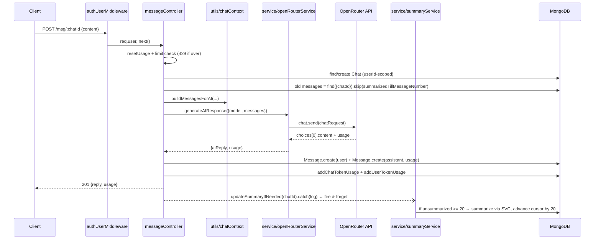

# Day 23 — AI Chat Backend: Consolidation and Hardening

## Overview

Day 23 is the **same OpenRouter-powered AI chat backend as Day 22**, re-implemented and refined. The `class/` copy is functionally identical to Day 22's `class/` (byte-for-byte except package metadata), while the `afterClass/` copy carries small but meaningful fixes over Day 22's `afterClass/`:

- **Bug fix in the summary cursor**: Day 22 queried `.skip(chat.summarizedTillMessageCount)` (wrong field name) — Day 23 uses the correct `chat.summarizedTillMessageNumber`, so the rolling-summary logic actually advances correctly.
- **Unhandled-rejection guard**: `updateSummaryIfNeeded(chat._id).catch(err => console.error("Failed to update chat summary:", ...))` in `messageController`, so a failure in the fire-and-forget summary task can never crash the process or hit the controller's catch block after headers are sent.
- Minor `index.js` cleanup (a commented-out test route for quick smoke testing).

In other words, this day is a "type it again and notice the details" reinforcement lecture: auth, chat CRUD, OpenRouter call, token accounting, and summary compression — all as Day 22, with the sharp edges filed down.

## Folder structure

```
Day23/
├── class/
│   ├── index.js                       # entry point (same as Day 22 class)
│   ├── config/
│   │   ├── database.js                # mongoose connect
│   │   └── openRouter.js              # OpenRouter SDK client (throws without API key)
│   ├── controllers/                   # user / chat / message controllers
│   ├── middlewares/authUserMiddleware.js
│   ├── model/                         # userSchema / chatSchema / messageSchema
│   ├── routes/                        # userRouter / chatRouter / messageRouter
│   ├── service/                       # ← singular dir name in class variant
│   │   ├── openRouterService.js       # generateAIResponse({model, messages})
│   │   └── summaryService.js          # updateSummaryIfNeeded(chatId)
│   ├── utils/                         # chatContext / tokenUsage / userUsage
│   ├── validators/userValidators.js
│   └── package.json
├── afterClass/                        # practice copy with the fixes listed above
│   └── ... (same layout, but "services/" plural + .env present)
```

**Environment variables** (`.env` keys in `afterClass/`): `MONGO_URI`, `PORT`, `JWT_SECRET`, `OPENROUTER_API_KEY`, `DEFAULT_AI_MODEL`.

## Code flow (per request)

1. **Auth**: `authUserMiddleware` verifies the JWT cookie and loads the user onto `req.user`.
2. **Quota**: `resetUsageIfNeeded` (5-hour window reset) and `hasTokenLimitReached` → 429 if the user's `tokenUsed >= tokenLimit`.
3. **Chat resolution**: existing `chatId` (ObjectId check + ownership via `userId` filter) or new Chat with `model` + auto topic.
4. **Context build** (`utils/chatContext.js`): system prompt + optional rolling `chat.summary` as a second system message + messages after `summarizedTillMessageNumber` + the current user message.
5. **AI call** (`service/openRouterService.js` → OpenRouter API): returns `aiReply` and `usage {promptTokens, completionTokens, totalTokens}`.
6. **Persist + bill**: save both messages (assistant message carries `usage`), bump `chat.messageCount += 2`, `addChatTokenUsage`, `addUserTokenUsage`, respond 201.
7. **Async summary** (`service/summaryService.js`): if ≥ 20 unsummarized messages, the next 20 are summarized by the same AI call; `chat.summary` replaced, cursor advanced by 20, usage billed — and in the `afterClass` version this is wrapped in `.catch`.

## Mermaid sequence — full happy path



## Key concepts

- **Naming-consistency bugs**: a single misspelled schema field (`summarizedTillMessageCount` vs `summarizedTillMessageNumber`) silently broke cursor advancement in Day 22's afterClass copy — Day 23 is the fix. Lesson: cursor fields used in `.skip()` must be referenced consistently across files.
- **Defensive async side effects**: any promise not awaited after `res.send()` still needs a `.catch`, or an unhandled rejection can kill a Node process.
- **Everything else carries over from Day 22**: OpenRouter as a model gateway, rolling-summary context compression, three-level token accounting (message/chat/user), quota with time-window reset, ownership-scoped queries.
- **Variant naming convention**: class uses `service/`, afterClass uses `services/`; controllers import from whichever exists in that tree — a reminder that import paths must match the actual directory name.

## Notes

- Credentials: `afterClass/.env` holds `MONGO_URI`, `PORT`, `JWT_SECRET`, `OPENROUTER_API_KEY`, `DEFAULT_AI_MODEL` — **all dummy/expired; do not copy them** (the OpenRouter key in particular). Use your own key and a git-ignored `.env`.
- No new features were added this day; if you've read Day 22's docs, the only deltas are the cursor bug fix, the `.catch` on summary, and the directory re-practice.
- `DEFAULT_AI_MODEL` remains an unused env hook — the model still comes from the chat document.
