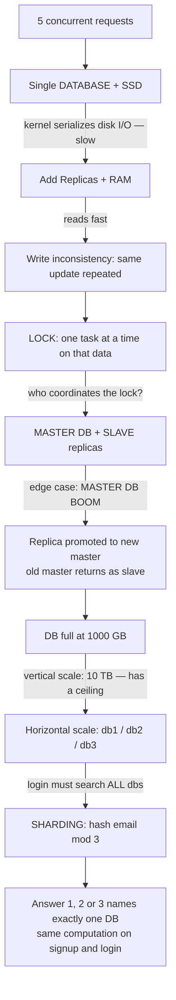

# Day 24 — Lecture Diagram: Database Replication, Locking, and Sharding

## Overview

Day 24 contains no code — it is the **hand-drawn lecture whiteboard** from class ("Lecture 23"), exported as both SVG and PNG. The diagram walks through how a production database layer scales and stays consistent:

1. What happens when 5 concurrent requests hit one database
2. Why SSD-backed reads are slow (kernel path) and why RAM-accelerated replicas help
3. Replicas and the data-inconsistency problem they create
4. **Locking** (one writer at a time) around a money-transfer example
5. **Master–Slave replication** — master decides which replica holds the lock
6. **Edge case: master dies** → a replica is promoted to the new master
7. **Vertical vs horizontal scaling**, and the cross-database search problem it creates
8. **Sharding** by hashing: `hash(email) mod 3` picks the database

`link.txt` also contains the original Excalidraw share link for the drawing.

## Files

| File | What it is |
|---|---|
| `Lecture 23.svg` | The whiteboard as vector SVG (~208 KB) — text inside is real XML, searchable |
| `Lecture 23.png` | Raster export (~3.3 MB) of the same drawing |
| `link.txt` | Excalidraw share URL: `https://excalidraw.com/#json=5rEV-FaxBl3aYitzYwN9h,...` — opens the editable source of the diagram in Excalidraw |

## The diagram

(SVG version of the same image: [Lecture 23.svg](Lecture%2023.svg))

### What it shows, section by section (transcribed from the SVG text)

**1. Basic setup.** `Frontend → LB (load balancer) → BACKEND → DatabAse`, plus "Replica of Database" boxes. Question posed: *what happens when 5 requests hit the database?* Answer: **it works one request at a time.**

**2. Why a single DB is slow.** SSD = "processor with RAM"; you can't read directly into the SSD — the request goes to the **kernel**, which calls the SSD with an API; the kernel is "completely busy here" and the processor (dual core = 2 parallel calculations, octa core = 8) is stuck serializing requests. Verdict: "it is a complete slow process — we need to improve this section."

**3. Replicas.** One `DATABASE` plus several `Replica` copies next to `Ram`/`SSD`. Reads get fast, but new question: when data changes (the name "chandan" → "ondan"), *do all replicas need the change too?*

**4. Locking.** Example: "Chandan sends 300 to Umesh" — read Chandan's balance, update it, add money to Umesh. If replicas handle this concurrently, "it repeats multiple times"; so the backend applies a **LOCK**: at one time, one task performs on that data. Signal flow: *from the backend, whichever database replica is reached first gets locked so no other replica can access that particular data.* Caveat noted: "in bad situations some internet or random issue — replicas can't be updated, so there is a catch."

**5. Master–Slave replication.** A `MASTER DB` plus `SLAVE DB` replicas. "Master DB decides which is locked or not"; once one replica confirms its work, confirmation goes back to the user.

**6. Edge case — master fails** ("<edge case> MASTER DB BOOM"): a node connected to the replicas is promoted to the **new master DB**; when the old master recovers, it comes back **as a slave**. (This is automatic failover — how MongoDB replica sets elect a new primary.)

**7. Scaling.** Database full at 1000 GB → try **vertical scaling** (10 TB machine), "but we cannot do more and more vertical scale, so try horizontal scaling": three databases, each holding 0→1 million users. New problem: a login request (`{email, password}`) must search **all** databases — found in db3 after "not found" in db1 and db2. "You cannot create new databases because of cost — so what do we do?"

**8. Sharding.** Convert the user input to a number (ASCII), take the **hash value mod 3** (3 databases, replicas ignored): the answer (1, 2, or 3) decides **which database** the signup data is stored in — and the same computation finds it on login. "Hurray, you fixed it. **This is called SHARDING.**"

## How it works — first principles

Start from the simplest possible system and let each failure force the next mechanism:

1. **One database, many requests.** A disk is not memory — a read request goes to the OS **kernel**, which issues the actual I/O to the SSD via its API. While the kernel is busy serving one request, the next one waits; the CPU (dual core = 2 parallel calculations, octa core = 8) can't parallelize a single disk's serialized I/O. So concurrency is bounded by one machine → **add copies of the database (replicas)**.
2. **Replicas fix reads, break writes.** Reads spread across replicas and get fast. But an update (`"chandan"` → `"ondan"`) now has to land on every copy — and replicas update at different moments, so concurrent writers can apply the same change "multiple times". → **Locking**: at one time, one task performs on that data; the backend locks whichever replica it reaches first so no other replica touches that particular record.
3. **Locks need a coordinator.** If every replica decides on its own lock, replicas still diverge (and "in bad situations — some internet or random issue — replicas can't be updated, so there is a catch"). → **Master–Slave**: the master decides which replica is locked or not, and only confirms back to the user once a replica confirms its work. One source of truth for ordering.
4. **The coordinator is a single point of failure.** "MASTER DB BOOM" → a node connected to the replicas is promoted to the **new master**; when the old master recovers, it rejoins **as a slave**. (This is exactly automatic failover / replica-set election.)
5. **Storage runs out.** Full at 1000 GB → **vertical scaling** (a 10 TB machine) works, but only until you can't buy a bigger box. → **Horizontal scaling**: 3 databases, each holding 0→1 million users.
6. **Horizontal scaling breaks lookup.** A login `{email, password}` must now be searched in **all** databases — "not found" in db1 and db2, "found" in db3. You can't keep adding databases because of cost. → **Sharding**: convert the key (email) to a number (ASCII), take `hash mod 3`; the result (1, 2, or 3) deterministically names the single database holding that user — both on signup and on login. "Search everywhere" becomes "compute once".

Each step solves exactly the problem the previous step created — that is the whole history of database scaling in one drawing.

## Flow (mermaid)

## Key concepts

- **Single-node bottleneck**: even with fast SSDs, one database serializes writes through the kernel; the fix is distributing load.
- **Replication** for read scale + fault tolerance — but replicas introduce **consistency** problems on writes.
- **Locking / mutual exclusion**: only one task may mutate a piece of data at a time; the coordination point is what a master/primary provides.
- **Master–Slave (primary–secondary) replication** with **automatic failover**: slave promoted to master on failure, demoted old master rejoins as slave.
- **Vertical vs horizontal scaling**: bigger box has a ceiling; sharding is the horizontal answer.
- **Sharding by hash**: `hash(key) mod N` deterministically maps each record to one shard, turning "search every DB" into "compute one DB" — the same idea behind consistent-hashing-style partitioning (naive mod version here).
- Trade-off glossed in the drawing: replicas can lag behind the master (eventual consistency) — "there is a catch."

## Notes

- No code and no credentials in this folder — only the two image files and `link.txt`. Nothing to redact.
- The link in `link.txt` points to the author's Excalidraw file; shared Excalidraw JSON links can expire, so the local SVG/PNG are the durable copies.
- Terminology in the sketch is informal ("Repilca", "DatabAse", "master/slave"); the modern preferred terms are **primary/secondary** and **replica set**.
