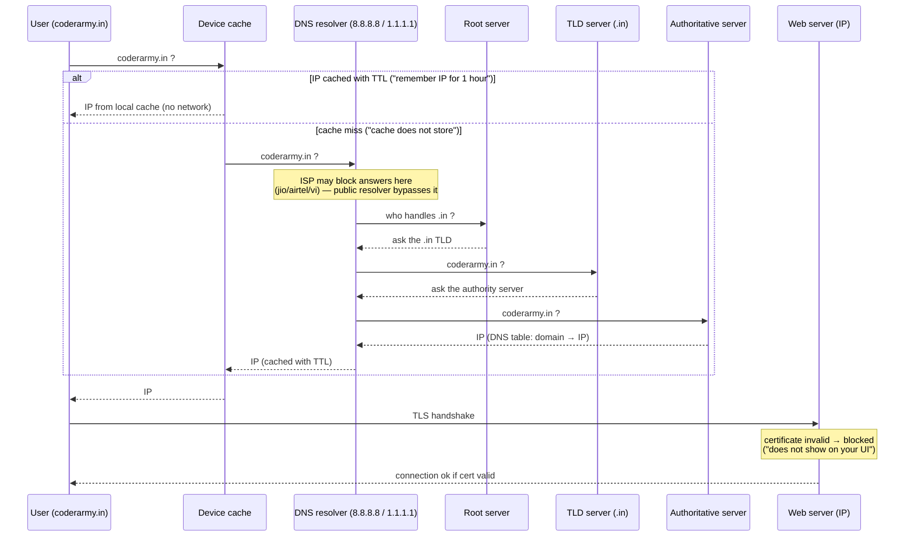

# Day 25 — Lecture Diagram: DNS Resolution and Domain/Database Blocking

## Overview

Day 25 is another **hand-drawn Excalidraw lecture whiteboard** ("Lecture 23.excalidraw"), exported as SVG + PNG, with no code. It continues Day 24's systems topic, this time covering **how a domain name becomes an IP address** — the full DNS resolution path — plus two practical asides: ISP-level DNS blocking and TLS certificate validation.

## Files

| File | What it is |
|---|---|
| `Lecture 23.excalidraw.svg` | The Excalidraw drawing as vector SVG (~92 KB) — contains the real text of the sketch |
| `Lecture 23.excalidraw.png` | Raster export (~3.6 MB) of the same diagram |

(Unlike Day 24 there is no `link.txt` in this folder.)

## The diagram

(SVG version of the same image: [Lecture%2023.excalidraw.svg](Lecture%2023.excalidraw.svg))

### What it shows, section by section (transcribed from the SVG text)

**1. Title & setup — "DNS AND DATABASE".** `ISP → Frontend → DNS` pipeline for resolving a domain like `coderarmy.in`.

**2. The resolver chain.** When the browser asks "coderarmy.in ?":
- **Device cache** is checked first: if the IP is stored locally with a **TTL** ("remember IP for 1 hour"), no network round trip is needed.
- If the cache misses ("for some how cache does not store"), the request goes to the **DNS resolver** — with examples like Google DNS `8.8.8.8` and Cloudflare `1.1.1.1`.

**3. ISP blocking aside.** "Sometimes DNS is blocked by ISP (jio/airtel/vi) — supabase and mongoes [MongoDB Atlas?] are blocked; changing ISP DNS to Google or Cloudflare makes it work fine." (Practical tip: switching your resolver to 8.8.8.8 / 1.1.1.1 bypasses ISP DNS blocks.)

**4. Hierarchy of DNS servers** ("Architecture"):
- **Root server** — if the resolver has no IP, the request moves on.
- **TLD server** — handles the top-level domain (`.in`, `.com`, `.en`, `.edu`); for `coderarmy.in` the `.in` TLD is consulted.
- **Authority (authoritative) server** — if the TLD does not store the IP for `coderarmy.in`, it forwards to the authority server, which returns the actual IP; the answer travels back: authority → DNS resolver → device.

**5. DNS records table.** Example mappings shown: `strikes.in → 12.3.4.5`, `chandan.com → 12.3.4.5` (domain name → IP rows in a DNS table).

**6. Certificate / TLS aside.** "Certified TLS — blocked because chandan.com is not valid certificate": the resolver table can return an IP, but the browser still validates the **TLS certificate** for the domain; a mismatched/invalid cert gets the site blocked even though DNS worked. ("but it does not show on your UI" — the block happens below the visible layer.)

## How it works — first principles

Why DNS exists at all: machines talk to **IP addresses**, humans remember **names**. Something has to translate one into the other, and it has to do it fast, on every request, for the whole internet. Each layer of the sketch is the cheapest fix for the previous layer's cost:

1. **Names → IPs is a lookup, so cache it.** The closest cache is the **device itself**: if `coderarmy.in`'s IP is stored locally with a **TTL** ("remember IP for 1 hour"), zero network round trips are needed. The TTL exists because IPs change — caching forever would serve stale answers.
2. **On a cache miss, ask a resolver.** The device forwards "coderarmy.in ?" to a **DNS resolver** — a public one like Google `8.8.8.8` or Cloudflare `1.1.1.1` (sketched alongside example answer IPs like `2.3.4.4`, `1.2.3.6`, `2.3.5.6`). The resolver does the recursive legwork so the device doesn't have to.
3. **Nobody stores the whole internet, so delegate by suffix.** The resolver asks a hierarchy: the **root server** ("who handles `.in`?") → the **TLD server** for `.in` (also `.com`, `.en`, `.edu` are shown) → the **authoritative server**, which actually holds `coderarmy.in`'s record. The answer travels back: authority → resolver → device. This is a trie-like delegation: each level only knows who is responsible for the next suffix.
4. **The answer lands in a DNS table** — rows of `domain name → IP` (`strikes.in → 12.3.4.5`, `chandan.com → 12.3.4.5`) — and is cached per the TTL from step 1, closing the loop.
5. **The same choke point is also a censorship point.** Because your ISP's resolver sits on the path, it can simply refuse to answer for some domains ("supabase and mongoes are blocked" by jio/airtel/vi). Switching your resolver to Google or Cloudflare sidesteps the ISP's filter — the domain was never down, only that resolver's answer was.
6. **A resolved IP still isn't a working site.** The browser then validates the **TLS certificate** for the domain; `chandan.com` with an invalid certificate gets **blocked** even though DNS answered correctly — and "it does not show on your UI", because the failure happens in the handshake layer below the page. DNS success ≠ usable site.

## Flow (mermaid)

## Key concepts

- **DNS resolution order**: device cache (with TTL) → recursive resolver (Google/Cloudflare) → root server → TLD server → authoritative server → IP returned to the client.
- **TTL caching**: cached IPs expire so changes propagate within the TTL window; here sketched as "remember IP for 1 hour".
- **ISP DNS blocking**: ISPs can filter answers at their resolver; using a public resolver (8.8.8.8 / 1.1.1.1) is the standard workaround.
- **DNS is only step one**: after the IP is known, the **TLS certificate** must match the domain or the connection is blocked — DNS success ≠ usable site.
- **Relation to the backend course**: this explains why in development `localhost` works without DNS and why deploying (custom domain + DNS records + TLS certs, e.g. on Vercel/Atlas/Supabase) involves the whole chain sketched here.

## Notes

- No code and no credentials in this folder — only the two diagram files. Nothing to redact.
- Sketch spellings ("mongoes", "TLD servr") are transcribed as drawn; the standard names are root / TLD / authoritative name servers.
- Pair with Day 24: Day 24 covered what happens *behind* the backend (database scaling), Day 25 covers what happens *before* it (getting from a domain name to the server in the first place).
