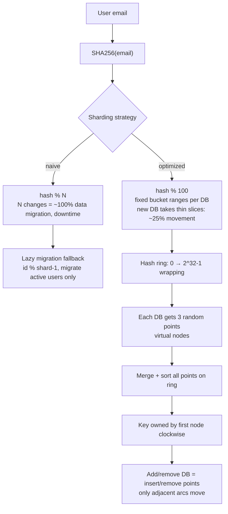

# Day 26 — Consistent Hashing

## Overview
Day 26 is a whiteboard session on **consistent hashing** — the sharding strategy used when a fixed `hash % N` formula breaks down as database shards are added or removed. The board starts from the naive `email % 3` approach, shows exactly why it forces a massive data migration, then progressively optimizes: modulo 100 buckets, hashing bucket numbers onto a **hash ring** with clockwise ownership, and finally virtual nodes (each DB owning multiple random points on the ring). Migration strategy (lazy migration) is also worked through.

## Files
| File | What it is |
|---|---|
| `consistentHAshing.excalidraw` | Editable Excalidraw source of the whiteboard |
| `consistentHAshing.svg` | Vector export of the same diagram (text extracted below) |
| `consistentHAshing.png` | Raster render of the full whiteboard |
| `docs.md` | This document |

## The diagram


### What it shows, section by section (transcribed from the SVG)
1. **The naive setup** — Three shards labelled `Shard / db 0, db1, db2`. A user email `chandan@gmail.com` is passed through `hash`, giving `number % 3 = 2` so it lands on shard 2. Shard sizes drawn unevenly: `3 m user`, `1 m user`, `1m user`, `1m User` (values `0,1,2` shown as shard ids).
2. **Adding a new shard** — `new db3`, with the note `let user inc and added db3`. The question posed: `Old term or formula (mode3) is valid for it ?` ("mode3" is as drawn — mod 3).
3. **Why it breaks** — The same email hashed: `64 % 3 = 1` (old formula) vs `64 % 4 = 0` (new formula) for `chandan@gmail.com`. Conclusion written on the board: `So here is conflict occurs`, `data is not managed properly`, `We need to distribute the whole data agin`, and a frustrated `FAHHHHH`. `The data Will be Like this ->>>>>` — nearly everything moves.
4. **Migration during re-sharding** — Notes: `here we can see the most the data was moved in the database`, `so when u do the migration ??`, `1. During Migration User cant see the response from the server side`.
5. **Lazy migration** — `1. A = lazy migration`: in the first condition `chandan@gmail.com. store in db0`, but in the 2nd condition it `store in db1`. Pseudocode on the board:
   ```
   if(findUser(DB))
     //if not found
   else{
     //check old data
     id%(shard-1)
   }
   found then send to user
   migration to new DB
   ```
   `Draw back is 3 million user present / 5 lakh is active so migration is done for 5 Lakh only` — only active users get migrated on demand.
6. **Optimization 1: modulo 100 buckets** — `let make more Optimize / take modulotns 100 / so answer will come 0 - 99`. Ranges: `0 --> 32 ----=> DB 0`, `33--> 65 ==> DB1`, `66 ->> 99 => DB2`, each with `1 million` users. Worked examples: `SHA256("chandan@gmail.com") % 100 = 35` and `SHA256("dipsa23@gmail.com") % 100 = 96` (long hash digests like `cb4beee59290e0420fca90979693040e29978befd5d7283cee35968691ee5ebe` written out).
7. **Adding a DB to a bucketed system** — `SO WHEN DB IS FULL ?? Then what to do ?` DB 3 only takes thin slices: `25 - 32`, `58 - 65`, `91 - 99` carved out of the existing ranges; remaining ranges `0 - 24`, `33 - 57`, `66 - 90` stay with DB0/DB1/DB2. `It store only this / so data movement IS LOW`. New chat/table: `0 - 24 DB0`, `33-57 DB1`, `66-90 DB2`, `25-32 DB3`, `58-65 DB3`, `91-99 DB3` — each main DB keeps `7.5 LAKH DATA` (drawn `7.5 LAK DATA` on one). `SO HERE 25 % DATA MOVEMENT ONLY`.
8. **Adding yet another DB** — `if New DB 4 WAS ATTACHED`, slices `20 - 24`, `52 - 57`, `86 - 90`, `25 - 27`, `28 - 32` are re-carved. `SO THE NEW TABLE IS`: `0-19 -> DB 0`, `33-52 -> DB 1`, `66-85 -> DB 2`, `20-24 -> DB 4`, `52-57 -> DB 4`, `86-90 -> DB 4`, `28-32 -> DB 4`, `25-27 -> DB 3`, `58-65 -> DB 3`, `91-99 -> DB 3`. Another example: `sangam@gamil.com` → `sha 256 - f18a86fae9e10a8354e0e13cfde9e31c28d0db6855d272ca83da0e1d741260e1`, `modulo is 25`.
9. **From fixed ranges to a ring** — `IN REAL WORLD WE USE USIGNED NUMEBR WHICH IS 2^(32-1)` (as drawn; unsigned 32-bit is really 2^32 − 1). A `0 … 99` circle with `%100` and `DB0 , DB1 , DB2` placed at random points `27`, `63`, `93`: `RANDOM CHOOSE BY DB0 → 0-27`, `DB1 → 28-63`, `DB2 → 64-96`. Gap question: `WHO HANDLE 97 - 99 DATA ?? LET WE SEND THIS TO DB0`.
10. **Why random single points are dangerous** — `🤣 U CHOOSE RANDOM VALUE YOUR DATABASE CAN BE BOOM FAHHHHH` — with one random point per DB the arcs can be wildly uneven.
11. **Virtual nodes** — `LETS GIVE THEM TO CHOOSE ANY 3 POINTS`: `DB 0 - 3`, `DB 1 - 3`, `DB 2 - 3`. Each DB gets 3 random points (`10, 48, 94` for DB 0; `4, 30, 54` for DB 1; `18, 42, 63` for DB 2), all merged and sorted: `4, 10, 18, 30, 42, 48, 54, 63, 94`, with ownership labels `DB 1, DB 0, DB 2, DB 1, DB 2, DB 0, DB 1, DB 2, DB 0` between consecutive points. A final ASCII sketch of the ring shows the points mapped around the circle (`94 DB0`, `4 DB1`, `10 DB0`, `63 DB2`, `18 DB2`, `54 DB1`, `30 DB1`, `48 DB0`, `42 DB2`).

## How it works — first principles
- **The basic problem:** you have millions of users and one database. You shard by `hash(key) % N`. It works while N never changes.
- **Why `hash % N` breaks:** the moment you add DB3, every key's remainder changes (`64 % 3 = 1` becomes `64 % 4 = 0`). Nearly all keys map to a different shard, so almost the entire dataset must be relocated — a full migration with downtime (`During Migration User cant see the response from the server side`).
- **Lazy migration as a stopgap:** keep both formulas; on a lookup, try the new shard, and if the user is missing, fall back to the old formula `id % (shard - 1)`, serve from there, and migrate that user to the new DB. Only active users (5 lakh of 3 million) ever migrate. Drawback: the code carries dual-lookup complexity forever.
- **Optimization 1 — decouple keys from server count:** hash into a fixed large number of buckets (`% 100`) and map bucket ranges to DBs. Adding a server means re-carving only a few thin ranges (e.g. `25-32`, `58-65`, `91-99` to DB3), so data movement drops to ~25%, and it shrinks further with each added DB.
- **Optimization 2 — the hash ring:** put the bucket space on a circle of unsigned 32-bit values (0 → 2^32 − 1, wrapping back to 0). Place each DB at a position on the ring; a key belongs to the first DB encountered moving **clockwise**. No global re-carving — ranges are implied by ring positions.
- **Optimization 3 — virtual nodes:** one random point per DB can produce hugely uneven arcs (`U CHOOSE RANDOM VALUE YOUR DATABASE CAN BE BOOM`). Give each DB several (here 3) random points on the ring. The merged, sorted point list defines many small arcs, and each DB ends up with a roughly equal, well-distributed share. Adding a DB inserts its points into the ring and steals only the adjacent arcs — minimal, predictable data movement.

## Key concepts
- `hash(key) % N` is only stable while N never changes — any resize remaps nearly every key.
- Lazy migration: serve a miss by falling back to the old shard formula, then migrate on demand.
- Fixed bucket count (`% 100`) decouples keys from server count; ranges per server are re-carved, not recomputed.
- Hash ring: keyspace wraps (unsigned 32-bit); a key is owned by the nearest node clockwise.
- Virtual nodes: multiple ring positions per server smooth out load and make scaling predictable.
- Data movement is the real cost metric: ~100% with naive mod, ~25% with buckets, minimal with a ring + virtual nodes.

## Flow


## Notes
- No credentials, API keys or tokens appear anywhere in the diagram — nothing to ignore.
- Spellings are transcribed exactly as drawn on the sketch, including `consistentHAshing`, `mode3` (mod 3), `modulotns` (modulations/modulo), `agin` (again), `NUMEBR` (number), `USIGNED` (unsigned), `gamil.com` (gmail.com), `7.5 LAK DATA` / `LAKH`, and the `FAHHHHH` / `BOOM` exclamations. The board also writes `2^(32-1)` for the ring size where standard unsigned 32-bit space is 0 to 2^32 − 1.
- The final ASCII ring sketch in the SVG is preserved above with its spacing as drawn.
