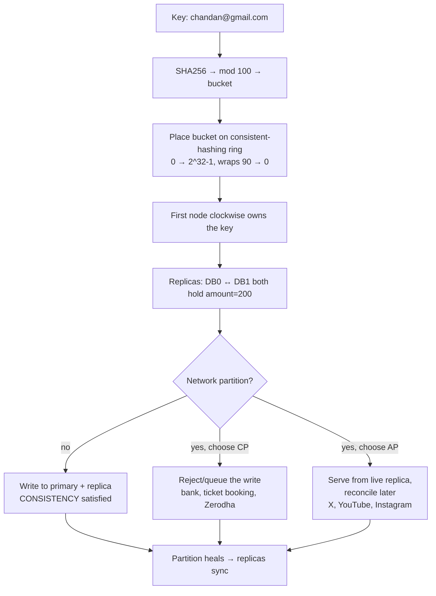

# Day 27 — CAP Theorem

## Overview
Day 27 is a whiteboard session on the **CAP theorem** and how it connects back to Day 26's consistent hashing. The first half of the board finishes the consistent-hashing picture: virtual nodes (`hash(DB0#0)`, `hash(DB0#1)`, `hash(DB0#2)`) placed on a `0 TO 2^32-1` ring, replicas, vertical vs horizontal scaling, and a full worked example of adding nodes DB1 → DB2 → DB3 to a ring and recomputing clockwise ownership. The second half introduces CAP: consistency vs availability demonstrated with a bank-balance replica pair, three concrete cases, and the rule that the C-vs-A choice only arises **during a partition**, with real-world examples (Zerodha/banking = CP, social media = AP).

## Files
| File | What it is |
|---|---|
| `Cap Theorem .excalidraw` | Editable Excalidraw source (note the spaces in the filename) |
| `Cap Theorem .svg` | Vector export of the same diagram (text extracted below) |
| `Cap Theorem .png` | Raster render of the full whiteboard |
| `docs.md` | This document |

## The diagram

### What it shows, section by section (transcribed from the SVG)
1. **Virtual nodes on the ring (behind the scenes)** — `Behind scene`: DB0, DB1, DB2 on a ring of `0 TO 2^32-1`, each with `3 virtual node` created as `hash(DB0#0)`, `hash(DB0#1)`, `hash(DB0#2)`. `the value nust be inside it` (`nust` as drawn) with sample token values `21434`, `1234`, `2334` per shard. Capacity note: `100GB  100TB HardDisk`, and `Replica 1`, `Replica 2` — `If crash then user can effected on this so we considered to make multiple shard of the DB`.
2. **Scaling options** — `8 Gb , 5TB hard` machine. `Purchase new case: 1. 80% full hogaya he` → `Purchase new 16GB 10TB which is vertcial scale` (vertical scaling) vs `Optimal scale: 8GB 10TB / horizontaly scale` — `data partion`. `In the section of AWS it can done by the one click`.
3. **Ring positions example** — Sample node positions: `DB0 -- 10`, `DB1 --22`, `DB1 -- 39` (as drawn), `DB2 -- 48`, `DB0 -- 61`, `DB0-- 72`, `DB2 -- 80`, `DB1-- 92`, `DB-- 98`.
4. **Key placement with migration** — `chandan@gmail.com --> hash--> mod 100 = we got a value between 0 to 99`; `SHA256("chandan@gmail.com") mod 100 = 42` → `DB2-42`. `During migration move to the DB0 -- 61`. `Old DB2 - 42 can be used the replica of it` — `so we don't delete the data and it helps to dont recreate the replica of new DB we can use the OLD data as a replica or backup`.
5. **The clockwise ownership rule (in Hinglish)** — `Because consistent hashing ring hai, 90 ke baad wapas 0 aata hai: 0 → 20 → 40 → 60 → 90 → 0 → ...`. Marked `IMPORTANT RULE FOREVER`: `Kisi key ka hash value jis node ko clockwise direction mein sabse pehle encounter karta hai, key us node ki hoti hai.` (Whichever node a key's hash first encounters going clockwise owns the key.)
6. **Worked example — adding nodes one by one**
   - `INITIAL STAGE`: `DB0 -> 0–90`. `Every key goes to DB0`: `hash = 15 -> DB0`, `37 -> DB0`, `62 -> DB0`, `88 -> DB0`.
   - `Case 2`: add `DB1 -> 60`. Ownership: `0–60 -> DB1`, `60–90 -> DB0`, `90–0 -> DB0`. Re-mapped keys: `20 -> DB1`, `40 -> DB1`, `55 -> DB1`, `70 -> DB0`, `85 -> DB0`.
   - `Case 3`: add `DB2 -> 40`. `DB0 -> 0`, `DB2 -> 40`, `DB1 -> 60`. Ownership: `0–40 -> DB2`, `40–60 -> DB1`, `60–90 -> DB0`, `90–0 -> DB0`.
   - `Case 4`: add `DB3 -> 20`. `SO NOW THE DATA`: `DB0 -> 0`, `DB3 -> 20`, `DB2 -> 40`, `DB1 -> 60`. Ownership: `0–20 -> DB3`, `20–40 -> DB2`, `40–60 -> DB1`, `60–90 -> DB0`, `90–0 -> DB0`. `SO now DB 0 can be deleted`.
7. **CAP statement** — `Cap Theorem`: `consistency, availability and partition --> U can achive CP and AP during partition` (achive as drawn).
8. **Case 1 — consistent replica pair** — `DB 0` and `DB 1` both hold `amount = 200` (`replica`). `user 100 rupe deduct karlo` → `100`, `conformation`, then `deduct from also replica` → `100`. `HERE we follow the consistency` (steps `1 2 3`).
9. **Case 2 — partition, choose consistency** — Same `amount = 200 / amount = 200` pair: `same process but some reason we cant tak with DB 1` (`tak` as drawn, talk). `then what we do ?? there is no conformation so 100 can be deduct <WE NEED CONSISTENCY> and we ignore AVAILABILITY` — the write is refused while DB1 is unreachable.
10. **Case 3 — availability wins (social media example)** — `virat koholi like = 1000` shown on both `DB 0` and `DB 1` (`ye banda like kiya`). `A like the POst but DB 0 IS dead but it shows availability` — `POST will be like when systeam is achievd` (as drawn), `We can send like please like after some time`, `here we need availability`, with `DB 0 <DEAD>` and `DB 1` still serving.
11. **What a partition is** — `Cap theorem introduce when during partition / DB 0 cannot be connected to the DB 1`. Causes listed: `-Network issue`, `-LAN disconnect`, `-Destroy`. `So we need to choose the consistency or avivality` (as drawn).
12. **Final summary** — Repeat of the replica pair (`amount = 200`, `replica`, `user 100 rupe deduct karlo`, `100`, `not avialbele` as drawn, `Disconnected`): `Consistency we follow here`. Then the real-world mapping: `Partition --> consistency ->> Bank, ticket booking, Zerodha`; `partition --> Availability --> Social Media, X, youtube, instagram`.

## How it works — first principles
- **Start with replicas:** to survive crashes you keep copies of your data on multiple shards (Day 26's ring) — `Replica 1`, `Replica 2`. Every write must reach every replica for the copies to agree.
- **Then partitions happen:** in a distributed system the network between replicas can fail at any time (network issue, LAN disconnect, machine destroyed). During a partition DB0 and DB1 cannot talk to each other, yet users keep hitting both.
- **C, A, P defined:** Consistency = every read sees the latest write (all replicas agree). Availability = every request gets a response. Partition tolerance = the system keeps operating despite the network split. CAP says: when a partition actually occurs, you must pick **consistency or availability** — you cannot have both at that moment.
- **Choosing C (CP):** refuse the write until the replicas can reconcile — the bank balance stays correct (`100` deducted on both or not at all) but the service is temporarily unavailable. Banks, ticket booking, Zerodha live here.
- **Choosing A (AP):** accept the write/like on whichever replica is reachable and reconcile later ("please like after some time") — the service always responds but replicas may temporarily disagree. Social media (X, YouTube, Instagram) lives here.
- **Tying back to consistent hashing:** when a node is added/removed on the ring, only the arcs between the old and new node move. During that migration the old shard's copy is kept as the replica/backup for the new shard (`we don't delete the data … use the OLD data as a replica or backup`), which is exactly how CP/AP systems keep consistency across re-sharding.
- **Real systems:** CP-leaning examples — MongoDB (configurable), Redis (async replication by default, config-dependent), etcd/ZooKeeper, HBase; AP-leaning — Cassandra (tunable, defaults AP), DynamoDB, CouchDB, Riak. CAP is about the *moment of partition*, not a permanent label — Cassandra can be tuned toward C with quorum writes/reads.

## Key concepts
- CAP theorem: during a network partition, a distributed store must sacrifice either consistency or availability.
- Partition tolerance is not optional — partitions are guaranteed to happen eventually, so C/A is the real tradeoff.
- CP (banks, ticket booking, Zerodha): block or reject operations when replicas can't confirm.
- AP (X, YouTube, Instagram): always respond; reconcile conflicts later.
- Clockwise ownership rule on a consistent-hashing ring: a key belongs to the first node encountered going clockwise; ranges wrap (`90 → 0`).
- Virtual nodes: `hash(DB#n)` for n = 0..2 spreads each DB across the ring.
- During re-sharding, keep the old shard's data as a replica/backup for the new owner instead of deleting it.
- Vertical scaling (bigger box: 16GB/10TB) vs horizontal scaling / data partitioning (more boxes) — horizontal is what consistent hashing enables.

## Flow

## Notes
- No credentials, API keys, tokens or secrets appear anywhere on the board — the long hex strings are SHA-256 digests of test email addresses, and the numbers (`21434`, `1234`, `2334`, hash values 15/20/37/40…) are illustrative ring tokens. Nothing to ignore.
- Spellings are transcribed exactly as drawn, including `nust` (must), `vertcial scale` (vertical), `horizontaly`, `partion` (partition), `achive` (achieve), `tak` (talk), `POst`, `systeam is achievd`, `avivality` (availability), `avialbele`, `koholi` (Kohli), `gamil.com`-style email typos, and mixed Hindi/English (Hinglish) sentences such as `80% full hogaya he`, `user 100 rupe deduct karlo`, `ye banda like kiya`, and the clockwise-rule line in Hindi — all preserved as written.
- The board's line `U can achive CP and AP during partition` is the core CAP takeaway as the author phrased it: you can be CP or AP during a partition, never both.
