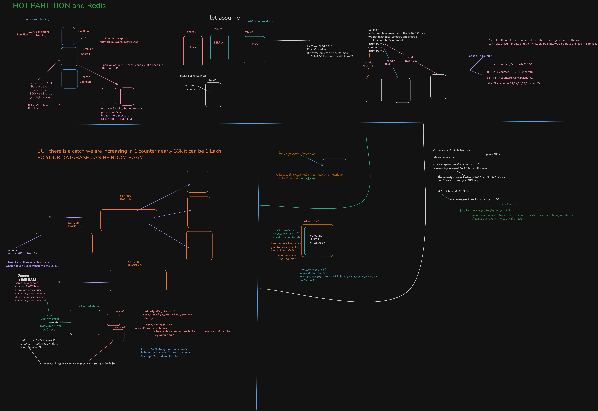
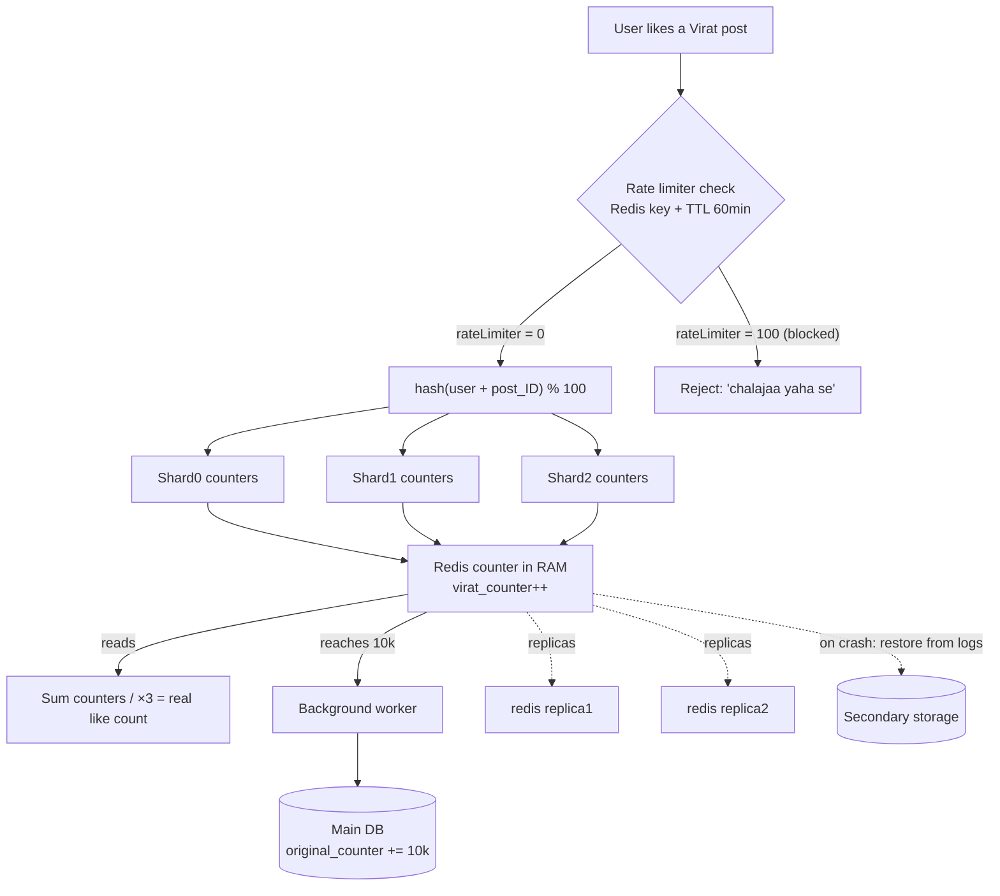

# Day 28 — Hot Partitions, Consistent Hashing & Redis (like counters, rate limiting)

## Overview
Whiteboard lecture on why a sharded database develops "hot partitions" (the celebrity problem), how replicas only help reads (not writes), how to distribute a viral like-counter across shards, and why an in-memory store like Redis is the right tool for counters, queues and rate limiters. All text below is transcribed from the Excalidraw SVG (`redish.svg`), sketch spellings preserved.

## Files
| File | What it is |
|---|---|
| `redish.svg` | Excalidraw vector export of the whiteboard lecture |
| `redish.png` | Raster (PNG) render of the same diagram |

## The diagram

### What it shows, section by section (transcribed from the SVG)
- **Title:** "HOT PARTITION and Redis consistent Hashing"
- **Sharding setup:** shard0, Shard1, Shard2 — "3 million" total, "1 million" per shard; "consistent hashing"; "1 million is the approx they are all evenly Distributed"; "Can we assume 3 shards can take at a one time Pressure ...??"
- **Celebrity problem:** "in this shard Virat Post and like commet share — BOOM so Shard1 get High pressure — IT IS CALLED CELEBRITY Probleam"
- **Replicas:** "we have 2 replica but write only perform on Shard 1"; "let add more pressure — RONALDO and MESI added"; "let assume 1 lakh/second read aaaa"; shard 1 + replica + replica each taking "33k/sec"; "Here we handle the Read Opearion But write only can be performed on SHARD1 How we handle here ??"
- **Like counter on one shard:** "POST : Like_Counter — Shard1 counter=0, counter++" — a single row being incremented by all writes.
- **Distribute the counter:** "Let Fix it — all Information are enter to the SHARD1 so we can distribute it shard0 and shard2. For Like counter We can add counter1=0, counter2=0, counter3=0"; each "handle 2Lakh like"; two ways to read:
  1. "Takk all data from counter and then show the Orginal data to the user"
  2. "Take 1 counter data and then multiply by 3 bcz we distribute the load in 3 phases"
- **Consistent hashing of counters:** `hash(chandan+post_ID) = hash % 100`; "0-32 -> counter0,1,2,3,4,5 (shard0)"; "33-65 -> counter6,7,8,9,10 (shard1)"; "66-99 -> counter11,12,13,14,15 (shard2)"; "Let add 16 counter"
- **Warning:** "BUT there is a catch we are increasing in 1 counter nearly 33k it can be 1 Lakh + — SO YOUR DATABASE CAN BE BOOM BAAM"
- **App servers with in-memory variables:** three "SERVER / BACKEND" boxes; "const viratPostLike = 0 — when like inc then variable increse, when it touch 10k it transfer to the SERVER"; "Danger it USE RAM, some How server crashed DATA boom. However we can use secondary storage to store it in case of server blast — secondary storage handle it — use variable"
- **Redis:** "Redish database — WHY — WRITE CODE — USE DATABASE TO HANDLE IT — redis DB"; "redish is a RAM hungry !!"; "what IF redish BOOM then what happen ?? — Redish 2 replica can be create — replica1, replica2"; "But adjusting the cost redish can be store in the secondary storage"
- **Flush-to-DB pattern:** "redishCounter = 8k, orginalCounter = 8k like — when redish counter reach like 10 k then we update the orginalCounter"; "For instant change we can choose RAM but whenever IT crash we use the logs to restore the likes"; "background Worker — it handle this type redish_counter when reach 10k it take it to the DATABASE"
- **Redis data structures:** "redish : RAM — virat_counter = 0, messi_counter = 0, ronaldo_counter =0 — here we use key_value pair so we can data can extract O(1) — unodered_map"; "also use SET"; "virat_comment = [] — queue data structor — comment recieve 1 by 1 and bulk data pushed into the main DATABASE"; "HERE IS A BIG HASH_MAP"
- **Rate limiter (last section):** "We can use Redish for the adding caounter"; "chandan@gmail.com RateLimiter = 0, chandan@gmail.com StartTime = 10.00am"; "chandan@gmail.com RateLimiter = 0 , TTL = 60 min — for 1 hour it can give 100 req — it gives O(1) — after 1 hour delte this"; "chandan@gmail.com RateLimiter = 100"; "But how can identify the rateLimit?? rateLimiter = 1 — when user request check first rateLimit if exist the user chalajaa yaha se; if rateLimit 0 then we allow the user"

## How it works — first principles
1. **Why shard at all?** One machine can't hold/serve everything. Hashing the key (`hash % N`) spreads 3 million rows evenly — ~1 million per shard.
2. **The hot partition (celebrity) problem.** Even distribution of *users* doesn't mean even distribution of *traffic*. If Virat posts, every like/comment/share on that one post hits Shard1 — one key becomes a hotspot no amount of sharding fixes, because the data itself is one row.
3. **Replicas only solve reads.** Adding replicas lets you split 1 lakh/sec of reads into 3 × 33k/sec, but writes must still go to the primary (Shard1). Reads scale horizontally; writes don't.
4. **Split the hot counter.** Instead of one `Like_Counter` row, keep counter1/counter2/counter3 on the three shards; each absorbs a third of the like traffic. The real value is either the sum of all counters or one counter × 3.
5. **Assign counters by consistent hashing.** `hash(user + postID) % 100` maps each like to a bucket range (0–32, 33–65, 66–99) so counters spread predictably. But per-shard traffic can still spike to 1 lakh+ — the database can still "boom".
6. **Move the hot counter out of the DB into memory.** App-server variables (`viratPostLike`) are fastest but live in volatile RAM: a crash loses the data.
7. **Redis = a database that manages RAM for you.** A purpose-built in-memory store: O(1) key-value ops (like an unordered_map), SETs for uniqueness, lists as queues (comments received 1-by-1, bulk-pushed to the main DB). It's "RAM hungry", so it needs replicas and/or persistence to secondary storage.
8. **Buffered writes back to the DB.** Redis counter and DB counter both read 8k; when the Redis counter reaches 10k, a background worker flushes it into the "original" DB counter. On crash, Redis logs (AOF-style) restore the likes.
9. **Rate limiting with TTL.** Key per user (`chandan@gmail.com:RateLimiter`), incremented per request; a TTL of 60 min expires the window; when the counter hits the limit (100 req/hour) the request is rejected — all O(1).

## Key concepts
- **Hot partition / celebrity problem** — one famous post overloads a single shard.
- **Replicas scale reads, not writes** — writes always go to the primary.
- **Counter sharding** — split one hot counter into many, combine on read.
- **Consistent hashing** — `hash(key) % buckets` spreads keys across shards; adding buckets doesn't remap everything.
- **Redis** — in-memory key-value DB: strings/counters, SETs, lists (queues), one big hash-map; O(1) operations.
- **RAM volatility** — variables/Redis lose data on crash; replicas + secondary storage + logs (persistence) cover it.
- **Write-behind / buffered flush** — background worker pushes Redis counters to the DB at a threshold (e.g., every 10k).
- **TTL-based rate limiter** — per-user key, fixed window, auto-delete after expiry.

## Flow

## Notes
- No credentials appear in the sketch; the email-like key `chandan@gmail.com` is a sample user key, not a real account.
- Spellings are transcribed as drawn: "Redish", "Probleam", "Opearion", "Takk", "unodered_map", "caounter", "delte", "chalajaa yaha se", "BOOM BAAM", "2Lakh", "MESI".
- Day 28 sketch says "hash % 100" with ranges 0–32 / 33–65 / 66–99 and mentions "16 counter" — the ranges are the lecturer's approximation, not exact thirds.
