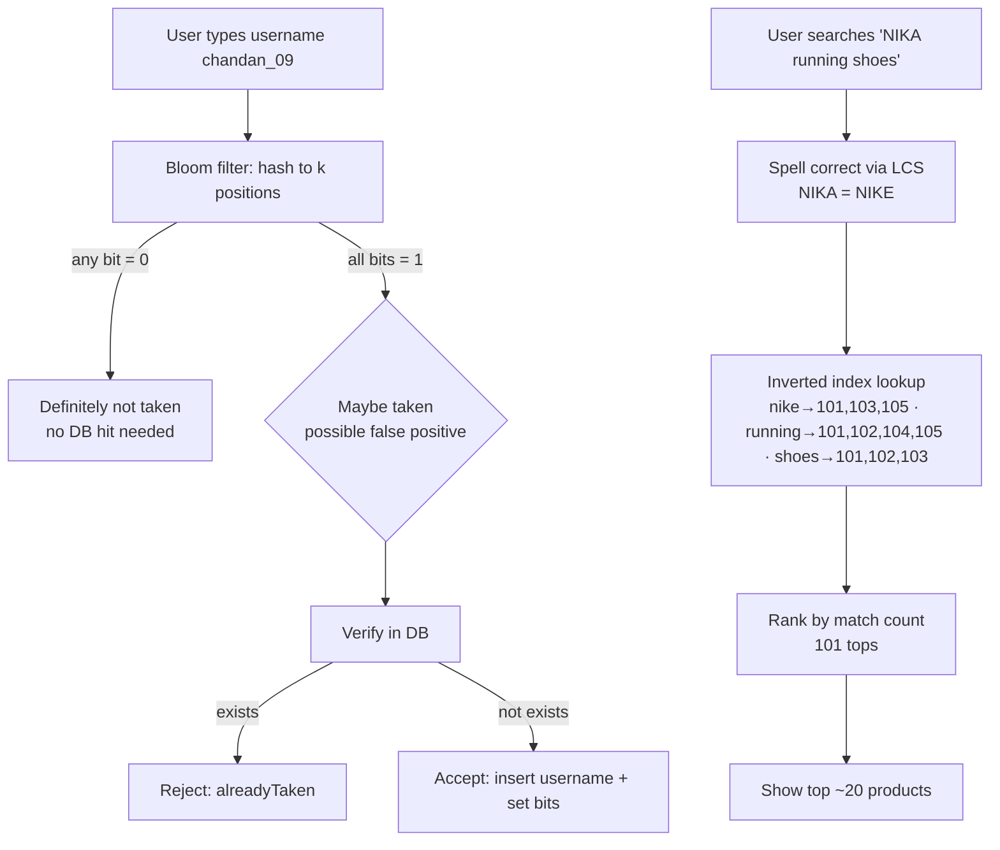

# Day 29 — Bloom Filters & Search (username checks, search ranking, fuzzy matching)

## Overview
Although the file is named "Cap Theorem", the whiteboard is actually about **Bloom Filters** (fast "does this username exist?" checks with controlled false positives) and **backend search** (full-text matching, ranking, pre-indexing, and spelling correction via longest common subsequence). Transcribed from `Cap Theorem.svg`; sketch spellings preserved.

## Files
| File | What it is |
|---|---|
| `Cap Theorem.svg` | Excalidraw vector export of the whiteboard lecture |
| `Cap Theorem .png` | Raster (PNG) render of the same diagram |

## The diagram

### What it shows, section by section (transcribed from the SVG)
- **Part 1 — Username availability check:** "Bloom Filter — 1: Instagram: Account open -> username"; "username exist / username not exist" answered via frontend → backend → database; example input `chandan_09`; "database contain 2 billion record — SSD store the data — data move from ssd -> RAM -> Search — user exprience bad"
- **Index table idea:** "indexTable user_name ->>>> Location"; "we can create Hash map unordered data, add that 2 billion username here, here we can get O(1) data"; "let 1 username -> 20byte, we have 2 billion, so 40GB around only for username"; "HASHMAP this data move to ram — username exist or not — think here 40Gb data move to ram"
- **Redis attempt:** "Redish redish store 40 GB data — But still it taking heavy space"
- **Bloom filter mechanics:** a bit array numbered 0–9; "chandan_01 --> hashFun --> 246" (bits set to 1); "dipsa_01 --> hashFun -> 128"; "-> 246 {HERE IN THE ARRAY ALL VALUE (246) ALL ARE FILLED BY "1" SO THERE USERNAME EXIST}"; "chanda_01 --> hashFun — APCETED" (typo for ACCEPTED — accepted as "maybe exists")
- **False positives:** "ananta_09 ->> has fun -> 218 — IT GOT rejected But this user name not exist"; "UserName ->> alreadyTaken - > yesTaken"; "Username--> not Taken(we answer False positive) -> yes Taken — we need decrease the false positve rate"; "userName -> notTaken --> NotTaken"; "we need increase the size of an ARRAY then we can decrease the FALSE positive case"
- **When to hit the DB:** "ladle DB ko check karna padeyga — userName taken pe nahi karna he — userName not taken pe DB ko chek karna padeyga mere ladlee" (if the filter says "taken", don't check the DB; only when it says "not taken" you must verify in the DB)
- **Where bloom filters are used:** "->unique ID — ->Unique URL — ->mobileNumber — ->Elastic Search"
- **Part 2 — Search bar problem:** "You are using amazon and search "nike running shoes" — backend handle this one?? user can type anything there... Problem: searchbar → database"; "you can use ID like take attached ID from fronted, fetch product from the database"
- **Sample products array:** JSON of 10 products (`_id` 101–110): Nike Air Zoom Pegasus 41 (5499), Adidas Ultraboost 5 (8999), Nike Court Vision Low (4299), Puma Velocity Nitro (6499), Nike Revolution 7 (3699), Adidas Runfalcon 5 (4499), Puma Smashic Casual Sneakers (2999), Nike Downshifter 13 (3999), Reebok Energen Run 3 (3499), Skechers Go Run Consistent (5299)
- **Naive matching:** "nike running shoes — give me a product where name and descp match with NIKE or RUNNING or SHOES — here we got 1000+ data from DB — we need to show only 20 DATA which is relevent BUT how ??? — NIKE tshirt also come from DB"; "we need kind of this where nike OR running OR shoes present show to the user"; "for more OPTIMIZATION add Ranking systeam"
- **Keyword gaming:** "BUT what we do some how a random person add their in descp "OUR shoes better than NIKE" but shoes name "Apsara" — in this case when user search NIKE "Apsara" will be there"
- **Pre-indexing (inverted index):** "we can predefined by the preINDEXING for searching faster — nike -> 101,103,105 — running -> 101,102,104,105 — shoes -> 101,102,103 — in index section most of matcched 101 that must be show to the USER otherwise GO for search 100million data"
- **Fuzzy / spelling correction:** "Another probleam user type -> "I need NIKA running shoes" — what u do to fix this spelling ?? — chek the mamximum matching words"; word list: "->nike ->Running ->adidas ->Sneakers"; ""NIKA" check what and how many change words required to the match the our table so WE CONCLUED NIKA = NIKE"; "LONGEST COMMON SUBSEQUENCE — LIKE KITNE CHANGE KARNE HE TERE KO TABLE KESATH MATCH KARWANNE KE LIYE"
- **Closing thought:** "DSA -> Le bhai new Product then wo to table pe nahii HOGA right? => So we can create INDEX multiple about on it — can we use vector embeding FOR it"

## How it works — first principles
1. **The basic problem:** checking username uniqueness against 2 billion rows means reading from SSD → RAM → search — slow, bad UX.
2. **Hash map index:** an in-memory unordered_map of usernames gives O(1) lookups, but 2 billion × 20 bytes ≈ 40 GB of RAM — too heavy. Redis holding the same 40 GB is still too much space.
3. **Bloom filter:** a bit array + k hash functions. Insert: hash the username, set those bit positions to 1. Query: hash and check the bits — if **any bit is 0**, the username definitely does NOT exist; if **all bits are 1**, it *probably* exists.
4. **False positives are the trade-off:** a "not taken" answer is always truthful; a "taken" answer may be a collision (e.g., `ananta_09` rejected though it never existed). Bigger array (and more/tuned hash functions) lowers the false-positive rate at the cost of space. Bloom filters never store the data itself — only bits.
5. **Practical rule:** treat the bloom filter as a cheap gate. If it says "taken" → tell the user immediately (no DB hit). If it says "not taken" → confirm in the DB before creating the account.
6. **Search, same first principles:** the user types free text; the backend must find relevant products from millions of rows. Naive `OR` matching over name/description returns 1000+ rows — you need ranking to show ~20.
7. **Inverted index (pre-indexing):** at write time, map each keyword → product IDs (`nike → 101,103,105`…). At search time, intersect/union the lists and rank by most matches (product 101 matched most → show first). This is the core of Elasticsearch-style search instead of scanning 100 million rows.
8. **Ranking abuse:** sellers can stuff competitor keywords ("OUR shoes better than NIKE" on a shoe named "Apsara"); pre-indexing/field weighting controls this.
9. **Fuzzy matching:** for typos ("NIKA"), compute edit distance / longest common subsequence against a known vocabulary ("nike", "running", "adidas", "sneakers") and map "NIKA = NIKE".
10. **New items problem:** a brand-new product isn't in the pre-built index — rebuild/multiple indexes, and the sketch teases vector embeddings as the modern solution.

## Key concepts
- **Bloom filter** — probabilistic set membership: no false negatives, tunable false positives, O(1), tiny space.
- **Space math** — 2B usernames × 20 B ≈ 40 GB; a bloom filter needs a few bits per element instead.
- **Bigger bit array ⇒ lower false-positive rate.**
- **Inverted index / pre-indexing** — keyword → document-ID lists, built ahead of time.
- **Ranking** — order results by match count/relevance, show top ~20.
- **LCS / edit distance** — spell correction by minimum changes against a vocabulary.
- **Vector embeddings** — teased as the semantic-search upgrade for new/unknown items.
- Use cases listed: unique IDs, unique URLs, mobile numbers, Elasticsearch.

## Flow

## Notes
- No credentials in the sketch — all names (`chandan_09`, `dipsa_01`, `chanda_01`, `ananta_09`) and the products JSON are dummy data.
- The file name says "Cap Theorem" but the diagram content covers Bloom Filters and search, not CAP. Transcribed as drawn.
- Sketch spellings preserved: "Redish", "exprience", "positve", "APCETED", "has fun" (hash fun), "systeam", "matcched", "mamximum", "relevent", "probleam", "ladle/ladlee", "embeding", "chek".
- Hinglish lines are transcribed verbatim ("DB pe check karna padeyga…", "KITNE CHANGE KARNE HE TERE KO…").
