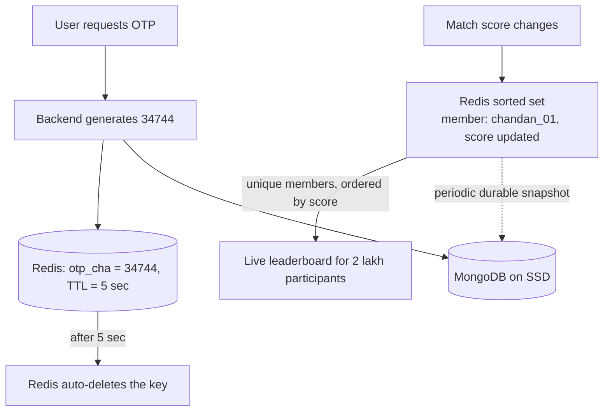

# Day 30 — Redis (Redish) Final: In-Memory DB, TTL, Lists, Hashes & Sorted Sets

## Overview
Wrap-up whiteboard on Redis ("Redish"): what an in-memory database is, OTP storage with TTL, Redis data types (strings, lists as queues, hashes/JS-object style, sorted sets for live leaderboards), and why frequently-changing data should live in Redis instead of hammering the main DB. Transcribed from `RedishFinal.svg`; sketch spellings preserved.

## Files
| File | What it is |
|---|---|
| `RedishFinal.svg` | Excalidraw vector export of the whiteboard lecture |
| `redishFinal.png` | Raster (PNG) render of the same diagram |

## The diagram

### What it shows, section by section (transcribed from the SVG)
- **Title:** "Day 30 redish — Redish : In memory DB"
- **Storage picture:** RAM vs SSD, with "monngo DB" (MongoDB) as the on-disk database behind the "Backend"; frontend → backend → redish.
- **Profile caching:** "Viratkoholi profile" fetched through backend.
- **OTP with TTL:** "OTP task — backend — redish — frontend — otp_cha — 34744"; "u can set TLL for 5 sec — after 5 sec OTP will be deletd in redish"
- **Redis string type:** "string — key --> Value(List)"
- **Redis list type:** `{"Chandan","rahul","aditya","deepa"}` — "data can be pop/push here like queue — In behind they used LinkedList kind of"
- **Redis hash type:** "key ---> JSObject — chandan_01 --> { name:"Chandan", age:"20", city:"Tamilnadu" }"
- **Live leaderboard (sorted set) example:** "contest 1 — IND vs SR : 5cr — 2lakh participate"; "contest 2 — IND vs SR : 5cr — 2lakh participate"; "2 laksh score" over a long row of zeros (scores updating repeatedly); two participants "chandan_01", "Dekash_014"
- **Why Redis here:** "here the data was changed changed repedatly — DB pe store kiya to phateyga tera DB — {memeber should be unique}"; "score arranged by the assending wise"

## How it works — first principles
1. **The basic problem:** a disk-based DB (MongoDB) reads/writes through the storage stack (SSD). For data that changes every millisecond — OTPs, live scores, sessions — that's too slow and overloads the DB.
2. **In-memory DB:** Redis keeps the working set in RAM, so reads/writes are sub-millisecond O(1)-ish operations. The backend talks to Redis for hot data and to MongoDB for durable data.
3. **TTL (time to live):** every key can carry an expiry. An OTP like `otp_cha: 34744` is set with a 5-second TTL; Redis deletes it automatically — no cron job, no manual cleanup, and the OTP can't be reused.
4. **Strings:** the simplest type — a key holds one value (counters, tokens, single OTPs).
5. **Lists:** `key → ["Chandan","rahul","aditya","deepa"]` — push/pop at the ends, backed by something like a linked list, so they behave like queues (e.g., pending tasks, comment buffers).
6. **Hashes:** `key → field:value` map, like a JS object stored under one key (`chandan_01 → {name, age, city}`) — read/update single fields without serializing the whole object.
7. **Sorted sets:** members with a numeric score, unique members, ordered by score — the natural structure for a live leaderboard of a 2-lakh-participant contest. You insert `chandan_01` with score X and Redis keeps the ranking for you (sketch says "assending wise"; you can read it ascending or descending).
8. **Why not the main DB:** scores "changed repedatly" — writing each update to MongoDB would "phateyga tera DB" (blow up your DB). Redis absorbs the hot write traffic; durable snapshots can be pushed to the DB periodically.

## Key concepts
- **Redis = in-memory database** — RAM-first, SSD/secondary storage for persistence.
- **TTL / expiry** — auto-delete keys (OTP in 5 sec); core of OTP, session, and rate-limit windows.
- **Data types** — String (counters, OTP), List (queue, push/pop), Hash (JS-object-like record), Sorted Set (leaderboard, unique members ranked by score).
- **Hot data in RAM, cold data on disk** — keep rapidly-changing data in Redis to protect the main DB.
- **Unique members** — sorted-set membership must be unique; scores tie-break ordering.

## Flow

## Notes
- No credentials in the sketch — `chandan_01`, `Dekash_014`, `Viratkoholi` and the OTP `34744` are dummy data; the OTP is an example, not a real code.
- Spellings transcribed as drawn: "Redish", "monngo DB", "TLL", "deletd", "otp_cha", "2 laksh", "repedatly", "memeber", "assending", "phateyga tera DB".
- Hinglish lines transcribed verbatim ("DB pe store kiya to phateyga tera DB").
