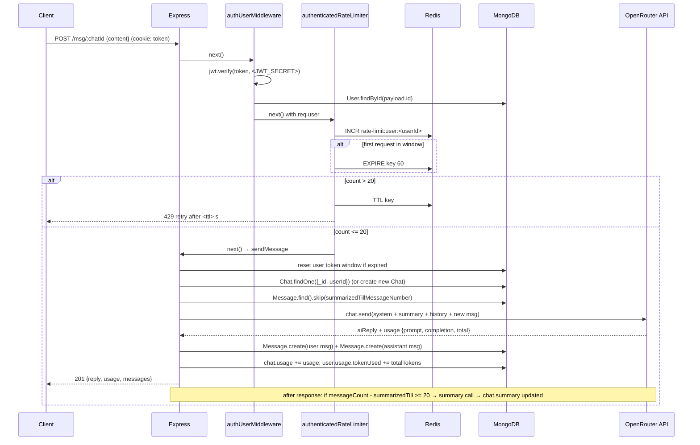

# Day 31 — Redis Rate Limiting + Token Usage & Chat Summaries in the Chat Backend

## Overview

Day 31 contains two versions of the same learning project — a Node/Express + MongoDB chat backend with an OpenRouter-powered AI assistant:

- `class/` — the code written during class
- `afterClass /` (note the trailing space in the folder name) — the polished after-class version. It is nearly identical but has two meaningful fixes:
  - `controllers/messageController.js` calls `updateSummaryIfNeeded(chat._id).catch(...)` **after** the response is sent, so a summary failure cannot hit the controller's `catch` and throw after headers are sent (in `class/` it is fire-and-forget with no `.catch`).
  - `routes/chatRouter.js` and `routes/messageRouter.js` import the **real** `authenticatedRateLimiter` (in `class/` the routers already import it correctly; in the after-class `chatRouter.js` there is actually a small bug — it imports `authenticatedRateLimiter` from `authUserMiddleware.js`, so it double-applies auth instead of rate limiting).

The two big topics of the day:

1. **Redis-backed rate limiting** — a fixed-window counter (`INCR` + `EXPIRE`) with two middlewares: a stricter per-IP limiter for unauthenticated endpoints (login/signup, 10 req/min) and a per-user limiter for authenticated endpoints (20 req/min).
2. **Token accounting + rolling chat summaries** — every AI call's token usage is tracked per-message, per-chat and per-user (10,000-token limit per 5-hour window), and every 20 messages a background LLM call compresses older messages into a `summary` field so future prompts stay small.

## Files / Project structure (tree)

```
Day31/
├── docs.md                          ← this file
├── class/                           ← class version
│   ├── index.js                     ← express app, mounts routers, connects Mongo + Redis, listens
│   ├── package.json                 ← express 5, mongoose, redis, jsonwebtoken, bcrypt, zod, @openrouter/sdk, cookie-parser, dotenv
│   ├── config/
│   │   ├── database.js              ← mongoose.connect(process.env.MONGO_URL)
│   │   ├── redis.js                 ← redis client from process.env.REDIS_URL, exports { redisClient, connectRedis }
│   │   └── openRouter.js            ← OpenRouter SDK client from process.env.OPENROUTER_API_KEY
│   ├── controllers/
│   │   ├── userController.js        ← signup, login, logout, profile, deleteAccount
│   │   ├── chatController.js        ← createChat, getRecentChat, getSingleChat, deleteChat
│   │   └── messageController.js     ← getMessage, sendMessage (the core AI flow)
│   ├── middlewares/
│   │   ├── authUserMiddleware.js    ← reads JWT cookie, verifies, loads User, sets req.user
│   │   ├── authenticatedRateLimiter.js   ← Redis fixed window: 20 req / 60 s per user
│   │   └── unauthenticatedRateLimiter.js ← Redis fixed window: 10 req / 60 s per IP
│   ├── model/
│   │   ├── userSchema.js            ← User + usage { tokenUsed, tokenLimit=10000, resetAt(+5h), totalTokenUsed }
│   │   ├── chatSchema.js            ← Chat: topic, model, summary, summarizedTillMessageNumber, messageCount, usage
│   │   └── messageSchema.js         ← Message: chatId, userId, role(user|assistant), content, usage
│   ├── routes/
│   │   ├── userRouter.js            ← per-route middleware ordering (see below)
│   │   ├── chatRouter.js            ← authUserMiddleware + authenticatedRateLimiter for all chat routes
│   │   └── messageRouter.js         ← authUserMiddleware + authenticatedRateLimiter for all message routes
│   ├── service/
│   │   ├── openRouterService.js     ← generateAIResponse(): sends chat, returns { aiReply, usage }
│   │   └── summaryService.js        ← updateSummaryIfNeeded(): every 20 messages, roll older messages into chat.summary
│   ├── utils/
│   │   ├── chatContext.js           ← buildMessagesForAI(): system prompt + summary + unsummarized msgs + new msg
│   │   ├── userUsage.js             ← resetUsageIfNeeded, hasTokenLimitReached, addUserTokenUsage
│   │   └── tokenUsage.js            ← addChatTokenUsage (accumulate usage on the Chat doc)
│   └── validators/userValidators.js ← zod schemas for signup/login (email, password complexity)
└── afterClass /                     ← after-class version (note trailing space in name)
    ├── .env                         ← <MONGO_URI>, PORT, <JWT_SECRET>, <OPENROUTER_API_KEY>, REDIS_URI, DEFAULT_AI_MODEL (all expired dummies)
    ├── index.js, package.json       ← same shape as class/
    ├── config/                      ← database.js, redis.js, openRouter.js (same as class/, env var MONGO_URI / REDIS_URI)
    ├── controllers/                 ← userController.js, chatcontroller.js, messageController.js
    ├── middleware/                  ← authUserMiddleware.js, authenticatedRateLimiter.js, unauthenticatedRateLimiter.js
    ├── model/                       ← userSchema.js, chatSchema.js, messageSchema.js
    ├── routes/                      ← userRouter.js, chatRouter.js, messageRouter.js
    ├── services/                    ← openRouterService.js, summaryService.js
    ├── utils/                       ← chatContext.js, userUsage.js, tokenUsage.js
    └── validators/userValidator.js  ← zod schemas
```

## How the code flows

### Startup (`index.js`)

1. `import "dotenv/config"` loads the `.env` first, so every config module can read env vars.
2. Express app is built: `express.json()` → `cookieParser()`.
3. Routers are mounted: `/user` → userRouter, `/msg` → messageRouter, `/chat` → chatRouter.
4. `startServer()` awaits `connectDB()` (MongoDB) then `connectRedis()` (Redis) — **both must succeed before** `app.listen`. If either fails the server never starts (fail-fast).

### Request lifecycle for an authenticated AI message (`POST /msg/:chatId` or `POST /msg`)

1. **Route matching** (`messageRouter.js`): router-level `use(authUserMiddleware)` then `use(authenticatedRateLimiter)` run before the controller.
2. **`authUserMiddleware`**:
   - Reads `req.cookies.token`; if missing → `401`.
   - `jwt.verify(token, <JWT_SECRET>)` → payload `{id, email}`.
   - `User.findById(payload.id)`; if gone → `404`.
   - Sets `req.user = existingUser` and calls `next()`. (Cost: one Mongo read per request.)
3. **`authenticatedRateLimiter`** (Redis fixed window — detail below).
4. **`sendMessage` controller**:
   - Validates `content` is non-empty (`400`).
   - **User token budget check**: `resetUsageIfNeeded(req.user)` — if `now > user.usage.resetAt`, reset `tokenUsed = 0` and push `resetAt` forward 5 hours. Then `hasTokenLimitReached(user)` — if `tokenUsed >= tokenLimit` (10,000) → `429` with current usage. This is a *quota*, separate from the Redis request-rate limiter.
   - **Chat resolution**:
     - If `chatId` present: validate it's a real ObjectId (`400` otherwise), then `Chat.findOne({ _id, userId: req.user._id })` — ownership check baked into the query, so another user's chat is just "not found" (`404`).
     - Else (new chat): require `model` in body, `Chat.create({ userId, model, topic: content.slice(0,40) })`.
   - **Build the AI context** (`utils/chatContext.js`): `[system prompt] + [chat.summary as a system message, if any] + [unsummarized messages] + [current user message]`. Unsummarized messages = `Message.find({chatId}).sort({createdAt:1}).skip(chat.summarizedTillMessageNumber)` — everything already rolled into the summary is skipped.
   - **AI call** (`service/openRouterService.js`): `openRouter.chat.send({ chatRequest: { model, messages } })`; extracts `choices[0].message.content` and `usage` (`promptTokens` = input, `completionTokens` = output, `totalTokens` = sum). Empty reply → throw.
   - **Persist**: create the user `Message` and the assistant `Message` (the assistant message stores the `usage`), bump `chat.messageCount += 2`, set topic if it's still "New Chat".
   - **Accounting**: `addChatTokenUsage(chat, usage)` and `addUserTokenUsage(user, usage.totalTokens)` (also bumps lifetime `totalTokenUsed`).
   - Respond `201` with the reply and usage.
   - **Then** (after the response): `updateSummaryIfNeeded(chat._id)` — fire-and-forget; in `afterClass /` it is wrapped in `.catch()` so an async failure after headers are sent can't crash anything.

### Rate limiter logic in detail (Redis fixed window)

Both limiters are the same algorithm with different keys and limits:

```js
const requestCount = await redisClient.incr(key);   // atomic +1, creates key at 1 if missing
if (requestCount === 1) {
    await redisClient.expire(key, 60);              // first request in the window starts the 60 s TTL
}
if (requestCount > limit) {
    const remainingTime = await redisClient.ttl(key); // seconds until the window resets
    return res.status(429).json({ message: `Too many requests. Try again after ${remainingTime} seconds.` });
}
next();
```

- **Algorithm: fixed window counter.** The window starts when the *first* request creates the key (`incr` returns 1) and ends 60 s later when the key expires. Not a token bucket, not sliding window — bursts that straddle a window boundary can allow up to 2× the limit in practice (e.g. 10 requests at t=59s and 10 more at t=61s).
- **Key design**:
  - Unauthenticated: `rate-limit:ip:<req.ip>` — keyed by client IP because there is no identity yet. Limit **> 10** requests rejected, i.e. 10 requests per 60 s.
  - Authenticated: `rate-limit:user:<userId>` — keyed by the verified user id, so a logged-in user can't evade the limit by switching IPs, and shared-NAT users aren't collectively punished. Limit **> 20** rejected, i.e. 20 requests per 60 s.
- **Why two limiters?** Unauthenticated endpoints (login, signup) are the abuse surface for credential stuffing and fake-account spam, so they get the stricter per-IP limit and run *before* auth. Authenticated endpoints know exactly who the caller is, so they get a per-user limit and run *after* `authUserMiddleware` (it needs `req.user._id`).
- **Middleware ordering matters**: in `userRouter.js` each route declares its own chain —
  - `POST /login`, `POST /signup` → `unauthenticatedRateLimiter` only (no auth exists yet).
  - `GET /profile`, `POST /logout` → `authUserMiddleware` → `authenticatedRateLimiter`.
  - `DELETE /delete` → `authUserMiddleware` only (delete is deliberately not rate-limited here).
- **Fail-open design**: both limiters wrap everything in try/catch; if Redis throws, they log and call `next()` anyway. Rate limiting is a protection layer, not core functionality — a Redis outage should degrade the rate limit, not take the API down.
- The `429` body includes `ttl(key)` so the client knows exactly when to retry.

### Token quota + rolling summary (context-window management)

- **Per-user quota** (`model/userSchema.js`, `utils/userUsage.js`): `usage.tokenLimit = 10000`, `usage.resetAt = now + 5h` at signup. Every `sendMessage` resets the window if expired, rejects over-quota with `429`, then adds the call's `totalTokens` to `tokenUsed` and `totalTokenUsed`. This bounds cost per user even if they pass the request-rate limiter.
- **Per-chat accounting** (`utils/tokenUsage.js`): `chat.usage` accumulates prompt/completion/total tokens, and `chatSchema` stores `summary`, `summaryUpdatedAt`, `summarizedTillMessageNumber` (how many messages are already compressed), `messageCount`.
- **Summary service** (`service/summaryService.js`, `SUMMARY_CHUNK_SIZE = 20`): when `messageCount - summarizedTillMessageNumber >= 20`, fetch the next 20 unsummarized messages and ask the model to produce a *rolling* summary: `system` ("keep goals/decisions/unresolved doubts") + `previous summary` + the 20 messages + "Summarize the above conversation." The new summary replaces `chat.summary`, `summarizedTillMessageNumber` advances by 20, and the summary call's own token usage is charged to the chat and the user. Next `sendMessage` then only sends `summary + messages after that point + new message` instead of the whole history — keeping prompts (and cost) bounded as a chat grows.

### Other routes (brief)

- **User**: `signup` (zod validation → duplicate-email check `409` → bcrypt hash cost 12 → create → JWT in httpOnly cookie, 1 h), `login` (zod → bcrypt.compare → JWT cookie), `logout` (clearCookie), `profile` (reads `req.user` set by middleware), `deleteAccount` (cascade: delete user's Messages → Chats → User, clear cookie).
- **Chat**: `createChat` (choose model), `getRecentChat` (user's last 20 chats, `topic` + `updatedAt` only, uses the `{userId, updatedAt:-1}` index), `getSingleChat` (ownership-scoped findOne), `deleteChat` (ownership check → delete chat's messages → delete chat).
- **Message**: `GET /msg/:chatId` (ownership check, all messages ascending).

## First principles

- **Why rate limit at all?** Every endpoint consumes finite resources — CPU, DB connections, third-party API credits (here: OpenRouter tokens, which cost real money). Without a limiter, one script can exhaust all of them for everyone (DoS) or drain a paid AI quota. Rate limiting converts "unbounded per-caller cost" into "bounded cost per caller per window".
- **Why Redis and not in-memory (`let counts = {}` in Node)?**
  1. **Shared state across instances**: the moment you run 2+ server processes (PM2 cluster, k8s replicas, or a load balancer), an in-memory map is per-process — a user gets 20 requests *per instance*. Redis is one shared counter for the whole fleet.
  2. **Survives restarts/deployments**: an in-memory map is wiped on every deploy, giving every attacker a fresh budget.
  3. **Atomicity**: `INCR` is a single atomic server-side operation. Doing `map[key]++` in JS is fine single-threaded, but the *check-then-expire* pattern is still easier and correct in Redis, and atomic ops matter once multiple instances converge on the same key.
  4. **TTL for free**: `EXPIRE` handles window reset; no cleanup timers/setInterval in app code.
- **Why a JWT in an httpOnly cookie?** httpOnly means JavaScript can't read it (XSS can't steal the token); stateless verification means no session store lookup; but the middleware still does one `User.findById` per request — so the user can be deleted and instantly lose access, and `req.user` is a real document the controllers can use.
- **Why middleware ordering matters**: Express runs the chain in declaration order and stops at the first response. `authUserMiddleware` must run *before* `authenticatedRateLimiter` because the limiter keys on `req.user._id`. The unauthenticated limiter must run *on* login/signup (before any auth is possible) and stricter (10/min vs 20/min) because anonymous traffic is the cheapest to generate and the classic vector for brute force. Putting a limiter before auth on protected routes would also count unauthenticated requests against per-IP keys — wrong bucket.
- **Why fail-open on Redis errors?** Rate limiting is defense-in-depth, not a feature. If the limiter throws and the request dies, Redis becomes a single point of failure for the whole API. Logging and calling `next()` trades strictness for availability — the right default for most apps (a fail-closed limiter is a deliberate, product-level choice).
- **Why summarize instead of sending full history?** LLM pricing and context windows are per-token. Sending 500 messages every turn is O(n) cost per request and eventually exceeds the context window. Compressing every 20 messages into a rolling summary makes prompt size O(recent window + summary) — constant-ish cost per message.
- **Why charge the summary call to the user too?** It's a real LLM call with real tokens. Hidden costs that aren't metered become budget leaks.

## Flow



Login/signup flow is the same shape but with `rate-limit:ip:<req.ip>` (limit 10/min) and no auth middleware.

## Key concepts

- **Fixed window rate limiting** — `INCR` a key, `EXPIRE` it on first hit, reject past the limit, `TTL` tells the client when the window resets. Simple and cheap; known weakness is boundary bursts (up to 2× limit across two adjacent windows). Upgrades: sliding window log, sliding window counter, token bucket (e.g. via Lua scripts or `redis-cell`).
- **Two-dimensional limiting** — request rate (Redis, per second/minute) AND token quota (Mongo, per 5 h). One stops abuse bursts; the other bounds expensive-resource consumption. They answer different questions and neither replaces the other.
- **Key namespacing** — `rate-limit:user:<id>` vs `rate-limit:ip:<ip>`; identity choice depends on whether the request is authenticated, and the unauthenticated key is inherently spoofable/shared (NAT, rotating proxies).
- **Fail-open vs fail-closed middleware.**
- **JWT auth via httpOnly cookie** + `req.user` enrichment in middleware.
- **Ownership scoping in the query itself** — `findOne({ _id, userId: req.user._id })` makes IDOR return 404 instead of leaking.
- **Rolling summarization** for bounded LLM context: `summary` + `summarizedTillMessageNumber` watermark + `skip()` fetch of unsummarized tail.
- **Post-response background work** — `updateSummaryIfNeeded` runs after `res.json`; in `afterClass /` it is `.catch()`-ed because errors after headers are sent can't become responses.
- **Zod validation at the edge** (signup/login schemas with password-complexity regexes), **bcrypt hashing** (cost 12), **MongoDB indexes** for the hot queries (`{userId, updatedAt:-1}` on chats, `{chatId, createdAt:1}` on messages).

## Setup & run

Each project runs independently (`class/` or `afterClass /`):

```bash
cd "Day31/class"          # or: cd "Day31/afterClass "
npm install
node index.js             # connects MongoDB + Redis first, then listens on PORT
```

Required environment variables (`.env`, placeholder names only):

| Variable | Purpose |
|---|---|
| `MONGO_URI` (or `MONGO_URL` in `class/`) | MongoDB connection string |
| `REDIS_URL` (or `REDIS_URI` in `afterClass /`) | Redis connection string |
| `JWT_SECRET` | Secret for signing/verifying auth JWTs |
| `OPENROUTER_API_KEY` | API key for the OpenRouter LLM calls |
| `PORT` | HTTP port (e.g. 3000) |
| `DEFAULT_AI_MODEL` | (afterClass .env) fallback model name |

Note: `class/config/redis.js` reads `process.env.REDIS_URL` while `afterClass /config/redis.js` reads `process.env.REDIS_URI` — match the variable name to the project you run.

You need a running MongoDB instance and a running Redis instance (local via `mongod`/`redis-server` + `docker`, or cloud — the code just uses the connection strings).

## Notes

- Any credentials present in the source or `.env` (MongoDB URI and password, JWT secret, OpenRouter API key, Redis URL/password) are **expired dummies** for learning purposes only — they are dead and must not be used or committed. This doc references them only as `<MONGO_URI>`, `<JWT_SECRET>`, `<OPENROUTER_API_KEY>`, `<REDIS_URL>`.
- The `afterClass ` folder name has a trailing space — quote it in shell commands: `cd "afterClass "`.
- Known quirks in the code (good learning points):
  - In `afterClass /routes/chatRouter.js`, `authenticatedRateLimiter` is imported from `authUserMiddleware.js`, so chat routes get auth applied twice and **no rate limiting**. `class/`'s routers import it correctly.
  - The fixed-window limiter has the classic boundary-burst weakness (see First principles).
  - `deleteAccount` performs three sequential deletes without a transaction — a mid-way failure leaves partial data.
  - `class/` fires `updateSummaryIfNeeded(chat._id)` without `.catch()` after `res.json` — an unhandled rejection risk; the after-class version fixes this.
  - Env var naming drifts between projects (`MONGO_URL` vs `MONGO_URI`, `REDIS_URL` vs `REDIS_URI`).
