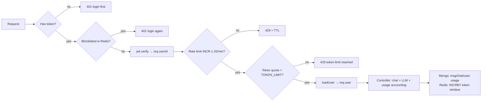

# Day 32 — Token-Usage Tracking, Rate Limiting & the Middleware Pipeline (Chat Backend Evolution)

## Overview

Day32 contains two versions of the same Express + MongoDB + Redis + OpenRouter chat backend:

- `class/` — the version built during the class (folder `middlewares/`, `service/`).
- `afterClass /` — the polished/final version (folder `middleware/`, `services/`, note the **trailing space** in the folder name).

The app is an AI chat backend where users sign up / log in (JWT in httpOnly cookie), create chats, send messages to an LLM through OpenRouter, and every LLM call is metered:

- **Token usage** is recorded at three levels: per-message, per-chat (Mongo), per-user (Mongo), and per-user *rolling window* (Redis counter with a TTL).
- **Rate limiting** is split in two: unauthenticated routes are limited by IP, authenticated routes by `userId` — both implemented with Redis `INCR` + `EXPIRE` (fixed-window limiter).
- **A token quota** (`TOKEN_LIMIT` env) blocks a user from calling the AI once their Redis token counter exceeds the limit until the window expires.
- Long chats are compressed via an LLM **summary** every 20 messages (`summaryService`), and only unsummarized messages are replayed to the model.

## Files / Project structure (tree)

```
Day32/
├── class/                          # in-class version
│   ├── index.js                    # express app + connect Mongo & Redis, listen
│   ├── package.json                # express 5, mongoose, redis, jsonwebtoken, bcrypt, zod, @openrouter/sdk
│   ├── config/
│   │   ├── database.js             # mongoose.connect(<MONGO_URI>)
│   │   ├── openRouter.js           # OpenRouter client with <OPENROUTER_API_KEY>
│   │   └── redis.js                # redis client from <REDIS_URI>, connectRedis()
│   ├── middlewares/
│   │   ├── authUserMiddleware.js           # cookie JWT verify + Redis blocklist check
│   │   ├── loadUserMiddleware.js           # User.findById(req.userId) -> req.user
│   │   ├── authenticatedRateLimiter.js     # 20 req/min per userId (Redis INCR)
│   │   ├── unauthenticatedRateLimiter.js   # 10 req/min per IP (Redis INCR)
│   │   └── tokenUsageMiddleware.js         # blocks user when TOKEN_LIMIT reached
│   ├── model/
│   │   ├── userSchema.js           # user + usage {tokenUsed, tokenLimit, resetAt, totalTokenUsed}
│   │   ├── chatSchema.js           # chat + summary fields + usage {prompt, completion, total}
│   │   └── messageSchema.js        # message + tokens + usage, indexes (chatId+createdAt)
│   ├── routes/
│   │   ├── userRouter.js           # /user login|signup|logout|profile|delete
│   │   ├── chatRouter.js           # /chat create|recent|single|delete
│   │   └── messageRouter.js        # /msg GET + POST (tokenUsage -> loadUser -> controller)
│   ├── controllers/                # userController, chatController, messageController
│   ├── service/                    # openRouterService, summaryService
│   ├── utils/                      # chatContext, tokenUsage, userUsage
│   └── validators/                 # zod signup/login schemas
│
└── afterClass /                    # final version (same layout, middleware/ and services/ names)
    ├── index.js
    ├── package.json                # adds `validator` dep
    ├── .env                        # EXPIRED DUMMY credentials — ignored
    ├── config/  middleware/  model/  routes/  controllers/  services/  utils/  validators/
```

## How the code flows (request lifecycle)

### Boot (`index.js`)

`import "dotenv/config"` → create Express app → `express.json()` + `cookieParser()` → mount routers at `/user`, `/msg`, `/chat` → `connectDB()` (Mongo) and `connectRedis()` → `app.listen(process.env.PORT)`.

### Auth chain (userRouter / chatRouter / messageRouter)

1. **`unauthenticatedRateLimiter`** — only on `POST /user/login` and `/signup`. Key = `rate-limit:ip:<req.ip>`; `INCR` the key, on first hit `EXPIRE 60`; if count > 10 → `429` with remaining TTL. On Redis failure it logs and calls `next()` (fail-open — availability over strictness for anonymous traffic).
2. **`authUserMiddleware`** — reads `req.cookies.token`; missing → `401`. Checks Redis `blocklist:<token>` (populated on logout, so logout really invalidates the JWT before it expires) → `401` if blocked. Then `jwt.verify(token, <JWT_SECRET>)` and puts `req.userId`, `req.token`, `req.tokenPayload` on the request.
3. **`authenticatedRateLimiter`** — same fixed-window pattern as above but keyed by `rate-limit:user:<userId>`, limit 20/min. Because it runs *after* auth, it can key on identity instead of IP (shared NATs can't exhaust each other, and logged-in abusers can't dodge the limit by changing IP).
4. **`tokenUsageMiddleware`** — messaging routes only. Reads `token-usage:<userId>` from Redis; if `tokenUsed >= <TOKEN_LIMIT>` → `429` with `retryAfter` (the key's TTL). Otherwise stores the key on `req.tokenUsageKey` so the controller can increment it later.
5. **`loadUserMiddleware`** — `User.findById(req.userId)`; missing user → `404`; otherwise `req.user = existingUser`. Auth proves *who* the caller is; loading the user fetches *current state* (usage counters, profile) and rejects tokens belonging to deleted accounts. It runs last, closest to the controller, so it's not wasted on requests the cheap middleware would have rejected.
6. **Controller** — the actual work.

Ordering rationale: cheap, in-memory/Redis checks (rate limit) run before the JWT crypto verify; the DB round-trip (`loadUser`) runs last of the middleware so rejected requests never pay for it.

### Sending a message (`POST /msg` or `POST /msg/:chatId` → `sendMessage`)

1. Validate `content`; validate `chatId` as a Mongo ObjectId; find the chat scoped to `userId` (ownership check) — or create a new `Chat` with `topic` = first 40 chars of the message.
2. Fetch **unsummarized** messages: `Message.find({chatId}).sort({createdAt:1}).skip(chat.summarizedTillMessageNumber)`.
3. `buildMessagesForAI` (utils/chatContext.js) assembles the prompt: system prompt → optional `chat.summary` as a second system message → old messages → the current user message. This is how long conversations stay inside the context window cheaply.
4. `generateAIResponse` (services/openRouterService.js) calls OpenRouter and returns the reply plus `usage: {promptTokens, completionTokens, totalTokens}` (defaults 0 if the API omits usage).
5. Persist both messages (`Message.create` for user + assistant, usage stored on the assistant message); `chat.messageCount += 2`; set topic if still "New Chat".
6. Record usage in three places:
   - Mongo chat: `addChatTokenUsage(chat, usage)` — chat.usage totals.
   - Mongo user: `addUserTokenUsage(user, totalTokens)` — lifetime `totalTokenUsed`.
   - Redis: `redisClient.incrBy(req.tokenUsageKey, totalTokens)`; on the first increment of the window (`tokenUsed === usage.totalTokens`) set `EXPIRE <TOKEN_WINDOW_SECONDS>` — a rolling quota window that the next request's `tokenUsageMiddleware` will check.
7. Respond `201` with reply, usage, `tokenUsed`, `tokenLimit` and both saved messages. (Bug: `updateSummaryIfNeeded(chat._id)` is placed *after* the `return`, so it never runs from this controller in `afterClass /`.)
8. `summaryService.updateSummaryIfNeeded` (called by design) fires every time `messageCount - summarizedTillMessageNumber >= 20`: it takes the next 20 messages, asks the LLM for a rolling summary (`Previous summary + new chunk`), stores it on the chat, advances `summarizedTillMessageNumber`, and bills the summary's tokens to the chat and user too.

### Auth routes

- `signup` — zod validation (name length, password complexity regexes, email normalize), duplicate-email `409`, `bcrypt.hash(password, 12)`, sign JWT `{id, email}` with `<JWT_SECRET>` (1h), set httpOnly cookie.
- `login` — zod → find user → `bcrypt.compare` → same cookie. Login response includes `usage` so the client can show quota.
- `logout` — writes the still-valid token into the Redis blocklist with `EX: payload.exp - now` (auto-cleans exactly at JWT expiry), clears the cookie.
- `profile` / `deleteAccount` — behind auth → rate limit → loadUser. Delete cascades: `Message.deleteMany` → `Chat.deleteMany` → `User.deleteOne` → clear cookie.

### `/chat` routes

`createChat` (model name required), `getRecentChat` (last 20 chats by `updatedAt`, uses the `{userId: 1, updatedAt: -1}` index), `getSingleChat` (returns topic + usage), `deleteChat` (ownership check, cascades messages).

> Note / bug worth spotting: in `afterClass /routes/chatRouter.js`, `authenticatedRateLimiter` is imported **from `authUserMiddleware.js`** instead of `authenticatedRateLimiter.js`, so the chat routes actually run `authUserMiddleware` twice and no rate limiting.

## First principles

- **Why track token usage at all?** Every LLM API call costs real money proportional to tokens in and out. If you expose an LLM to the internet with only a request-rate limiter, one user sending "write me a 5000-word essay" 20 times a minute can drain your budget. A rate limiter caps *requests*; a token quota caps *cost*. Both are needed because they measure different abuse dimensions (frequency vs. payload size).
- **Why a middleware chain?** Cross-cutting concerns (auth, rate limiting, quota, user loading) are not business logic. Express middleware lets you compose them per-route like a pipeline: each one either short-circuits with a response or enriches `req` and passes on. Controllers then contain only business logic and can assume "the caller is a valid, within-quota user with `req.user` loaded."
- **Why load the user *after* auth (and after rate limiting)?**
  - `authUserMiddleware` establishes identity (cheap: JWT verify + one Redis GET). `loadUserMiddleware` does a Mongo query (expensive relative to the others) — do the cheap checks first so bad requests never touch the database.
  - Separating them matters because some routes need the user record and some don't, and later middleware (tokenUsage) only needs `req.userId`, not the full document.
  - It also closes the "token outlives account" hole: a JWT is valid until expiry, but `loadUserMiddleware` 404s if the account was deleted.
- **Why rate limit by IP for anonymous routes but by userId for authenticated ones?** Anonymous users have no identity, so IP is the only handle (imperfect behind NAT). Once authenticated you have a stable identity — key on it, because IPs change and are shared while `userId` is exact.
- **Why Redis for counters and the blocklist instead of Mongo?** These are hot, tiny, ephemeral values incremented on every request. Redis is in-memory, has native atomic `INCR`/`INCRBY`/`EXPIRE`/`TTL`, and entries clean themselves up. Mongo would add a write per request and need manual TTL cleanup. Mongo keeps the *durable* accounting (chat/user lifetime usage), Redis keeps the *transient* windows (60s rate window, token quota window, token blocklist until JWT expiry).
- **Why summarize old messages?** Context windows and prompt tokens both cost. Replaying the entire history on every turn makes each request more expensive than the last. Compressing every 20 messages into a rolling summary means the prompt is roughly constant size: summary + small recent tail. The `summarizedTillMessageNumber` cursor makes this resumable and idempotent.
- **Fail-open vs fail-closed:** the rate limiters `next()` on Redis errors (don't take the whole app down because the limiter is down), while auth fails closed (a broken auth check must never let requests through).

## Flow

```mermaid
sequenceDiagram
    participant C as Client
    participant E as Express
    participant R as Redis
    participant M as MongoDB
    participant O as OpenRouter

    C->>E: POST /msg/:chatId (cookie: token, body: content)
    E->>R: GET blocklist:<token>
    R-->>E: nil (not blocked)
    E->>E: jwt.verify(token, <JWT_SECRET>) → req.userId
    E->>R: INCR rate-limit:user:<userId> (EXPIRE 60 on first)
    R-->>E: count ≤ 20 → OK
    E->>R: GET token-usage:<userId>
    R-->>E: used < TOKEN_LIMIT → OK (req.tokenUsageKey set)
    E->>M: User.findById(req.userId) → req.user
    E->>M: findOne({_id: chatId, userId}) (ownership check)
    E->>M: unsummarized messages (skip summarizedTillMessageNumber)
    E->>O: chat.send(system + summary + history + question)
    O-->>E: reply + usage{prompt, completion, total}
    E->>M: save user msg + assistant msg (usage), update chat totals + user totals
    E->>R: INCRBY token-usage:<userId> totalTokens (EXPIRE window on first incr)
    E-->>C: 201 { reply, usage, tokenUsed, tokenLimit }

    Note over E,R: Next request: tokenUsageMiddleware reads token-usage:<userId>; if ≥ TOKEN_LIMIT → 429 + retryAfter (TTL)
```



## Key concepts

- **Middleware pipeline & ordering** — cheap checks first (Redis rate limit), identity second (JWT), quota third, expensive DB load last; controllers assume a pre-validated request.
- **Fixed-window rate limiting with Redis** — `INCR` key + `EXPIRE 60` only when count is 1; `TTL` returned to the client as `retryAfter`. Simple, atomic, self-cleaning (a sliding-window/`token bucket` is the next step).
- **JWT in httpOnly cookies + Redis blocklist** — stateless auth, but logout/blocking made possible by blacklisting the raw token until its `exp`.
- **Token accounting at multiple scopes** — per-message (`Message.usage`), per-chat (`Chat.usage`), per-user lifetime (`User.usage.totalTokenUsed`), and per-user rolling window (`token-usage:<userId>` in Redis) for enforcement vs. Mongo for durable audit.
- **Quota enforcement pattern** — check in middleware before doing work, record *after* the LLM responds with the actual usage, share the key via `req.tokenUsageKey`.
- **Conversation summarization** — rolling LLM summary every `SUMMARY_CHUNK_SIZE = 20` messages with a `summarizedTillMessageNumber` cursor; prompt = system + summary + unsummarized tail.
- **Ownership checks** — every chat/message query is scoped with `userId: req.user._id`, so even a valid JWT can't touch another user's data (404/403 otherwise).
- **Zod input validation** with password strength regexes and email normalization; **bcrypt** (cost 12) for passwords.
- **Fail-open limiters vs fail-closed auth** on Redis errors.
- **Spotted bugs (good learning material):** `updateSummaryIfNeeded` after `return` in `sendMessage`; wrong import in `afterClass /routes/chatRouter.js` (auth middleware reused as rate limiter); `INCRBY` expire check only triggers when the counter was previously absent, so windows can outlive `TOKEN_WINDOW_SECONDS`; both projects hardcode port fallback in logs.

## Setup & run

Requires Node 18+, a MongoDB instance, a Redis instance, and an OpenRouter account.

```bash
cd Day32/class        # or: cd "Day32/afterClass "   (trailing space!)
npm install
node index.js         # connects Mongo + Redis, listens on process.env.PORT
```

Create a `.env` (both projects):

```
PORT=3000
MONGO_URI=<MONGO_URI>                 # expired dummy in repo — replace with your own
REDIS_URI=<REDIS_URI>
JWT_SECRET=<JWT_SECRET>
OPENROUTER_API_KEY=<OPENROUTER_API_KEY>
TOKEN_LIMIT=10000                     # tokens allowed per quota window
TOKEN_WINDOW_SECONDS=3600             # quota window length
```

Smoke test: `POST /user/signup` → cookie is set → `POST /chat/createChat {"model":"..."}` → `POST /msg/<chatId> {"content":"hi"}` → response includes `usage` and `tokenUsed`; exceed `TOKEN_LIMIT` and the next `POST /msg` returns 429.

## Notes

- All credentials found in the repo (`.env`, MongoDB URIs, Redis URI, JWT secrets, OpenRouter API keys) are **EXPIRED DUMMIES** and are deliberately not reproduced here — always use the `<PLACEHOLDER>` form above and never commit real secrets.
- The folder `afterClass ` has a trailing space in its name — quote it in the shell.
- `class/` vs `afterClass /` are near-identical; `afterClass /` adds `validator` to package.json and is the version this document follows in detail.
