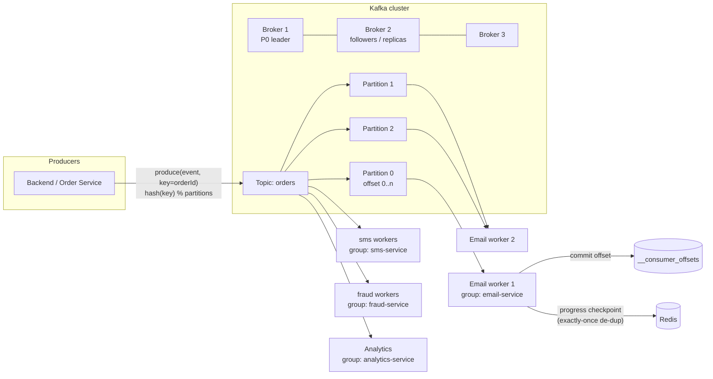

# Day 33 — Kafka (Message Broker & Event Streaming)

## Overview
Lecture 33 introduces Apache Kafka as the solution to a core distributed-systems problem: when one event (e.g. `OrderConfirmed`) must reach many independent services (restaurant, delivery, notification, fraud, analytics, recommendation), calling each service directly creates tight coupling, scaling pain, and cascading failures. Kafka replaces direct service-to-service calls with a central, durable, append-only event pipeline: **Producer → Kafka → Consumer groups**. The whiteboards go further than the PDF: delivery guarantees (at-most-once / at-least-once / exactly-once) worked out with an email-worker example, an Uber driver-location use case, partitioning by key, and broker replication with leader/follower failover.

## Files
| File | What it is |
|---|---|
| `Lecture 33_ Kafka.pdf` | Lecture notes (23 pages): problem Kafka solves, event-driven architecture, DB vs Kafka, topics, partitions, partition keys, brokers, producers/consumers, consumer groups, offsets, replication, KRaft, hot partitions, performance design, segments, retention, replay, compaction, delivery guarantees |
| `Kafka.svg` | Excalidraw whiteboard — Kafka internals: order events with offsets, consumer rates, email-worker crash/retry, delivery guarantees, Uber location workers, brokers with leaders/replicas |
| `Kafka.png` | PNG export of the same whiteboard |
| `n_bgvnrfiu.svg` | Second Excalidraw whiteboard (in-class deep-dive) — same topics plus B+ tree indexing recap, Redis-based exactly-once mail worker, partition-key hashing (`userID % 3`), RabbitMQ/SQS comparison |

## From the lecture PDF

### Basic concepts
1. **Problem Kafka solves** — One event, many reacting services. Direct calls mean: tight coupling, hard to scale, hard to add new services, slow responses, one failure affects others, no historical data. Kafka = **event streaming architecture**.
2. **Event-driven architecture** — Services publish *events* (`OrderCreated`, `OrderConfirmed`, `OrderShipped`, `OrderDelivered`). Architecture: `Producer → Kafka → Consumers`. Kafka is the **central event pipeline**.
3. **Database vs Kafka** — A DB stores **current state** (`orderId → delivered`); purpose: query state, source of truth. Kafka stores **events describing changes**; purpose: broadcast events, build pipelines, enable replay, decouple services.
4. **Topics** — A stream of related events (`orders`, `payments`, `users`, `inventory`, `delivery`). Topics represent **business domains**.
5. **Partitions** — Topics are split into partitions (P0, P1, P2…) for scalability. Each partition is an **append-only log**. Benefits: parallel processing, high throughput, horizontal scaling.
6. **Ordering** — Kafka guarantees **ordering inside a partition only** (`OrderConfirmed` before `OrderShipped` must land in the same partition).

### Producers, consumers, offsets
7. **Partition key** — `partition = hash(orderId) % number_of_partitions` ensures all events of one order go to the same partition, preserving order.
8. **Brokers** — A broker is a Kafka server; each broker stores some partitions (Broker1→P0, Broker2→P1, Broker3→P2). A cluster of brokers = **Kafka cluster**.
9. **Producers** — Order/Payment/User services send events to a topic, choosing the partition via `hash(key) % partitions`.
10. **Consumers** — Email, Analytics, Fraud, Recommendation services read messages sequentially from partitions.
11. **Consumer groups** — Scaling: many instances join one group (e.g. `email-service-group`); Kafka distributes partitions (`P0→Email1, P1→Email2, P2→Email3`). Rule: **one partition → one consumer in a group; one consumer → multiple partitions allowed**.
12. **Partition assignment** — A **Group Coordinator** tracks consumers in a group, assigns partitions, and handles rebalancing (e.g. 4 partitions / 3 consumers → C1: P0,P1; C2: P2; C3: P3).
13. **Offsets** — Each message in a partition has a unique number (0, 1, 2 …). Consumers track their reading position by offset.
14. **Offset commit** — After processing, the consumer commits the offset ("processed up to offset 2", next read at 3). Offsets are stored in Kafka's internal topic `__consumer_offsets`.

### Advanced: fault tolerance & internals
15. **Replication** — Each partition has a Leader broker and follower brokers. Writes go to the leader; followers replicate. If the leader fails, **a follower becomes the new leader**.
16. **KRaft** — Modern Kafka manages metadata (topic partitions, broker list, leader assignments) with **KRaft (Kafka Raft)**: leader election, cluster metadata, broker health tracking.
17. **Hot partition** — One partition gets most traffic (P0: 10k events/s vs 500/300) due to poor key distribution (e.g. `key = popular restaurantId`). Fix: better key, more partitions.
18. **Kafka performance design** —
    - **Sequential writes**: append-only → sequential disk writes are very fast.
    - **Page cache**: `Disk → Page Cache → Network`; most reads come from RAM.
    - **Batching**: send 100 messages in one request → less network overhead, fewer disk ops.
    - **Zero copy**: Linux `sendfile()` — `Disk → Kernel → Network` instead of `Disk → Kernel → App → Network`; fewer memory copies, less CPU.
19. **Log segments** — Partitions are split into segment files (`0–999`, `1000–1999`, …); writes go to the latest segment; old segments are deleted easily.
20. **Retention policy** — Messages retained for a configured period/size (e.g. 7 days), deleted by **time or size — not by consumption**.
21. **Replay** — Because messages are retained, consumers can re-read old offsets (analytics reprocessing, ML training, debugging, data recovery).
22. **Log compaction** — Keep only the latest value per key (`user1 = C`); used for state updates, configuration, user profiles.
23. **Delivery guarantees** — **At-most-once** (delivered once or lost, no duplicates), **at-least-once** (≥1 time, duplicates possible but no loss — most common), **exactly-once** (idempotent producers + transactions).
24. **Mental model** — Kafka is a **distributed commit log**: Producers → Topics → Partitions → Brokers → Consumer Groups → Offsets. Enables event streaming, data pipelines, real-time analytics, microservice communication, replayable logs. Strengths: high throughput, horizontal scaling, fault tolerance, event replay, service decoupling.

## The diagram(s)

### What the whiteboard shows (transcribed from `Kafka.svg`)
- **KAFKA INTERNALS** — data was sequential (that's why throughput is HIGH); "Kafka → Topic, Partition, Broker, consumer group".
- **Fan-out example**: `OrderConfirmed → Restaurant Service, Delivery Assignment, Notification Service, Fraud Detection, Analytics, Recommendation Engine` — Frontend → Backend → Kafka → email / sms / fraud / recommendation workers.
- **Offsets on a partition**: `offset 0: order1, 1: order2, 2: orderplaced, 3: orderplaced2`.
- **Consumer speeds differ**: 100 data/sec, 200 data/sec, 50 data/sec, 80 data/sec → each consumer tracks its own range (`0–99`, `0–199`, `0–49`, `0–79`).
- **Delivery guarantee walkthrough (email worker)**: consumer processes `0–99`, crashes at `0–20`; on restart must resume at `21–99` — otherwise *data was lost* (at-most-once: send once, never again). At-least-once: after processing 0–99 send confirmation to Kafka; a duplicate send (0–99 again) is possible. Exactly-once: can we send the mail to the user exactly once? Solution sketch: email worker commits progress to Redis (`redis_emailDB`) — processes 0–30, crashes, checks Redis and resumes from 31–99; but "still the cost is high" — hence multiple email workers reading one Kafka, `0–99 / 100–199 / 200–299`.
- **Uber location use case**: driver sends location to backend (1 lakh drivers × updates/sec) → Kafka → pickup workers, fare calculator, fraud detector. Driver locations as ordered events (`0: d1:L1, 1: d1:L2, 2: d2:L3 …`). "What if all pickup workers are inconsistent? → use multiple Kafka partitions for exact distribution, so load on workers decreases." Backend picks partition per order: `hash(orderID) mod 100`.
- **Partitions & consumers**: `p0, p1, p2`; email worker 1 takes `p0,p1`, worker 2 takes `p2`; sms workers 1–3; fraud workers 1–3.
- **Broker replication**: `P0: Leader, P1: Leader, P2: Leader` on one broker with followers (replicas) on other brokers — "broker stores where [data] exist".
- **Producer acknowledgements**: when Kafka receives data it acks the backend and creates replicas; alternative mode — no ack, producer sends data repeatedly, Kafka stores and replicates. Retry strategy: if ack missed, retry after 3s, then 5s; if still nothing after 10s, Kafka may be dead. "From Kafka's side we avoid multiplication of data."
- Topics for other domains: `Location topic` (d1, d2, d3 → location workers), `Topic = User Activity` (ad campaign).

The second whiteboard (`n_bgvnrfiu.svg`) covers the same material live, adding: B+ tree indexing recap (`1 lakh` rows, `log n`), the same email-worker crash/resume with Redis ("DB → mail bhej diya hai" as the de-dup store, "0–30 dubara, 31–99 mail"), at-most/at-least/exactly-once trade-off ("duplicacy" vs "miss ho jayenge"), OTP delivery, the Uber pickup-worker fan-out, payment events (`payment initiated → clear → refund`) and user-activity events (Nike → cart → order) flowing through keyed partitions (`userId % 3`), brokers with `p0/p1/p2` leaders + replicas across 3 servers (3 lakh drivers), retry timings (2s, 3s, 5s) when `orderPlace` acks are missed, keyed messages `{restaurantId, order details, location, payment}` (partition key = `userId`), and a closing comparison — "fan-in / fan-out, name?? — RabbitMQ, SQS system" — plus using Redis (`key = email`) as a per-worker queue.

## How it works — first principles
1. **One copy of the truth of "what happened"**: instead of N services asking each other, the producer appends one event to a shared log. Every interested service reads it independently — the definition of decoupling.
2. **The log is the storage**: an append-only file is the fastest possible write pattern (sequential disk I/O). Reading is just reading a file from a position (offset) — so a message broker can be as fast as a filesystem.
3. **Scaling = splitting**: one log is one serialization point, so topics are sharded into partitions. Parallelism = number of partitions; order = guaranteed only within a partition, so related events must share a partition key.
4. **Scaling consumers = groups**: a partition can be owned by exactly one consumer per group, so adding consumers divides the work; different groups (email, sms, fraud) each get a full copy of the stream — that's fan-out with independent pacing.
5. **Progress = offset commit**: consumers remember where they are by committing offsets to `__consumer_offsets`. Crash → resume from the last commit. Committing *before* processing = at-most-once; *after* = at-least-once; idempotency/transactions or an external de-dup store (Redis) = exactly-once.
6. **Surviving machine death = replication**: each partition lives on one leader broker plus follower replicas. If the leader dies, a follower is promoted. Producers get acks (or fire-and-forget) and retry with backoff on missed acks.

## Flow

## Key concepts
- **Event-driven architecture / event streaming** — publish-what-happened instead of call-who-cares.
- **Topic** — named stream of related events (a business domain).
- **Partition** — sharded append-only log inside a topic; unit of parallelism and ordering.
- **Partition key** — `hash(key) % partitions` keeps related events ordered together.
- **Broker / cluster** — Kafka server holding partitions; cluster = many brokers.
- **Producer / Consumer** — write events / read sequentially.
- **Consumer group** — partitions split among group members; each group gets the full stream.
- **Group coordinator** — assigns partitions, rebalances.
- **Offset & offset commit** — per-message position; committed to `__consumer_offsets` for crash recovery.
- **Replication / leader-follower** — fault tolerance; follower promoted on leader failure.
- **KRaft** — Kafka's Raft-based metadata management (replaces ZooKeeper).
- **Hot partition** — skewed key distribution overloading one partition.
- **Sequential writes, page cache, batching, zero copy (`sendfile`)** — why Kafka is fast.
- **Log segments / retention / log compaction** — file layout, time/size-based deletion, keep-latest-per-key.
- **Replay** — re-read from old offsets for reprocessing/ML/debugging.
- **Delivery guarantees** — at-most-once, at-least-once, exactly-once.
- Related tools mentioned: Redis (de-dup/queue), RabbitMQ, AWS SQS.

## Notes
- No credentials, tokens, or API keys appear in any file in this folder.
- The whiteboards contain student-style spellings from the live session (e.g. "ofset", "oder", "kaffka", "partiation", "Backaend", "redish"); they were transcribed as concepts above, cleaned for readability.
