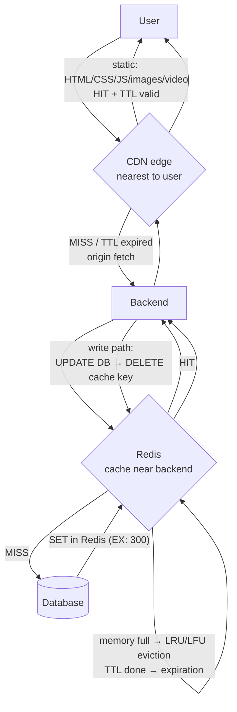

# Day 34 — Caching and Distributed Systems (Caching, Distributed Caching, CDN)

## Overview
Lecture 34 covers caching from first principles: why we cache (avoid hammering the DB with 100,000 identical queries), what a cache is (Redis in memory vs database on disk), cache hit/miss, distributed caching (shared external cache when the backend scales beyond one server, and sharding the cache itself), CDN vs Redis, the four caching strategies (cache-aside, read-through, write-through, write-behind), the cache invalidation problem and its solutions (TTL, explicit delete, delete-vs-update, concurrency races), cache stampede / thundering herd, TTL jitter, cache eviction policies (LRU, LFU, FIFO, random), and the crucial distinctions between invalidation, expiration, and eviction. The CDN whiteboard extends the lecture with a hands-on CDN section: geographic placement, TTLs per content type, sliding-window TTL extension, DNS resolution to CDN edge IPs, and TLS certificates for CDN ↔ origin (`strikes.in` / `origin.strikes.in`).

## Files
| File | What it is |
|---|---|
| `Lecture 34_ Caching and Distributed Systems.pdf` | Lecture notes (50 pages): caching basics, distributed caching, CDN vs Redis, caching strategies, invalidation, stampede, TTL jitter, eviction (LRU/LFU/FIFO/random), one-line interview definitions |
| `CDN.svg` | Excalidraw whiteboard — CDN: DB/backend per country, nearest-edge serving, YouTube example, TTL strategies, `strikes.in` static asset TTLs, DNS/nslookup to CDN IPs, TLS certificates for CDN and origin |
| `CDN.png` | PNG export of the same whiteboard |

## From the lecture PDF

### Basic concepts
1. **Why caching?** — Without a cache, `GET /user/123` goes Client → Backend → Database every time. If 100,000 users request the same data, the DB receives 100,000 queries — but much of the data is identical (`user:123 → { name: "Rohit", city: "Delhi" }`). Store a copy somewhere faster: that copy is a **cache**.
2. **What is caching?** — Store frequently accessed data in a faster storage layer so we don't repeatedly fetch or compute it from the original source. Architecture: Client → Backend → **Cache** → Database.
3. **Cache-hit walkthrough (Redis)** — First request: Redis `MISS` → backend queries DB → backend does `SET user:123` in Redis → returns response. Second request: Redis `HIT` → response returned; the database is not involved.
4. **Why is a cache faster?** — A DB handles disk access, indexes, query execution, joins, locks, transactions, network calls. A cache like Redis keeps data in memory: RAM access, very fast. Caching reduces: latency, DB load, CPU usage, network calls, cost.
5. **Cache hit vs miss** — **Hit**: data found in cache (`FOUND → Return data`). **Miss**: data not available (`NOT FOUND → Database`), and we commonly cache the DB response afterwards.

### Distributed caching
6. **The scaling problem** — One backend server with a local cache (`const cache = new Map()`) works. But behind a load balancer with Server 1/2/3, each server has separate RAM: Server 1 caches `user:123`, Servers 2 and 3 are empty — Server 2 doesn't know what Server 1 cached and re-queries the DB.
7. **Solution: shared external cache** — Move the cache outside the servers: Load Balancer → Server 1/2/3 → **Redis** → Database. Server 1 caches on a miss; later Server 3 gets a `HIT` from data cached by Server 1. Popular technologies: **Redis, Memcached**.
8. **The cache itself can be distributed** — Redis memory 64 GB but 500 GB required → one Redis machine can't hold everything → **Redis cluster** (Redis 1/2/3) with sharding (`user:1 → Redis 1`, `user:2 → Redis 2`, `user:3 → Redis 3`). So "distributed caching" means both: multiple backends sharing one external cache, and the cache spread across machines.

### CDN vs Redis
9. **Layering** — User → CDN → Backend → Redis → Database. **CDN** caches content geographically close to users: images, videos, CSS, JavaScript, fonts, HTML. **Redis** caches application data close to the backend: user profiles, product info, sessions, API responses, recommendations, rate-limiting counters. Remember: **CDN = cache near users; Redis = cache near backend**.

### Caching strategies
10. **What is a strategy?** — Decisions: how should data enter the cache? who checks the cache? what happens on writes? Major strategies: **Cache Aside, Read Through, Write Through, Write Behind / Write Back**.
11. **Cache-aside** — Most common. Application manages the cache: `GET /product/100` → check Redis; HIT → return; MISS → query DB → `SET` in Redis → return. Code sketch:
    ```js
    let product = await redis.get("product:100");
    if (!product) {
      product = await database.getProduct(100);
      await redis.set("product:100", JSON.stringify(product), { EX: 300 });
    }
    return product;
    ```
    App is responsible for checking Redis, fetching DB, updating Redis — the cache sits "aside" from the DB.
12. **Read-through** — Same flow, but the **cache layer itself** handles the miss; the backend just asks "give me product:100". Plain Redis doesn't know how to query MongoDB/MySQL — you need an extra library/caching layer for this abstraction.
13. **Write-through** — On writes (user changes name Rohit → Rohit Negi), write **cache + database together**. Advantage: cache always fresh. Disadvantage: every write involves cache + DB → writes are slower.
14. **Write-behind / write-back** — For extremely fast writes: update cache, return success immediately, flush to DB asynchronously later. Example: user likes a YouTube video (10,000 → 10,001 in Redis, return instantly; DB updated later). Benefit: very fast writes. Problem: if the cache crashes before flushing, the DB is never updated — **data could be lost**; needs careful durability design.
15. **Strategy comparison** —
    - Cache Aside: app manages cache manually; very common; good for read-heavy systems.
    - Read Through: cache layer manages DB loading; app code simpler.
    - Write Through: write cache + DB together; better consistency; slower writes.
    - Write Behind: write cache first, DB updated later; very fast writes; higher data-loss risk.

### Cache invalidation
16. **The problem** — Redis has `user:123 { city: "Delhi" }`; user changes city Delhi → Bangalore. DB now says Bangalore but Redis still says Delhi → **stale data**. Fundamental question: when the original data changes, how do cached copies learn they are no longer valid?
17. **Solution 1 — TTL** — `user:123, TTL = 5 minutes`; entry expires, next request misses and reloads fresh data. Simple, but if data changes after 10 seconds, users may see stale data for ~4m50s — TTL gives **eventual freshness, not immediate**.
18. **Solution 2 — explicit invalidation** — `UPDATE user:123` in DB, immediately `DELETE user:123` in Redis. Next request misses and rebuilds from the latest value.
19. **Delete cache or update cache?** — Option 1: Update DB + Update Redis. Option 2: Update DB + **Delete** Redis. Deleting is usually safer: cached data may be a derived object (user table + orders + subscription + permissions + recommendations) — recomputing/patching it correctly is complicated; deleting and letting the next request rebuild is simpler.
20. **Why invalidation is hard: concurrency race** — Two servers, `Update DB / Delete cache` pattern: Server B reads OLD value from DB → Server A updates DB with NEW value → Server A deletes cache → Server B stores the OLD value into Redis. Final state: **DB = NEW, Redis = OLD** — even though A invalidated correctly. The problem isn't "how do I run DEL in Redis"; it's keeping multiple copies of changing data consistent under concurrent operations.
21. **Cache stampede / thundering herd** — `product:iphone` TTL expires at 10:00 PM; exactly then 100,000 users request it — everyone sees `CACHE MISS` → 100,000 DB queries → DB overloaded. Solutions: **distributed locking, request coalescing, stale-while-revalidate, TTL jitter**.
22. **TTL jitter** — If 1 million products all have `TTL = exactly 5 minutes` and were inserted together, they all expire together → huge DB spike. Instead `TTL = 5 minutes + random variation` (`product:1 → 282s`, `product:2 → 316s`, `product:3 → 301s`, `product:4 → 274s`) so expiration spreads over time.

### Eviction
23. **What is eviction?** — Different from invalidation. Redis has 1 GB, all used; inserting `product:999` needs memory — something must be removed. Which item? That's the **eviction policy**.
24. **LRU — Least Recently Used** — Remove the item not used for the longest time (A: 1s ago, B: 10s, C: 2min, D: 1h → remove D). Mental model: recent access = likely needed again; old access = safer to remove.
25. **LFU — Least Frequently Used** — Remove the item used fewest times (A: 10,000 reqs, B: 8,000, C: 200, D: 2 → remove D). Popular objects stay cached. LRU asks "**when** was it last used?"; LFU asks "**how often** was it used?". LRU vs LFU example: Product A requested 100,000 times historically but 1h ago; Product B requested 2 times but 1s ago — LRU removes A, LFU removes B.
26. **FIFO** — Remove whatever entered first (insert order A,B,C,D + E → remove A) regardless of popularity — can be inefficient.
27. **Random eviction** — Pick a random key, delete it. Not intelligent but extremely cheap; fine where tracking overhead isn't worth it.
28. **Expiration vs eviction** — **Expiration**: TTL finishes → removed because of **time**. **Eviction**: memory full → removed because of **memory pressure** (an item with 30 min TTL remaining can still be evicted).
29. **Invalidation vs eviction** — Invalidation: data is no longer **correct** (DB changed) → correctness problem. Eviction: cache needs **space**, data may still be perfectly correct → memory-management problem.
30. **Complete picture (Amazon example)** — `GET /product/iphone`: User → Backend → Redis (HIT/MISS) → DB → store in Redis → response. Price changes ₹80,000 → ₹75,000: DB update + delete Redis key = **cache invalidation**. Later Redis is full and inserts `product:macbook`, removing an old/unpopular key = **cache eviction**. Later `product:iphone` reaches its 10-min TTL and disappears = **cache expiration**. Three separate events.
31. **Final mental model** — CACHE splits into three questions: **how does data enter/read/write?** → Caching Strategy (cache-aside, read-through, write-through, write-behind); **data changed in original DB?** → Cache Invalidation (TTL, explicit delete, explicit update, versioning, events/pub-sub); **memory is full — what to remove?** → Eviction Strategy (LRU, LFU, FIFO).
32. **One-line definitions (interviews)** — Cache: temporary fast storage avoiding repeated fetch/compute. Distributed cache: shared by multiple app servers, often itself spread across machines. Hit/miss: found / not found. Cache-aside: app checks cache first, loads DB on miss. Invalidation: removing/updating cache when source changes. Expiration: auto-remove after TTL. Eviction: remove because memory is running out. LRU/LFU: remove least-recently / least-frequently used. Stampede: many requests miss the same entry simultaneously and overload the DB.
33. **Most important principle** — Caching improves performance by creating copies; one original data → multiple copies → which copy is latest? when do copies expire? how do we update/remove stale copies? what when thousands miss together? **Caching is a trade-off between performance and consistency/complexity.**

## The diagram(s)


### What the whiteboard shows (transcribed from `CDN.svg`)
- **CDN: Content Delivery Network** — baseline: client → backend → DB.
- **Geographic placement**: separate backend+DB per region — **India, USA, Saudi Arabia, Australia** — "put DB and backend near the user country to fulfill the request."
- **CDN serving**: client → nearest **CDN service** → fast response; clients 2, 3 hit nearby edges. CDNs are present in large amounts across the world, "to save the backend." CDN caches **HTML, CSS, JS, images, video**; dynamic content it does not store.
- **YouTube example**: client → CDN for the video; comments/likes go to the backend. Use **TTL (total time to leave)** — for like/comment counts, 10 sec so the CDN re-requests the backend for updated values; a YT video gets TTL 24 hours. Problem: a 5 GB video with a 24 h TTL — re-requesting for 24 h is not great → sliding extension: request 1 sets 24 h, request 2 extends by another 24 h ("extend like sliding-window type"). Deletion: when a video is deleted we must broadcast to all CDN servers. Better pattern: set TTL 30 min; after 30 min don't just delete — ask the backend if the video still exists; if yes add another 30 min and loop until the video is gone.
- **Static-site TTLs (strikes.in)**: `index.html — TTL 5 min`; `css → 1 year (style.css)`; `js → 1 year (script.js)`; `images → 1 year`. For new changes deploy `index.html`, `style1.css`, `script1.js` and delete the old CSS/JS from the CDN ("that is useless").
- **DNS**: terminal capture — `nslookup strikes.in` → `Server: 192.168.1.1`, non-authoritative answer: `18.67.195.123 / 18.67.195.33 / 18.67.195.19 / 18.67.195.92` — "this IP address [is that] of the CDN / load balancer; in the case of a load balancer its IP will be returned there."
- **TLS for the CDN**: how does the CDN get strikes.in's certificate, and how does it understand data sent to it (it must cache what it understands)? → create a certificate proving the CDN owns strikes.in: **CDN generates a public and private key, goes to the operator/CA server, which adds the key-value pair to strikes.in's DNS and issues the certificate** (public key / private key / CA boxes on the board).
- **Origin certificate**: another certificate is needed for CDN → backend: `origin.strikes.in`, IP e.g. `19.8.7.6`. "We cannot publicly expose origin.strikes.in's IP, so the backend always answers only to the CDN — avoids hackers. To prove it, there is a TLS certificate."

## How it works — first principles
1. **A copy beats a query**: fetching/computing data costs disk seeks, index lookups, joins, locks; a RAM copy costs ~one pointer hop. Every repeated identical request is waste — caching turns the 100,000th identical DB query into a memory read.
2. **Where the cache sits determines what it solves**: near the user (CDN) it saves the network journey and the backend; near the backend (Redis) it saves the database. Same principle (store a copy closer to the consumer) applied at different layers.
3. **Copies go stale**: the moment data exists in two places, writes must keep them consistent. You either never serve stale data (write-through, explicit invalidation — slower writes) or accept staleness bounded by TTL (eventual freshness — simpler, faster).
4. **Deleting beats patching**: cached values are often derived aggregates; updating them correctly under concurrency is hard, so delete and rebuild — but concurrency itself can resurrect stale data (the read-old/write-new race), which is why invalidation is famously "one of the two hard problems."
5. **Shared state needs shared memory**: per-process `Map()` caches break the instant you scale horizontally; a shared external cache (then a sharded cluster) restores a single source of cached truth.
6. **Finite memory forces choice**: TTL handles time-based removal; eviction policies (LRU/LFU/FIFO/random) encode a bet about the future — recent use or frequent use predicts future use — and both must be distinguished from invalidation, which is about correctness, not space.
7. **Caches fail loudly at scale**: synchronized expiry (stampede) or clustered expiry (no jitter) convert a cache layer into a DB DoS attack; randomizing and coalescing requests are the defenses.

## Flow


## Key concepts
- **Cache / hit / miss** — faster copy of data; found / not found.
- **Why caches win** — RAM vs disk, and skipping query execution entirely.
- **Distributed cache** — shared external Redis/Memcached; then a sharded Redis cluster when one machine isn't enough.
- **CDN vs Redis** — cache near users (static content) vs cache near backend (application data).
- **Caching strategies** — cache-aside, read-through, write-through, write-behind (with pros/cons).
- **Cache invalidation** — TTL, explicit delete (usually safer than update), versioning, pub-sub; stale-data and concurrency races.
- **Cache stampede / thundering herd** — mass simultaneous miss; fixes: locking, request coalescing, stale-while-revalidate, TTL jitter.
- **Expiration vs eviction vs invalidation** — time-based vs memory-pressure vs correctness-based removal.
- **Eviction policies** — LRU, LFU, FIFO, random.
- **CDN internals** — geo-placement, per-asset TTLs, sliding TTL renewal, deletion broadcast, DNS to CDN edge IPs, TLS certificates (CDN cert + origin `origin.strikes.in` cert, origin hidden from the public).

## Notes
- No credentials, tokens, or API keys appear in any file in this folder. The only IP addresses shown are educational placeholders (`192.168.1.1` local resolver, `18.67.195.x` CDN/anycast-style IPs, `19.8.7.6` example origin IP) — not secrets.
- The whiteboard contains student-style spellings ("Conetent", "Total time to leave" for time-to-live, "operaive server" for operator/CA server, "amswer"); transcriptions above clean these up while keeping the original ideas.
